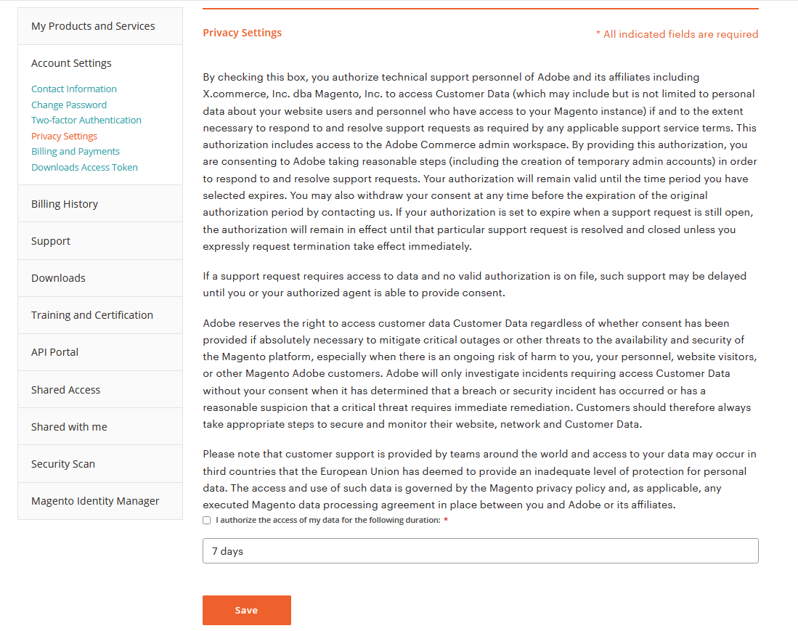

# Supporto Adobe accesso ai dati dei clienti e privacy

L’assistenza tecnica di Adobe potrebbe richiedere l’accesso ai dati relativi ad Adobe Commerce per fornire supporto. L’autorizzazione può essere fornita solo dal titolare dell’account Adobe Commerce principale nelle impostazioni di privacy dell’account Adobe Commerce, se lo desidera. Consentendo questo accesso prima di creare richieste di supporto, sarà possibile analizzare correttamente il problema e/o velocizzare la risoluzione. Tieni presente che il &quot;Proprietario del progetto&quot; di un progetto Adobe Commerce Cloud potrebbe non essere il titolare principale dell’account Adobe Commerce.

>[!NOTE]
>
>La scheda Impostazioni privacy sarà disponibile/visibile solo per gli utenti con diritti di supporto associati a un prodotto pagato/acquistato e per gli utenti che sono l’ID immagine principale e direttamente autorizzati; questa scheda non è disponibile per la delega a un altro utente tramite Accesso condiviso. Dopo aver concesso l’accesso, possono essere necessari 5-10 minuti per aggiornare tutti i sistemi di Adobe interni. Se l’accesso non veniva concesso prima della presentazione del ticket, il proprietario dell’account principale avrebbe dovuto aggiornare il ticket con il consenso esplicito all’accesso ai dati.

Per autorizzare l&#39;accesso:

1. [Accedi](https://account.magento.com/customer/account/login) come utente primario autorizzato al supporto.
1. Nella pagina **[!UICONTROL My Account]** > **[!UICONTROL Account Settings]**, assicurati di aver completato il tuo [profilo account](https://account.magento.com/customer/account/edit) e fai clic su **[!UICONTROL Save]**.
1. Nella pagina **[!UICONTROL My Account]** > **[!UICONTROL Account Settings]** > **[!UICONTROL Privacy Settings]**. Verrà visualizzato un modulo di consenso per consentire al personale di supporto tecnico Adobe di accedere ai tuoi dati.
1. Dopo aver esaminato le informazioni sulle impostazioni della privacy, scegliere se selezionare la casella di controllo accanto a **Autorizzo l&#39;accesso ai dati per la seguente durata:**.
1. Nell’elenco a discesa Durata, seleziona il periodo di tempo in cui desideri che il personale di supporto tecnico Adobe abbia accesso ai dati del cliente. Puoi scegliere tra 7 giorni, 30 giorni, un anno o indefinitamente.
1. Fare clic su **[!UICONTROL Save]**. Verranno aggiornate le date di inizio e fine nella parte inferiore della pagina in **Hai dato il consenso per la seguente durata** (schermata). Dopo aver concesso il consenso, l’utente principale autorizzato visualizzerà nella parte inferiore della schermata l’opzione per revocare il consenso.
   

Puoi fare clic su **Revoca del consenso** in qualsiasi momento per revocare il consenso, ad Adobe se il personale di supporto ha accesso ai tuoi dati.
