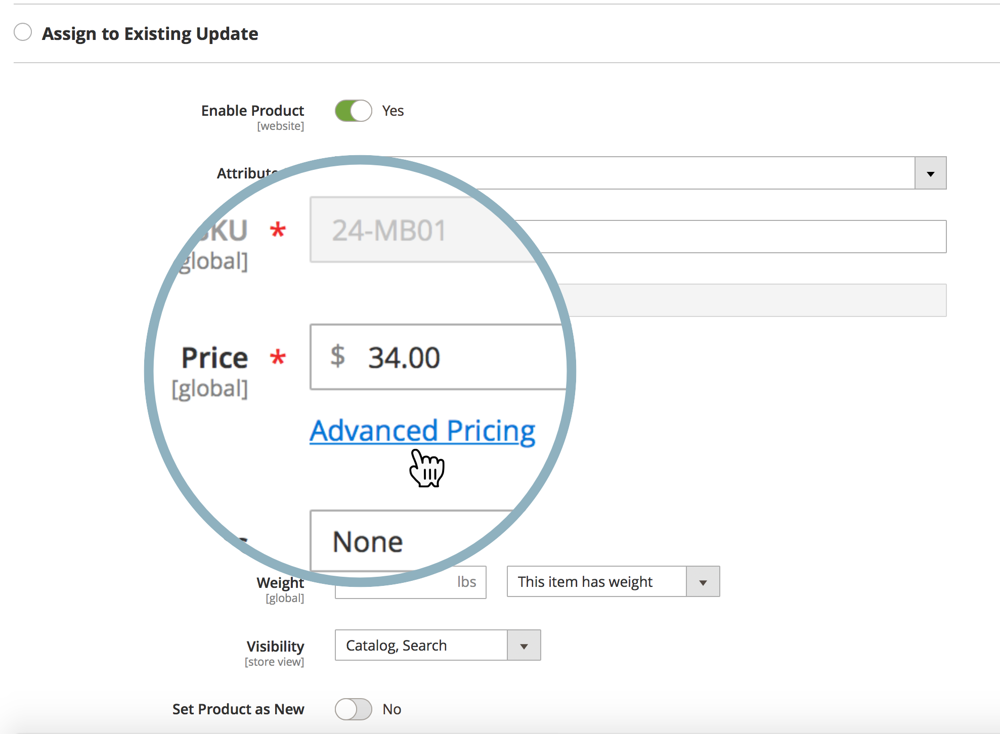
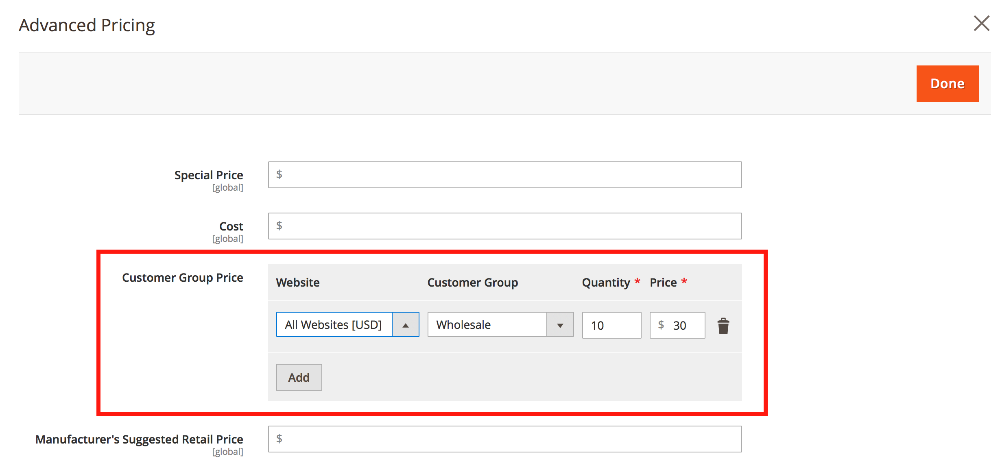

# Posso pianificare gli aggiornamenti di Gestione temporanea dei contenuti per i prezzi in un catalogo condiviso?

Adobe Commerce non offre la funzionalità di pianificazione di un aggiornamento dei prezzi ([Staging dei contenuti](https://experienceleague.adobe.com/docs/commerce-admin/content-design/staging/content-staging.html)) per uno o più prodotti in un catalogo condiviso.

Ciò significa che non è possibile pianificare un aggiornamento del prezzo direttamente dal **Imposta determinazione prezzi e struttura** del pannello di amministrazione di Commerce (non è presente **Pianifica nuovo aggiornamento** in questo menu).

È comunque possibile utilizzare metodi alternativi e pianificare un aggiornamento del prezzo per:

* un gruppo di clienti
* il prezzo base del prodotto

## Pianifica aggiornamento prezzo per un gruppo di clienti

1. Inizio [pianificazione di un nuovo aggiornamento del prodotto](https://experienceleague.adobe.com/docs/commerce-admin/content-design/staging/content-staging-scheduled-update.html).
1. Scorri verso il basso fino a **Prezzo** e fai clic su **Advanced Pricing**.

   {width="600"}

1. In **Sezione Prezzo gruppo di clienti**, seleziona il gruppo di clienti necessario e imposta il prezzo aggiornato.

   {width="700"}

1. Completa la pianificazione dell’aggiornamento come al solito.

In questo flusso di lavoro, è possibile aggiornare il prezzo solo per un singolo prodotto; l’aggiornamento collettivo del prezzo non è disponibile.

Ricorda: i cataloghi condivisi sfruttano i prezzi dei gruppi di clienti.

**Documentazione correlata**

* [Pianificazione di un aggiornamento (Content Staging)](https://experienceleague.adobe.com/docs/commerce-admin/content-design/staging/content-staging-scheduled-update.html) nella guida utente.
* [Advanced Pricing](https://experienceleague.adobe.com/docs/commerce-admin/catalog/products/pricing/pricing-advanced.html) nella guida utente.

## Pianifica aggiornamento prezzo per il prezzo base

Consulta l’articolo correlato: [In che modo la modifica del prezzo di base influisce sul prezzo di catalogo condiviso?](/help/faq/general/base-price-change-affect-on-shared-catalog-price.md) nella nostra knowledge base di supporto.
