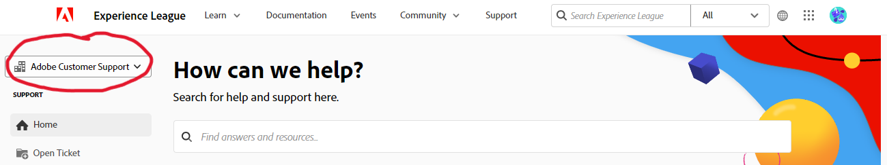
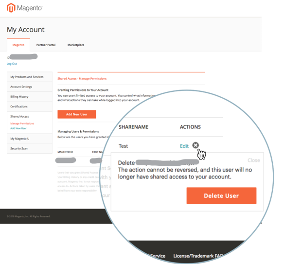

# Guida utente al supporto Experience League per Adobe Commerce

In questa guida, scopri come inviare un ticket di supporto a [Experience League Support](https://experienceleague.adobe.com/home#support) e fornire accesso condiviso agli account Adobe Commerce.

>[!NOTE]
>
>Il supporto Adobe Commerce è migrato dal Centro assistenza Adobe Commerce ad Experience League. Utilizza il flusso del modulo per casi di Experience League descritto [qui](#what-is-experience-support) per inviare casi di supporto.

>[!NOTE]
>
>La parte Knowledge Base del Centro assistenza di Adobe Commerce è stata migrata al portale Adobe Experience League. Quando crei un ticket di supporto, ti verranno suggeriti gli articoli correlati della Knowledge Base, insieme ad altra documentazione pertinente di Adobe Commerce proveniente da Adobe Experience League.

**Aggiornamento principale:** 29 luglio 2024

**[COS&#39;È IL SUPPORTO EXPERIENCE LEAGUE?](#what-is-experience-support)**

**[CASI DI SUPPORTO](#support-cases)**

* [Accedi al supporto Experience League](#sign-in-experience-support)
* [Inviare un caso di supporto](#submit-case)

   * [Pagina iniziale di Adobe Experience League](#experience-league-start-page)
   * [Pagina dell’account Adobe Commerce](#submit-case-adobe-commerce-account-page)
   * [*Verificare l&#39;indirizzo e-mail*](#verify-email-address-error)

* [Tracciare i casi di supporto](#track-support-cases)
* [Commenti nel tuo caso](#comments-in-your-case)
* [Chiudi il caso](#close-case)
* [Riapri il caso](#reopen-case)
* [Inviare un ticket tramite Cloud Console](#cloud-console)
* [Hotline per Adobe Commerce P1](#P1-hotline)
* [Modello operativo per responsabilità condivisa Adobe Commerce](#shared-responsibility-operational-model)

**[ACCESSO CONDIVISO: CONCEDI PRIVILEGI AD ALTRI UTENTI PER ACCEDERE AL TUO ACCOUNT](#shared-access)**

* [Chi può fornire l’accesso condiviso](#who-can-provide-shared-access)
* [Fornire accesso condiviso](#provide-shared-access)
* [Revoca (eliminazione) accesso condiviso](#revoke-shared-access)

   * [Come si eliminano gli utenti a cui è stato concesso l’accesso condiviso tramite un progetto Cloud?](#remove-cloud-shared-access-users)

* [Accedere all’account condiviso (cambiare account)](#switch-accounts)
* [Risoluzione dei problemi di accesso condiviso](#troubleshooting-shared-access)

**[DOMANDE FREQUENTI SULLA FATTURAZIONE PER ADOBE COMMERCE](#billing-faq)**

## COS’È IL SUPPORTO EXPERIENCE LEAGUE? {#what-is-experience-support}

Experience League Support è un portale di supporto, ad Adobe dove i clienti Adobe Commerce idonei possono inviare e gestire ticket di supporto. È anche possibile consultare gli articoli sulla risoluzione dei problemi.

## CASI DI SUPPORTO {#support-cases}

La gestione dei casi di supporto di Adobe Experience League consente di lavorare con il supporto tramite casi per risolvere problemi specifici rilevati durante l’utilizzo di prodotti Adobe, incluso Adobe Commerce, per tutti i prodotti Adobe Commerce sotto contratto.

## ACCEDI AL SUPPORTO EXPERIENCE LEAGUE {#sign-in-experience-support}

L’accesso ti consente di inviare, aggiornare e rispondere alle domande degli agenti sui ticket di supporto.

Per accedere al supporto Adobe Experience League, eseguire la procedura seguente:

1. Passa a [experienceleague.adobe.com](https://experienceleague.adobe.com/).
1. Accedi utilizzando le credenziali di accesso di Adobe.

### Inviare un caso di supporto {#support-case}

Dopo aver effettuato l’accesso, puoi inviare un caso di supporto utilizzando la pagina Home di Adobe Experience League, la pagina dell’account Adobe Commerce e la pagina dell’account Adobe Commerce Cloud.

* Se sei il proprietario dell’account, segui i passaggi indicati di seguito.
* Se si è un utente di Accesso condiviso, è necessario innanzitutto cambiare account. Consulta [Accedere all&#39;account condiviso (cambiare account)](https://experienceleague.adobe.com/en/docs/commerce-knowledge-base/kb/help-center-guide/magento-help-center-user-guide#switch-accounts), quindi puoi procedere ai passaggi seguenti.

#### Pagina iniziale di Adobe Experience League {#experience-league-start-page}

Per inviare un nuovo caso di supporto utilizzando la pagina iniziale di Adobe Experience League, eseguire la procedura seguente:

>[!INFO]
>
>1. Se appartieni a più organizzazioni, dovrai selezionare l’organizzazione appropriata dal menu a discesa.
>1. Per inoltrare un caso, devi avere diritto al supporto. In caso contrario, nella parte superiore della pagina viene visualizzata una barra che informa che non sei un utente autorizzato al supporto nell’organizzazione.

1. Fai clic su **Supporto** nell&#39;intestazione. Verrà aperta la home page del Supporto tecnico.

   

1. Per iniziare il processo di assegnazione del supporto, accertarsi di aver selezionato l&#39;organizzazione appropriata dall&#39;elenco a discesa (se disponibile), poiché è possibile che più organizzazioni con nomi simili, ciascuna con i propri diritti.

   

1. Fare clic su **[!UICONTROL Open Ticket]** nel menu a sinistra o su **[!UICONTROL Get Started]** nella scheda *[!UICONTROL Open a support ticket]*.

   

1. Seleziona un prodotto dal menu a discesa e fornisci il titolo e la descrizione del caso.

   

1. Adobe Experience League ti suggerirà articoli e best practice per risolvere il tuo caso. Se hai ancora bisogno di supporto diretto, dovrai fornire alcune informazioni aggiuntive prima di inviare il caso.

   

1. Dopo aver inserito tutte le informazioni richieste, fare clic su **[!UICONTROL Submit case]**.

>[!IMPORTANT]
>
>Se non riesci a visualizzare l’organizzazione nel menu a discesa organizzazione quando accedi a experienceleague.adobe.com, potrebbe essere necessario sincronizzare il profilo con accounts.magento.com prima di richiedere supporto o gestire un caso di supporto esistente.   
>
>1. Passa a accounts.magento.com e accedi con lo stesso profilo (aziendale, scolastico o personale) che utilizzerai per gestire i casi di supporto in Adobe Experience League. 
>1. Dopo aver effettuato l’accesso al tuo profilo accounts.magento.com, torna a experienceleague.adobe.com e accedi. 
>1. Seleziona la tua organizzazione dal menu a discesa organizzazione. 
>1. Se l’organizzazione non viene ancora visualizzata, contatta l’amministratore di Commerce per ottenere i diritti di delegato del supporto. Per ulteriori informazioni, vedere l&#39;articolo della Guida di [Condivisione account Commerce](https://experienceleague.adobe.com/en/docs/commerce-admin/start/commerce-account/commerce-account-share). 

Per accedere all&#39;Experience League e inviare un caso di supporto è necessario disporre di un account sia su https://account.adobe.com che su https://account.magento.com. Non potrai inviare un caso di supporto finché non avrai effettuato l’accesso.

>[!NOTE]
>
>Se disponi già di un account all’indirizzo https://account.magento.com ma non sei in grado di accedere, potresti non essere stato registrato per un account all’indirizzo https://account.adobe.com, richiesto da agosto 2022.
>
>Per risolvere il problema:
>1. Crea un account all’indirizzo https://account.adobe.com utilizzando lo stesso indirizzo e-mail sul tuo ID MAG.
>1. Vai all’indirizzo https://account.magento.com per collegare il tuo Adobe ID con l’ID MAG.

#### Pagina dell’account Adobe Commerce {#submit-case-adobe-commerce-account-page}

Per inviare un nuovo ticket di supporto utilizzando la pagina dell’account Adobe Commerce, effettua le seguenti operazioni:

1. Accedi al tuo account Adobe Commerce. Consulta [istruzioni dettagliate](https://experienceleague.adobe.com/docs/commerce-admin/start/commerce-account/commerce-account-create.html?lang=en#create-a-commerce-account) nella nostra guida utente.
1. Fare clic sulla scheda **Supporto**.

   {width="800"}

1. La pagina di supporto di Adobe Experience League viene caricata automaticamente.
1. Selezionare **[!UICONTROL Open Ticket]** dal menu di sinistra.
1. Compila i campi.
1. Fai clic su **Invia**.

#### *Verifica il tuo indirizzo e-mail* nella pagina dell&#39;account Adobe Commerce {#verify-email-address-error}

Non potrai inviare un ticket di supporto se ricevi l&#39;errore Verifica il tuo indirizzo e-mail simile a quello riportato di seguito nella pagina [Account Adobe Commerce](https://account.magento.com/).

### Tracciare i casi di supporto {#track-support-case}

I casi di assistenza sono quelli che:

* si sono presentati personalmente.
* sono stati aggiunti a come watcher tramite CC (copia per conoscenza).

#### Visualizza i tuoi casi

Puoi visualizzare i tuoi casi facendo clic su **[!UICONTROL My Cases]** nel menu a sinistra.

#### Cerca casi

Per trovare i casi, digita la query di ricerca nel campo *[!UICONTROL Search]* e premi *Invio* sulla tastiera.

#### Intensifica i casi

Se ritieni che un caso richieda ulteriore attenzione e che il tempo di risposta iniziale sia scaduto, puoi inoltrare il caso. Per farlo,

1. Fare clic su **[!UICONTROL Escalate to management]** in basso a destra del pannello *[!UICONTROL Case Detail]* sul lato destro dello schermo.

   

1. Dopo aver fatto clic su, viene visualizzato un modulo popup. Compila il modulo e fai clic su **[!UICONTROL Escalate]**.

   

   *I motivi per l&#39;escalation possono includere*: abilità di comunicazione dell&#39;agente, conoscenze tecniche dell&#39;agente, richiamata/aggiornamento in attesa, modifica dell&#39;urgenza del problema, risoluzione non soddisfatta delle aspettative o tempo di risoluzione.

#### Aggiungere un controllo sui casi di supporto

Puoi aggiungere dei controlli ai casi di supporto inviati da membri dell’organizzazione. I controllori riceveranno notifiche e-mail quando vengono inviati nuovi casi o quando i casi esistenti vengono aggiornati.

1. Per aggiungere un watcher a un case esistente, apri il case e fai clic sull’icona a forma di matita accanto a &quot;watchers&quot; nel pannello Dettagli case sul lato destro dello schermo.

   

1. Dopo aver fatto clic sulla matita, puoi aggiungere o rimuovere gli osservatori dall’elenco.

   

### Commenti nel tuo caso {#comments-in-your-case}

I commenti nel tuo caso contengono tutti i commenti scritti da te o dal team di supporto Adobe Commerce. I commenti vengono visualizzati dall&#39;ultimo (in alto) al primo (in basso).
Per aggiungere un commento, effettua le seguenti operazioni:

1. Scorri fino alla parte inferiore del biglietto.
1. Scrivere il commento nel campo **[!UICONTROL Comments]** e fare clic su **[!UICONTROL Add comments]**.

### Chiudi il caso {#close-case}

Per chiudere il caso, fai clic su **[!UICONTROL Close case]** in basso a destra del pannello *[!UICONTROL Case Detail]*.

### Riapri il caso {#reopen-case}

Per riaprire il caso, rispondi all’e-mail del nostro sistema di supporto relativa al caso in questione e richiedi all’agente di riaprirlo. Se lo fai entro 14 giorni dalla chiusura del caso, l&#39;agente può riaprire il caso per te. Tuttavia, se è dopo 14 giorni, l&#39;agente dovrà creare un nuovo caso.

### Inviare un ticket tramite Cloud Console {#cloud-console}

Per inviare un nuovo ticket di supporto tramite Cloud Console, effettua le seguenti operazioni:

1. Accedi alla [console cloud](https://console.adobecommerce.com).
1. Selezionare **[!UICONTROL Support]** nel menu utente.
1. La pagina **[!UICONTROL My Tickets]** viene caricata.
1. Fare clic su **[!UICONTROL Submit a ticket]** nell&#39;angolo superiore destro.
1. Compila i campi.
1. Fai clic su **Invia**.
1. Fare clic su **[!UICONTROL Submit]**.

### Hotline per Adobe Commerce P1 {#P1-hotline}

L&#39;articolo della [hotline Adobe Commerce P1](https://experienceleague.adobe.com/docs/commerce-knowledge-base/kb/how-to/adobe-commerce-p1-notification-hotline.html) fornisce i numeri della hotline P1 per Adobe Commerce quando si richiede assistenza durante un incidente P1 e spiega quali informazioni fornire.

### Modello operativo per responsabilità condivisa Adobe Commerce {#shared-responsibility-operational-model}

Vedi l&#39;articolo su [Modello operativo per responsabilità condivisa di Adobe Commerce](https://experienceleague.adobe.com/en/docs/commerce-operations/security-and-compliance/shared-responsibility#operational-responsibilities-summary),
che ha lo scopo di chiarire le responsabilità operative per la nostra offerta Pro Infrastructure.

### Aprire un ticket di follow-up {#follow-up}

L’apertura di un ticket di follow-up garantirà che la questione originale sia collegata al ticket di follow-up per la continuità.

Per aprire un ticket di completamento, fai clic sul collegamento &quot;*crea un completamento*&quot; nella parte inferiore del ticket a cui desideri aggiungere un completamento.

## ACCESSO CONDIVISO: CONCEDI PRIVILEGI AD ALTRI UTENTI PER ACCEDERE AL TUO ACCOUNT {#shared-access}

Puoi concedere un accesso limitato al tuo account per altri titolari di account Adobe Commerce. In particolare, utilizzando la funzionalità **accesso condiviso**, è possibile fornire privilegi ai dipendenti e ai provider di servizi attendibili per utilizzare l&#39;account del Centro assistenza in modo che possano utilizzare i ticket di supporto.

Puoi fornire e gestire l&#39;accesso condiviso utilizzando la pagina del tuo account Adobe Commerce all&#39;indirizzo [https://account.magento.com](https://account.magento.com/).

### Chi può fornire l’accesso condiviso {#who-can-provide-shared-access}

Solo il proprietario dell’account (titolare dell’account principale) con i privilegi indicati di seguito può fornire l’accesso condiviso ad altri utenti.

La gestione degli utenti e del loro accesso è responsabilità del cliente, in particolare nella prospettiva dell’accesso condiviso. Pertanto, il team di supporto Adobe Commerce non può fornire l’accesso condiviso a un account Adobe Commerce per conto di un cliente. I clienti sono invitati ad aggiungere utenti con accesso condiviso, utilizzando la [pagina dell&#39;account Adobe Commerce](https://account.magento.com/).

Gli utenti a cui è stato fornito l’accesso condiviso non possono trasferire o concedere tale accesso ad altri utenti.

### Fornire accesso condiviso {#provide-shared-access}

Consulta la sezione [Condividere un account Commerce](https://experienceleague.adobe.com/en/docs/commerce-admin/start/commerce-account/commerce-account-share) della Guida introduttiva di Adobe Commerce per i passaggi dettagliati sulla configurazione di un account condiviso.

Dopo aver fornito l&#39;accesso condiviso a un nuovo utente, le informazioni correlate sono disponibili in **Accesso condiviso** > **Gestione autorizzazioni** della pagina del tuo account Adobe Commerce.

### Revoca (eliminazione) accesso condiviso {#revoke-shared-access}

1. Accedi al tuo account Adobe Commerce all&#39;indirizzo [https://account.magento.com](https://account.magento.com/).
1. Nel pannello a sinistra, in Accesso condiviso, scegli **Gestisci autorizzazioni.**
1. Trovare l&#39;utente da cui revocare l&#39;accesso condiviso e fare clic sull&#39;icona {width="25"} nella riga dell&#39;utente (**Azioni** colonna).
1. Fai clic su **Elimina utente** per revocare l&#39;accesso o su X nell&#39;angolo superiore per annullare la revoca.

   {width="800"}

   Puoi anche revocare l&#39;accesso condiviso utilizzando il menu **Modifica**:

1. Accedi al tuo account Adobe Commerce all&#39;indirizzo [https://account.magento.com](https://account.magento.com/).
1. Nel pannello a sinistra, in Accesso condiviso, scegli **Gestisci autorizzazioni.**
1. Trovare l&#39;utente da cui revocare l&#39;accesso condiviso e fare clic su **Modifica** nella riga dell&#39;utente (**Azioni** colonna).
1. Fai clic su **Elimina utente** nella parte inferiore della pagina.
1. Nel popup di conferma, fai clic su **Elimina utente** per revocare l&#39;accesso o su X nell&#39;angolo superiore per annullare la revoca.

### Come si eliminano gli utenti a cui è stato concesso l’accesso condiviso tramite un progetto Cloud? {#remove-cloud-shared-access-users}

<u>Prodotti e versioni interessati</u>

* Adobe Commerce Cloud (tutte le versioni)

<u>Causa</u>

Se hai/hai avuto un progetto Adobe Commerce Cloud e hai aggiunto un utente al progetto, ti verrà automaticamente concesso l’accesso condiviso sull’ID immagine del proprietario del progetto. Questo sarebbe normalmente indicato nella colonna **[!UICONTROL Share Name]**, che mostra *Accesso condiviso cloud da MAG[XYZ]*.

Se manca il collegamento DELETE, significa che Accesso condiviso è stato concesso automaticamente tramite Commerce Cloud.

<u>Soluzione</u>

Non è possibile eliminare l&#39;elenco di utenti di Accesso condiviso con il nome di condivisione di *Accesso condiviso cloud da MAG[XYZ]* se l&#39;accesso condiviso non è stato aggiunto o fornito in questa pagina. Questi vengono conservati a scopo informativo/di audit.

Tuttavia, una volta revocate le autorizzazioni per tali utenti di Accesso condiviso, questi non disporranno più di tale accesso.

1. Accedi al tuo account Adobe Commerce all&#39;indirizzo [https://account.magento.com](https://account.magento.com/).
1. Nel pannello a sinistra, in *[!UICONTROL Shared Access]*, scegli **[!UICONTROL Manage Permissions]**.
1. Trovare l&#39;utente da cui revocare l&#39;accesso condiviso e fare clic su **[!UICONTROL Edit]** nella riga dell&#39;utente (*[!UICONTROL Actions]* colonna).
1. Deseleziona tutte le risorse in *[!UICONTROL Grant Account Permissions]*.

{width="800"}

Per ulteriori informazioni, consulta la documentazione [Gestione accesso utente](https://experienceleague.adobe.com/docs/commerce-cloud-service/user-guide/project/user-access.html#manage-users-from-the-project-web-interface) nella guida Commerce on Cloud Infrastructure.

### Accedere all’account condiviso (cambiare account) {#switch-accounts}

Per utilizzare l’accesso condiviso fornito, effettua le seguenti operazioni:

1. Accedi al tuo account Adobe Commerce all&#39;indirizzo [https://account.magento.com](https://account.magento.com/).
1. Fare clic sul menu **Cambia account** e selezionare un account.

   {width="800"}

Per sapere quale account si sta attualmente utilizzando (il proprio account nativo o accesso condiviso), vedere il menu **Cambia account**: viene visualizzato l&#39;account attivo.

### Risoluzione dei problemi di accesso condiviso {#troubleshooting-shared-access}

Consulta l&#39;[articolo sulla risoluzione dei problemi di accesso condiviso](/help/troubleshooting/miscellaneous/shared-access-troubleshooting.md) nella Knowledge Base di supporto.

## DOMANDE FREQUENTI SULLA FATTURAZIONE PER ADOBE COMMERCE {#billing-faq}

I commercianti pagano in genere i nostri servizi con una transazione con carta di credito (CC) e queste [Domande frequenti sulla fatturazione per Adobe Commerce](/help/faq/general/billing-faq-for-adobe-commerce.md) sono una risorsa per aiutarti a pagare la fattura.

