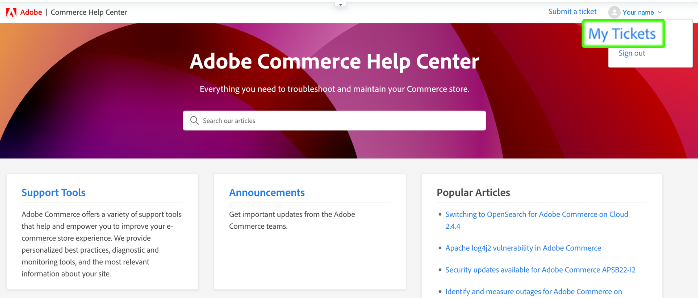
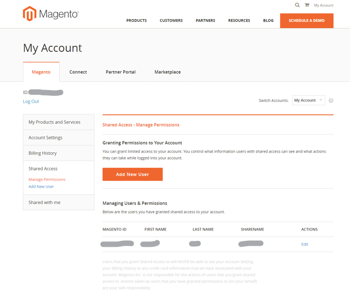

# Guida utente di Adobe Commerce Help Center

In questa guida, scopri come inviare un ticket di supporto al [Centro assistenza Adobe Commerce](https://support.magento.com/hc/en-us) e fornire accesso condiviso agli account Adobe Commerce.

>[!NOTE]
>
>Il supporto Adobe Commerce è in fase di passaggio dall’Help Center di Adobe Commerce all’Experience League. Se hai ricevuto una notifica di accesso, utilizza il flusso del modulo per casi di Experience League descritto [qui](#what-is-experience-support). Se non ricevi alcuna notifica, continua a utilizzare il [flusso di casi del Centro assistenza Adobe Commerce](#what-is-adobe-commerce-help-center).

>[!NOTE]
>
>La parte Knowledge Base del Centro assistenza di Adobe Commerce è stata migrata al portale Adobe Experience League. Quando crei un ticket di supporto, ti verranno suggeriti gli articoli correlati della Knowledge Base, insieme ad altra documentazione pertinente di Adobe Commerce proveniente da Adobe Experience League.

**Aggiornamento principale:** 8 luglio 2024

**[COS&#39;È IL SUPPORTO EXPERIENCE LEAGUE?](#what-is-experience-support)**

**[CASI DI SUPPORTO](#support-cases)**

* [Accedi al supporto Experience League](#sign-in-experience-support)
* [Inviare un caso di supporto](#submit-case)

   * [Pagina iniziale di Adobe Experience League](#experience-league-start-page)
   * [Pagina dell’account Adobe Commerce](#submit-case-adobe-commerce-account-page)
   * [*Verificare l&#39;indirizzo e-mail*](#verify-email-address-error)

* [Tracciare i casi di supporto](#track-support-cases)
* [Commenti nel tuo caso](#comments-in-your-case)
* [Chiudi il caso](#close-case)

**[COS&#39;È IL CENTRO ASSISTENZA ADOBE COMMERCE?](#what-is-adobe-commerce-help-center)**

**[TICKET DI SUPPORTO](#support-tickets)**

* [Accedi All&#39;Help Center](#login)
* [Invia un ticket di supporto](#submit-ticket)

   * [Pagina iniziale del Centro assistenza](#submit-ticket-help-center-start-page)
   * [Pagina Account Magento](#submit-ticket-magento-account-page)
   * [Console cloud](#submit-ticket-magento-cloud-account-page)
   * [Informazioni nel ticket di supporto](#info-in-support-ticket)
   * [Il collegamento &quot;Invia un ticket&quot; non viene visualizzato nella pagina iniziale del Centro assistenza Adobe Commerce](#no-submit-link)
   * [*&quot;Verifica il tuo indirizzo e-mail&quot;*](#verify-email-address)
   * [Modulo di invio biglietto: il commerciante non viene visualizzato nel menu a discesa Organizzazione](#merchant-not-displayed)

* [Tracciare i biglietti](#track-tickets)
* [Hotline di Adobe Commerce P1 (accesso richiesto)](#P1-hotline)
* [Modello operativo per responsabilità condivisa Adobe Commerce (accesso richiesto)](#shared-responsibility-operational-model)
* [Spiegazione dei campi dei ticket di supporto](#ticket-fields-explained)
* [Stato del ticket: modalità di elaborazione delle richieste](#ticket-status)
* [Conversazione nel biglietto](#conversation-in-ticket)
* [Risolvi il tuo ticket](#resolve-ticket)
* [Aprire un ticket di follow-up](#follow-up)

**[ACCESSO CONDIVISO: CONCEDI PRIVILEGI AD ALTRI UTENTI PER ACCEDERE AL TUO ACCOUNT](#shared-access)**

* [Chi può fornire l’accesso condiviso](#who-can-provide-shared-access)
* [Fornire accesso condiviso](#provide-shared-access)
* [Revoca (eliminazione) accesso condiviso](#revoke-shared-access)

   * [Come si eliminano gli utenti a cui è stato concesso l’accesso condiviso tramite un progetto Cloud?](#remove-cloud-shared-access-users)

* [Accedere all’account condiviso (cambiare account)](#switch-accounts)
* [Risoluzione dei problemi di accesso condiviso](#troubleshooting-shared-access)

**[DOMANDE FREQUENTI SULLA FATTURAZIONE PER ADOBE COMMERCE](#billing-faq)**

**[IL MAGENTO U FA ORA PARTE DI ADOBE DIGITAL LEARNING SERVICES](#magento-u)**

>[!NOTE]
>
>A meno che tu non riceva una notifica, continua a utilizzare il [flusso di casi del Centro assistenza Adobe Commerce](#what-is-adobe-commerce-help-center). Se sei stato avvisato di essere nella coorte con accesso, segui l&#39;Experience League di flusso del modulo del caso descritto [di seguito](#what-is-experience-league-support).

## COS’È IL SUPPORTO EXPERIENCE LEAGUE? {#what-is-experience-support}

Experience League Support è un portale di supporto, ad Adobe dove i clienti Adobe Commerce idonei possono inviare e gestire ticket di supporto. È anche possibile consultare gli articoli sulla risoluzione dei problemi.

## CASI DI SUPPORTO {#support-cases}

La gestione dei casi di supporto di Adobe Experience League consente di lavorare con il supporto tramite casi per risolvere problemi specifici rilevati durante l’utilizzo di prodotti Adobe, incluso Adobe Commerce, per tutti i prodotti Adobe Commerce sotto contratto.

## ACCEDI AL SUPPORTO EXPERIENCE LEAGUE {#sign-in-experience-support}

L’accesso ti consente di inviare, aggiornare e rispondere alle domande degli agenti sui ticket di supporto.

Per accedere al supporto Adobe Experience League, eseguire la procedura seguente:

1. Passa a [experienceleague.adobe.com](https://experienceleague.adobe.com/).
1. Accedi utilizzando le credenziali di accesso di Adobe.

### Inviare un caso di supporto {#support-case}

Dopo aver effettuato l’accesso, puoi inviare un caso di supporto utilizzando la pagina Home di Adobe Experience League, la pagina dell’account Adobe Commerce e la pagina dell’account Adobe Commerce Cloud.

* Se sei il proprietario dell’account, segui i passaggi indicati di seguito.
* Se si è un utente di Accesso condiviso, è necessario innanzitutto cambiare account. Consulta [Accedere all&#39;account condiviso (cambiare account)](https://experienceleague.adobe.com/en/docs/commerce-knowledge-base/kb/help-center-guide/magento-help-center-user-guide#switch-accounts), quindi puoi procedere ai passaggi seguenti.

#### Pagina iniziale di Adobe Experience League {#experience-league-start-page}

Per inviare un nuovo caso di supporto utilizzando la pagina iniziale di Adobe Experience League, eseguire la procedura seguente:

>[!NOTE]
>
>1. Se appartieni a più organizzazioni, dovrai selezionare l’organizzazione appropriata dal menu a discesa.
>1. Per inoltrare un caso, devi avere diritto al supporto. In caso contrario, nella parte superiore della pagina viene visualizzata una barra che informa che non sei un utente autorizzato al supporto nell’organizzazione.

1. Fai clic su **Supporto** nell&#39;intestazione. Verrà aperta la pagina home del Supporto tecnico.

   

1. Per avviare il processo di assegnazione del supporto, fare clic su **[!UICONTROL Open Ticket]** nel menu a sinistra oppure su **[!UICONTROL Get Started]** nella scheda *[!UICONTROL Open a support ticket]*.

   

1. Seleziona un prodotto dal menu a discesa e fornisci il titolo e la descrizione del caso.

   

1. Adobe Experience League ti suggerirà articoli e best practice per risolvere il tuo caso. Se hai ancora bisogno di supporto diretto, dovrai fornire alcune informazioni aggiuntive prima di inviare il caso.

   

1. Dopo aver inserito tutte le informazioni richieste, fare clic su **[!UICONTROL Submit case]**.

Per accedere all&#39;Experience League e inviare un caso di supporto è necessario disporre di un account sia su https://account.adobe.com che su https://account.magento.com. Non potrai inviare un caso di supporto finché non avrai effettuato l’accesso.

>[!NOTE]
>
>Se disponi già di un account all’indirizzo https://account.magento.com ma non sei in grado di accedere, potresti non essere stato registrato per un account all’indirizzo https://account.adobe.com, richiesto da agosto 2022.
>
>Per risolvere il problema:
>1. Crea un account all’indirizzo https://account.adobe.com utilizzando lo stesso indirizzo e-mail sul tuo ID MAG.
>1. Vai all’indirizzo https://account.magento.com per collegare il tuo Adobe ID con l’ID MAG.

#### Pagina dell’account Adobe Commerce {#submit-case-adobe-commerce-account-page}

Per inviare un nuovo ticket di supporto utilizzando la pagina dell’account Adobe Commerce, effettua le seguenti operazioni:

1. Accedi al tuo account Adobe Commerce. Consulta [istruzioni dettagliate](https://experienceleague.adobe.com/docs/commerce-admin/start/commerce-account/commerce-account-create.html?lang=en#create-a-commerce-account) nella nostra guida utente.
1. Fare clic sulla scheda **Supporto**.

   {width="800"}

1. La pagina di supporto di Adobe Experience League viene caricata automaticamente.
1. Selezionare **[!UICONTROL Open Ticket]** dal menu di sinistra.
1. Compila i campi.
1. Fai clic su **Invia**.

#### *Verifica il tuo indirizzo e-mail* nella pagina dell&#39;account Adobe Commerce {#verify-email-address-error}

Non potrai inviare un ticket di supporto se ricevi l&#39;errore Verifica il tuo indirizzo e-mail simile a quello riportato di seguito nella pagina [Account Adobe Commerce](https://account.magento.com/).

### Tracciare i casi di supporto {#track-support-case}

I casi di assistenza sono quelli che:

* si sono presentati personalmente.
* sono stati aggiunti a come watcher tramite CC (copia per conoscenza).

#### Visualizza i tuoi casi

Puoi visualizzare i tuoi casi facendo clic su **[!UICONTROL My Cases]** nel menu a sinistra.

#### Cerca casi

Per trovare i casi, digita la query di ricerca nel campo *[!UICONTROL Search]* e premi *Invio* sulla tastiera.

#### Intensifica i casi

Se ritieni che un caso richieda ulteriore attenzione e che il tempo di risposta iniziale sia scaduto, puoi inoltrare il caso. Per farlo,

1. Fare clic su **[!UICONTROL Escalate to management]** in basso a destra del pannello *[!UICONTROL Case Detail]* sul lato destro dello schermo.

   

1. Dopo aver fatto clic su, viene visualizzato un modulo popup. Compila il modulo e fai clic su **[!UICONTROL Escalate]**.

   

   *I motivi per l&#39;escalation possono includere*: abilità di comunicazione dell&#39;agente, conoscenze tecniche dell&#39;agente, richiamata/aggiornamento in attesa, modifica dell&#39;urgenza del problema, risoluzione non soddisfatta delle aspettative o tempo di risoluzione.

#### Aggiungere un controllo sui casi di supporto

Puoi aggiungere dei controlli ai casi di supporto inviati da membri dell’organizzazione. I controllori riceveranno notifiche e-mail quando vengono inviati nuovi casi o quando i casi esistenti vengono aggiornati.

1. Per aggiungere un watcher a un case esistente, apri il case e fai clic sull’icona a forma di matita accanto a &quot;watchers&quot; nel pannello Dettagli case sul lato destro dello schermo.

   

1. Dopo aver fatto clic sulla matita, puoi aggiungere o rimuovere gli osservatori dall’elenco.

   

### Commenti nel tuo caso {#comments-in-your-case}

I commenti nel tuo caso contengono tutti i commenti scritti da te o dal team di supporto Adobe Commerce. I commenti vengono visualizzati dall&#39;ultimo (in alto) al primo (in basso).
Per aggiungere un commento, effettua le seguenti operazioni:

1. Scorri fino alla parte inferiore del biglietto.
1. Scrivere il commento nel campo **[!UICONTROL Comments]** e fare clic su **[!UICONTROL Add comments]**.

### Chiudi il caso {#close-case}

Per chiudere il caso, fai clic su **[!UICONTROL Close case]** in basso a destra del pannello *[!UICONTROL Case Detail]*.

>[!NOTE]
>
>Continua a utilizzare il flusso di moduli del Centro assistenza Adobe Commerce [di seguito](#what-is-adobe-commerce-help-center) per l&#39;invio e la gestione dei ticket a meno che non ti sia stato notificato che sei nella coorte con accesso al flusso di moduli del caso di Experience League descritto [qui](#what-is-experience-league-support).

## CHE COS&#39;È ADOBE COMMERCE HELP CENTER? {#what-is-adobe-commerce-help-center}

Il [Centro assistenza Adobe Commerce](https://support.magento.com/hc/en-us) è un portale di supporto per Adobe Commerce, dove i clienti qualificati possono inviare e gestire ticket di supporto. È anche possibile consultare gli articoli sulla risoluzione dei problemi.

## TICKET DI SUPPORTO {#support-tickets}

Adobe Commerce Ticketing System consente di utilizzare i ticket di supporto per risolvere i problemi specifici che si verificano durante l’utilizzo di Adobe Commerce, per tutti i prodotti Adobe Commerce.

## ACCEDI AL CENTRO ASSISTENZA {#login}

L’accesso consente di inviare, aggiornare e rispondere alle domande degli agenti sui ticket di supporto.

Per accedere al Centro assistenza di Adobe Commerce, effettua le seguenti operazioni:

1. Accedere al Centro assistenza all&#39;indirizzo <https://support.magento.com>.
1. Fai clic su **Accedi** nell&#39;angolo superiore destro.

Usa le credenziali dell&#39;account di Magento per accedere. Per ulteriori informazioni, consulta [L&#39;account di Magento](https://experienceleague.adobe.com/docs/commerce-admin/start/commerce-account/commerce-account-create.html) nella guida utente.

### <strong>Invia un ticket di supporto</strong> {#submit-ticket}

Dopo aver effettuato l’accesso, puoi inviare un ticket di supporto utilizzando la pagina iniziale dell’Help Center, la pagina dell’account di Magento e la pagina dell’account Magento Cloud.

* Se sei il **Proprietario account**, segui i passaggi indicati di seguito.
* Se sei un utente di **Accesso condiviso, devi prima cambiare account** [Accedere all&#39;account condiviso (cambiare account)](#switch-accounts), quindi puoi procedere ai passaggi seguenti.

#### Pagina iniziale del Centro assistenza {#submit-ticket-help-center-start-page}

Per inviare un nuovo ticket di supporto utilizzando la pagina iniziale di Adobe Commerce Help Center, eseguire la procedura seguente:

1. Vai a [Centro assistenza Adobe Commerce](https://support.magento.com/hc/en-us).
1. Fai clic su **Invia un ticket** nell&#39;angolo superiore destro.

   {width="800"}

1. Compila i campi.
1. Fai clic su **Invia**.

*è necessario avere* un account sia su https://account.adobe.com che su https://account.magento.com, quindi accedere al Centro assistenza utilizzando l&#39;account Adobe Commerce per inviare un ticket di supporto. Finché non avrai effettuato l&#39;accesso, [il pulsante **Invia un ticket** non verrà visualizzato](#no-submit-link).

>[!NOTE]
>
>Se disponi già di un account all’indirizzo https://account.magento.com ma non sei in grado di effettuare l’accesso, potresti non essere stato registrato per un account all’indirizzo https://account.adobe.com, richiesto da agosto 2022.
>
>Per risolvere il problema:
>
>1. Crea un account all’indirizzo https://account.adobe.com utilizzando lo stesso indirizzo e-mail sul tuo ID MAG.
>1. Vai all’indirizzo https://account.magento.com per collegare il tuo Adobe ID con l’ID MAG.

#### Pagina Account Magento {#submit-ticket-magento-account-page}

Per inviare un nuovo ticket di supporto utilizzando la pagina dell’account di Magento, effettua le seguenti operazioni:

1. Accedi al tuo account di Magento. Consulta [istruzioni dettagliate](https://experienceleague.adobe.com/docs/commerce-admin/start/commerce-account/commerce-account-create.html?lang=en#create-a-commerce-account) nella nostra guida utente.
1. Fare clic sulla scheda **Supporto**.

   {width="800"}

1. La pagina iniziale dell&#39;Help Center viene caricata automaticamente.
1. Fai clic su **Invia un ticket** nell&#39;angolo superiore destro.
1. Compila i campi.
1. Fai clic su **Invia**.

#### Console cloud {#submit-ticket-magento-cloud-account-page}

Per inviare un nuovo ticket di supporto tramite Cloud Console, effettua le seguenti operazioni:

1. Accedi alla [console cloud](https://console.adobecommerce.com).
1. Selezionare **[!UICONTROL Support]** nel menu utente.
1. La pagina **[!UICONTROL My Tickets]** viene caricata.
1. Fare clic su **[!UICONTROL Submit a ticket]** nell&#39;angolo superiore destro.
1. Compila i campi.
1. Fai clic su **Invia**.
1. Fare clic su **[!UICONTROL Submit]**.

#### Informazioni nel ticket di supporto {#info-in-support-ticket}

I campi contrassegnati con un asterisco rosso ( **\*** ) sono obbligatori e devono essere compilati. Se lasci vuoto uno di questi campi, non potrai inviare il biglietto.

Consulta [I campi ticket spiegati](#ticket-fields-explained) di seguito per informazioni più dettagliate.

### Il collegamento &quot;Invia un ticket&quot; non viene visualizzato nella pagina iniziale del Centro assistenza Adobe Commerce {#no-submit-link}

#### Problema

È possibile accedere all&#39;Help Center di Adobe Commerce e inviare una richiesta di supporto, ma il collegamento **Invia un ticket** non viene visualizzato nella pagina iniziale dell&#39;Help Center.

#### Causa

La causa potrebbe essere una delle seguenti:

* Non è stato eseguito l&#39;accesso all&#39;Help Center.
* Se utilizzi l’accesso condiviso per la prima volta, non hai eseguito i passaggi necessari per garantire che Adobe Commerce Help Center sia configurato correttamente tramite la chiamata SSO da Magento.com.
* Il tuo account non ha diritto al supporto di Adobe Commerce (ad esempio, non sei un cliente Commerce pagante o sei un cliente Open Source).

#### Soluzione

[Accedi al Centro assistenza](/help/help-center-guide/help-center/magento-help-center-user-guide.md#provide-shared-access).

Il collegamento **Invia ticket** verrà visualizzato solo per i clienti con un&#39;e-mail collegata a un contratto di supporto valido.

#### Utilizzo dell’account di accesso condiviso

Per poter utilizzare l’account di accesso condiviso per inviare i ticket di supporto, è necessario eseguire le seguenti operazioni (questa operazione deve essere eseguita solo una volta):

1. Dopo aver ricevuto [l&#39;accesso condiviso](https://support.magento.com/hc/en-us/articles/360052444712#who-can-provide-shared-access), accedi al tuo account di [Magento sul sito Web magento.com](https://account.magento.com/).
1. Nel campo a discesa **Cambia account** nell&#39;angolo in alto a destra, selezionare l&#39;account di accesso condiviso.
1. Fai clic sulla scheda **Supporto** nel pannello a sinistra. In questo modo il Centro assistenza Adobe Commerce sarà configurato correttamente tramite la chiamata SSO da Magento.com al Centro assistenza Adobe Commerce.

#### Non visualizzo ancora il collegamento **Invia un ticket**

Se non si dispone di **Account condivisi** nell&#39;elenco a discesa **Cambia account**, ma si sta lavorando per un client che dispone di una licenza Adobe Commerce, chiedere di concedere l&#39;accesso condiviso. Per ulteriori dettagli, esaminare [Fornire accesso condiviso all&#39;account di Magento](/help/help-center-guide/help-center/magento-help-center-user-guide.md#provide-shared-access).

Se sei un proprietario della licenza di Adobe Commerce, verifica di non disporre di una fattura con stato **Pagamento in sospeso**. I diritti di supporto vengono concessi o revocati automaticamente in base allo stato di pagamento della fattura.

Verifica Dello Stato Dei Pagamenti:

1. Accedi a [magento.com](https://support.magento.com/).
1. Fai clic su **Cronologia fatturazione** a sinistra.
1. Se **hai** una fattura con lo stato **Pagamento in sospeso**, **contatta il tuo Account Team di Adobe** per risolvere il problema relativo al pagamento.

Forniamo supporto solo ai proprietari di licenze Adobe Commerce e agli account con accesso condiviso a un account con una licenza Adobe Commerce. Se hai bisogno di supporto per la versione di Magento Open Source, utilizza queste risorse tecniche di supporto autonomo:

* [Centro assistenza Adobe Commerce](https://support.magento.com/)
* [Documentazione per gli sviluppatori di Adobe Commerce](https://developer.adobe.com/commerce/docs/)
* [Risorse di documentazione di Adobe Commerce](https://experienceleague.adobe.com/docs/commerce.html)
* [Forum di Magenti](https://community.magento.com/?_ga=2.99592990.1084044056.1559046120-720752292.1551793747)

Se si verificano problemi durante l&#39;accesso al proprio account o si ritiene che l&#39;accesso condiviso sia stato configurato correttamente, ma non è ancora possibile visualizzare il pulsante **Invia un ticket**, inviare un&#39;e-mail a [Problemi di accesso all&#39;Help Center](mailto:grp-magento-helpcenterloginissues@adobe.com). Verranno esaminate le impostazioni dell&#39;account e le autorizzazioni per il supporto.

>[!NOTE]
>
>Se riscontri un problema durante l’accesso al progetto cloud, invia il ticket per questo problema tramite i canali regolari. Non inviare un’e-mail se sei in grado di inviare un ticket.

### Errore &quot;Verifica il tuo indirizzo e-mail&quot; nella pagina dell’account del Magento {#verify-email-address}

Non potrai inviare un ticket di supporto se ricevi l&#39;errore *Verifica il tuo indirizzo e-mail* simile a quello riportato di seguito nella [pagina account di Magento](https://account.magento.com/).

{width="800"}

La soluzione consiste nel convalidare il tuo indirizzo e-mail:

1. Accedi a https://account.adobe.com e richiedi una password, se necessario.
1. Verifica il tuo account Adobe.

>[!NOTE]
>
>Questo vale solo per il collegamento di convalida e-mail da https://account.magento.com (pagina Account di Magento).

### Modulo di invio biglietto: il commerciante non viene visualizzato nel menu a discesa Organizzazione {#merchant-not-displayed}

#### Problema

Prerequisiti: disponi di un account di accesso condiviso concesso da un commerciante.

Passaggi da riprodurre:

1. Accedi all&#39;Help Center utilizzando l&#39;account condiviso.
1. Fai clic sul collegamento **Invia un ticket**. Viene aperto il modulo di invio dei ticket.
1. Espandere il campo a discesa **Organizzazione** per selezionare il commerciante.

Risultato previsto:

Il commerciante corrispondente all&#39;account condiviso è elencato nelle opzioni **Organizzazione**.

Risultato effettivo:

Il commerciante corrispondente all&#39;account condiviso utilizzato non è disponibile nelle opzioni **Organizzazione**.

#### Soluzione

Dopo aver ottenuto l’accesso condiviso dal commerciante, devi effettuare le seguenti operazioni (una sola volta):

1. Accedi al tuo account di Magento [ sul sito Web magento.com](https://account.magento.com/).
1. Nel campo a discesa **Cambia account** nell&#39;angolo in alto a destra, selezionare l&#39;account di accesso condiviso.
1. Fai clic sulla scheda **Supporto** nel pannello a sinistra. In questo modo il Centro assistenza Adobe Commerce sarà configurato correttamente tramite la chiamata SSO da Magento.com al Centro assistenza Adobe Commerce.

Se hai già eseguito questa operazione, verifica se ti è stato concesso l&#39;accesso condiviso *da più di un esercente* facendo clic sulla scheda [[!UICONTROL Shared with me] del tuo account](https://account.magento.com/grantor/manage/shared/):
* Se viene elencato un solo [!UICONTROL Share Name], ovvero se è stato concesso un solo commerciante, *non verrà visualizzato un elenco a discesa [!UICONTROL Organization]*.
* Se sono presenti più [!UICONTROL Share Names], è possibile che i diritti del supporto del commerciante siano scaduti perché la licenza è stata precedentemente revocata a causa di problemi di pagamento.

### Tracciare i biglietti {#track-tickets}

I tuoi biglietti sono quelli che:

* hanno inviato personalmente
* sono stati aggiunti a come watcher tramite CC (copia per conoscenza)

#### Visualizza i tuoi biglietti

Per elencare tutti i biglietti, fai clic sul menu del tuo profilo (angolo superiore destro) nella pagina iniziale del Centro assistenza e seleziona **I miei biglietti**.

{width-&quot;800&quot;}

Per passare dai biglietti in corso a quelli in fase di CC, fare clic sulla scheda corrispondente:

* **I miei biglietti**
* **Biglietti in CC**
* **Biglietti organizzazione** (disponibili se il tuo account è associato a più organizzazioni)

Per ordinare i ticket, fare clic sulle intestazioni di colonna **Creato** o **Ultima attività**.

#### Cerca biglietti

Per trovare i ticket, digita la query di ricerca nel campo **Cerca ticket** e premi *Invio* sulla tastiera. Seleziona [uno stato](#ticket-status) per ulteriori filtri.

#### Segui ticket organizzazione

Puoi seguire i ticket di supporto inviati dai membri della tua organizzazione.

Quando segui i biglietti della tua organizzazione:

* è possibile visualizzare i ticket nella scheda **Ticket organizzazione**
* ricevere notifiche e-mail quando vengono inviati nuovi biglietti o quando vengono modificati quelli esistenti

Per seguire/non seguire i ticket di un’organizzazione:

1. Vai alla scheda **I miei biglietti** > **Biglietti organizzazione**.
1. Seleziona un&#39;organizzazione nel menu e fai clic su **Segui/Non seguire**.

### Hotline per Adobe Commerce P1 {#P1-hotline}

**È necessario effettuare l&#39;accesso** per accedere all&#39;articolo della [hotline Adobe Commerce P1](https://experienceleague.adobe.com/docs/commerce-knowledge-base/kb/how-to/adobe-commerce-p1-notification-hotline.html) che fornisce i numeri di hotline P1 per Adobe Commerce quando si richiede assistenza durante un incidente P1 e spiega quali informazioni fornire.

### Modello operativo per responsabilità condivisa Adobe Commerce {#shared-responsibility-operational-model}

Vedi l&#39;articolo su [Modello operativo per responsabilità condivisa di Adobe Commerce](https://experienceleague.adobe.com/en/docs/commerce-operations/security-and-compliance/shared-responsibility#operational-responsibilities-summary),
che ha lo scopo di chiarire le responsabilità operative per la nostra offerta Pro Infrastructure.

### Spiegazione dei campi dei ticket di supporto {#ticket-fields-explained}

#### URL interessato

Crea un collegamento all’ambiente in cui il team di supporto Adobe Commerce potrebbe riscontrare il problema. Assicurati di avviare l’URL con &quot;http://&quot; o &quot;https://&quot;.

#### Allegati

Allega registri, schermate, registrazioni video o qualsiasi altro supporto che possa illustrare meglio il problema.

#### URL backoffice (solo MOM)

L&#39;URL deve iniziare con &quot;https://&quot;. In genere è nel formato: nome del commerciante +&quot;.mcom.magento.com/admin/login&quot;, ad esempio &quot;https://luma.mcom.magento.com/admin/login&quot;.

Puoi anche inserire il collegamento diretto relativo al problema.

#### CC

Messaggi di posta elettronica delle persone che si desidera seguire il ticket, ad esempio *first@e.mail*.

Puoi aggiungere le e-mail delle persone che non hanno un Account di Magento o un account Zendesk; queste persone sono ancora in grado di contribuire alla conversazione nel biglietto.

Per aggiungere più e-mail a CC:

>[!NOTE]
>
>L’utente in CC: deve disporre di un account esistente all’indirizzo https://account.magento.com. In caso contrario, devono innanzitutto crearne uno all’indirizzo https://account.adobe.com e accedere a https://account.magento.com con tale account.

1. Immetti l’e-mail.
1. Premi *Spazio* sulla tastiera per salvare l&#39;e-mail immessa. L’e-mail viene visualizzata in una cornice grigia.\
   
1. Inizia a digitare l’e-mail successiva.
1. Salvare tutte le altre e-mail premendo *Spazio*.

Per eliminare le e-mail da CC: fai clic su **x** in un messaggio e-mail con frame.

#### Prodotto

Seleziona il tipo di prodotto Adobe Commerce con cui stai lavorando:

* Adobe Commerce: il campo **[!UICONTROL Implementation Type]** verrà visualizzato dopo aver selezionato questa opzione (per ulteriori dettagli, vedere di seguito)
* Magento Order Management
* Rapporti di Adobe Commerce: [rapporti avanzati non inclusi](https://experienceleague.adobe.com/docs/commerce-admin/config/general/advanced-reporting.html)
* Adobe Commerce [Servizi di pagamento](https://experienceleague.adobe.com/docs/commerce-merchant-services/payment-services/overview.html)
* Servizi Adobe Commerce: [solo Channel Manager](https://experienceleague.adobe.com/docs/commerce-channels/channel-manager/guide-overview.html)

#### Tipo di implementazione

Questo campo verrà visualizzato solo dopo aver selezionato **[!UICONTROL Product]** = *Adobe Commerce*

Specificare il metodo di distribuzione:

* Cloud: scegli questa opzione solo se utilizzi Adobe Commerce su infrastruttura cloud
* On-premise: *Tutte le istanze con hosting autonomo e [hosting basato su cloud di AWS]* (escluso Adobe Commerce on Cloud)

#### URL progetto cloud

Specifica l&#39;URL per il progetto della console cloud, ad esempio `https://console.adobecommerce.com/<owner-user-name>/<project-ID>`.

Un altro metodo per ottenere l’URL del progetto è il seguente:

1. Accedi alla [console cloud](https://console.adobecommerce.com).
1. Fai clic sul progetto appropriato.
1. Copia l’URL.

#### Motivo del contatto

I motivi del contatto variano a seconda del prodotto. Scegliere il motivo del contatto più adatto ai sintomi che si manifestano. Per ulteriori informazioni sul motivo del contatto da scegliere, consulta l&#39;articolo [Descrizioni motivo contatto ticket di supporto](/help/faq/general/support-ticket-contact-reason-descriptions.md).

#### ID ambiente Adobe Commerce

Questo campo verrà visualizzato solo dopo aver selezionato **[!UICONTROL Contact Reason]** = *Applicazione Adobe Commerce Cloud*, seguito da **Motivo contatto applicazione Adobe Commerce** = *[!DNL Live Search]*.
Vai a **[!UICONTROL System]** > **[!UICONTROL Services]** > **[!UICONTROL Commerce Services Connector]** > **[!UICONTROL SaaS Identifier]** e fornisci *[!UICONTROL Data Space ID]*.

#### Tipo di integrazione (dati) (solo reporting di Adobe Commerce)

Seleziona il tipo di integrazione disponibile in Adobe Commerce Reporting. Questo aiuterà i nostri ingegneri a risolvere in modo più efficiente il problema.

#### Descrizione

Includi una panoramica del problema con il maggior numero di dettagli ragionevolmente possibile.

Fornisci dettagli precisi, passaggi da riprodurre (tranne per l&#39;infrastruttura cloud e on-premise di Adobe Commerce, in cui è presente un campo [Passaggi da riprodurre](#steps) separato) e sintomi del problema o della richiesta. Assicurati di includere eventuali SKU interessate, punti di dati pertinenti e altri collegamenti pertinenti.

#### Ambiente (Adobe Commerce su infrastruttura cloud, Adobe Commerce on-premise, solo Adobe Commerce Reporting and Shipping)

Selezionare il **tipo di ambiente** per il quale si è verificato il problema:

* Sviluppo (**Rami di integrazione**)
* Staging
* Produzione

Per ulteriori informazioni sugli ambienti di infrastruttura cloud di Adobe Commerce, consulta l&#39;articolo [Architettura Pro](https://experienceleague.adobe.com/docs/commerce-cloud-service/user-guide/architecture/pro-architecture.html) nella nostra guida utente.

#### Numero di ordini interessati (solo MOM)

Selezionare l&#39;intervallo di ordini interessati.

Elenco a discesa applicabile solo al prodotto Order Management.

#### Organizzazione

Indica l’organizzazione a cui vuoi associare il biglietto, nel caso in cui lavori con più organizzazioni.

Questo campo viene visualizzato quando l’account è associato a più organizzazioni.

>[!WARNING]
>
>Assicurati di aver selezionato l’organizzazione corretta. Se si seleziona un&#39;organizzazione errata, una terza parte non correlata all&#39;organizzazione sarà in grado di visualizzare informazioni potenzialmente riservate e proprietarie.

>[!NOTE]
>
>L’organizzazione può essere modificata dopo l’invio del ticket. Per modificare l’organizzazione, segui la procedura riportata di seguito.
>
>1. Vai alla colonna di destra del biglietto.
>1. Individua il menu a discesa delle organizzazioni disponibili.
>1. Seleziona l’organizzazione appropriata.
>
>

Inoltre, questo ci consentirebbe di incrociare rapidamente i riferimenti a ticket simili/duplicati/correlati inviati per questa organizzazione in passato e di identificare indizi che potrebbero essere utili per indagare e risolvere il ticket corrente.

Se disponi dell&#39;accesso condiviso a più organizzazioni ma questo campo non è disponibile, fai riferimento al [Modulo di invio ticket: l&#39;esercente non è visualizzato nell&#39;elenco a discesa Organizzazione](https://experienceleague.adobe.com/docs/commerce-knowledge-base/kb/help-center-guide/magento-help-center-user-guide.html#merchant-not-displayed)

#### Nome partner (nome commerciante)

Per i commercianti: **Nome partner** è il nome dell&#39;organizzazione di sviluppo (Adobe Commerce [Partner tecnologico](https://partners.magento.com/portal/directory/?&amp;partner_type=6) o [Partner soluzione](https://partners.magento.com/portal/directory/?&amp;partner_type=1)) che partecipa allo sviluppo del tuo archivio Adobe Commerce.

Per i partner: **Nome commerciante** è il nome del cliente.

#### URL progetto (solo Commerce Cloud)

Collegamento alla [console cloud](https://experienceleague.adobe.com/docs/commerce-cloud-service/user-guide/project/overview.html).

#### Passaggi per la riproduzione (solo Adobe Commerce on-premise e Adobe Commerce su infrastruttura cloud)

Fornisci istruzioni dettagliate per riprodurre il problema, tra cui:

* Passaggi da replicare
* Risultato previsto
* Risultato effettivo

*Consiglio:* Supponiamo che tu stia scrivendo questi passaggi per qualcuno che conosce **niente** su Adobe Commerce:

* Menziona ogni passaggio, anche se sembra semplice e ovvio
* Non fare affidamento sul presupposto che il lettore sappia cosa si intende

Scrivi in un linguaggio semplice, con frasi brevi.

#### Oggetto

Includi una breve panoramica del problema (ad esempio, *Errore 404 in tutte le pagine*).

**Articoli suggeriti:** quando inserisci il termine di ricerca, viene visualizzato un elenco di articoli della documentazione di Adobe Commerce che potrebbero essere correlati al problema. Fare clic su un articolo nell&#39;elenco per aprirlo.

*Consiglio:* gli articoli proposti possono contenere la soluzione che si prevede di ricevere dal team di supporto Adobe Commerce.

#### Versione (Adobe Commerce on-premise, Adobe Commerce on cloud infrastructure and Shipping only)

Seleziona la versione di Adobe Commerce con cui stai richiedendo assistenza. Tutte le versioni supportate di Adobe Commerce sono elencate in alto. Le versioni non supportate sono elencate in basso tra parentesi. Se è in corso la migrazione, seleziona la versione più recente per assicurarti di essere supportato.

Per trovare la versione di Adobe Commerce (infrastruttura cloud), scorri verso il basso la pagina [Console cloud](https://experienceleague.adobe.com/docs/commerce-cloud-service/user-guide/project/overview.html) e controlla nella parte inferiore centrale della finestra.

Se utilizzi [Elasticsearch](https://experienceleague.adobe.com/docs/commerce-operations/installation-guide/prerequisites/search-engine/overview.html) o [OpenSearch](https://experienceleague.adobe.com/docs/commerce-operations/installation-guide/prerequisites/search-engine/aws-opensearch.html), non selezionare questa opzione.

Per ottenere queste informazioni, in Adobe Commerce Admin, vai a **Marketing** > **Live Search** > **Ambiente GraphQL**, scorri verso il basso fino alla fine della pagina, quindi fai clic su **INTESTAZIONI HTTP**.

### Stato del biglietto: modalità di elaborazione dei biglietti {#ticket-status}

Il biglietto può avere uno di questi tre stati.

#### **1. Apri**

Il ticket non è stato risolto ed è in fase di elaborazione da parte del team di supporto Adobe Commerce. Se hai fornito tutte le informazioni che ti aspettavi in un particolare passaggio della conversazione e il passaggio successivo deve essere effettuato dal supporto Adobe Commerce, il tuo ticket è nello stato **Apri**.

#### **2. In attesa della risposta**

Il supporto Adobe Commerce si aspetta di ricevere informazioni da parte tua.

Nella tua risposta, puoi specificare ulteriori dettagli tecnici sul problema, fornire dettagli sull’escalation o dichiarare se la soluzione, offerta dal supporto Adobe Commerce, si è rivelata utile per il problema. Assicurati di fornire le risposte il prima possibile, poiché il supporto Adobe Commerce non può procedere con l&#39;elaborazione del biglietto mentre si trova nello stato **In attesa della risposta**.

Fai riferimento all&#39;articolo [Aggiornamento dei criteri del ciclo di vita dei ticket di supporto Adobe Commerce](/help/help-center-guide/help-center/magento-support-ticket-lifecycle-policy-update.md) per dettagli sui criteri di notifica e tempistica.

#### **3. Risolto**

Il supporto Adobe Commerce ha fornito una soluzione per il problema e hai accettato che sia stato utile. Sei tu che contrassegna il ticket come **Risolto**. Se il problema si verifica di nuovo, è possibile riaprire il ticket, impostandone lo stato su **Apri**.

### Conversazione nel biglietto {#conversation-in-ticket}

La conversazione nel ticket unisce tutti i commenti scritti da te o dal team di supporto Adobe Commerce. I commenti vengono visualizzati dall&#39;ultimo (in alto) al primo (in basso).

Per aggiungere un commento alla conversazione, eseguire la procedura seguente:

1. Scorri fino alla parte inferiore del biglietto.
1. Fare clic sul campo **Aggiungi alla conversazione** per iniziare a scrivere.

   

1. Per aggiungere una persona al commento, specifica l&#39;e-mail nel campo **CC** del campo commento.

   >[!NOTE]
   >
   >L’utente in CC: deve disporre di un account esistente all’indirizzo https://account.magento.com. In caso contrario, devono innanzitutto crearne uno all’indirizzo https://account.adobe.com e accedere a https://account.magento.com con tale account.

   

1. Una volta completato il commento, fai clic su **Invia**.

### Risolvi il tuo ticket {#resolve-ticket}

Per risolvere il ticket, fai clic su **Contrassegna come risolto** nella parte inferiore del ticket.

### Aprire un ticket di follow-up {#follow-up}

L’apertura di un ticket di follow-up garantirà che la questione originale sia collegata al ticket di follow-up per la continuità.

Per aprire un ticket di completamento, fai clic sul collegamento &quot;*crea un completamento*&quot; nella parte inferiore del ticket a cui desideri aggiungere un completamento.

## ACCESSO CONDIVISO: CONCEDI PRIVILEGI AD ALTRI UTENTI PER ACCEDERE AL TUO ACCOUNT {#shared-access}

Puoi concedere un accesso limitato al tuo account per altri titolari di account Adobe Commerce. In particolare, utilizzando la funzionalità **accesso condiviso**, è possibile fornire privilegi ai dipendenti e ai provider di servizi attendibili per utilizzare l&#39;account del Centro assistenza in modo che possano utilizzare i ticket di supporto.

Puoi fornire e gestire l&#39;accesso condiviso utilizzando la pagina del tuo account Adobe Commerce all&#39;indirizzo [https://account.magento.com](https://account.magento.com/).

### Chi può fornire l’accesso condiviso {#who-can-provide-shared-access}

Solo il proprietario dell’account (titolare dell’account principale) con i privilegi indicati di seguito può fornire l’accesso condiviso ad altri utenti.

La gestione degli utenti e del loro accesso è responsabilità del cliente, in particolare nella prospettiva dell’accesso condiviso. Pertanto, il team di supporto Adobe Commerce non può fornire l’accesso condiviso a un account Adobe Commerce per conto di un cliente. I clienti sono invitati ad aggiungere utenti con accesso condiviso, utilizzando la [pagina dell&#39;account Adobe Commerce](https://account.magento.com/).

Gli utenti a cui è stato fornito l’accesso condiviso non possono trasferire o concedere tale accesso ad altri utenti.

### Fornire accesso condiviso {#provide-shared-access}

Consulta la sezione [Condividere un account Commerce](https://experienceleague.adobe.com/en/docs/commerce-admin/start/commerce-account/commerce-account-share) della Guida introduttiva di Adobe Commerce per i passaggi dettagliati sulla configurazione di un account condiviso.

Dopo aver fornito l&#39;accesso condiviso a un nuovo utente, le informazioni correlate sono disponibili in **Accesso condiviso** > **Gestione autorizzazioni** della pagina del tuo account Adobe Commerce.

### Revoca (eliminazione) accesso condiviso {#revoke-shared-access}

1. Accedi al tuo account Adobe Commerce all&#39;indirizzo [https://account.magento.com](https://account.magento.com/).
1. Nel pannello a sinistra, in Accesso condiviso, scegli **Gestisci autorizzazioni.**
1. Trovare l&#39;utente da cui revocare l&#39;accesso condiviso e fare clic sull&#39;icona {width="25"} nella riga dell&#39;utente (**Azioni** colonna).
1. Fai clic su **Elimina utente** per revocare l&#39;accesso o su X nell&#39;angolo superiore per annullare la revoca.

   {width="800"}

   Puoi anche revocare l&#39;accesso condiviso utilizzando il menu **Modifica**:

1. Accedi al tuo account Adobe Commerce all&#39;indirizzo [https://account.magento.com](https://account.magento.com/).
1. Nel pannello a sinistra, in Accesso condiviso, scegli **Gestisci autorizzazioni.**
1. Trovare l&#39;utente da cui revocare l&#39;accesso condiviso e fare clic su **Modifica** nella riga dell&#39;utente (**Azioni** colonna).
1. Fai clic su **Elimina utente** nella parte inferiore della pagina.
1. Nel popup di conferma, fai clic su **Elimina utente** per revocare l&#39;accesso o su X nell&#39;angolo superiore per annullare la revoca.

### Come si eliminano gli utenti a cui è stato concesso l’accesso condiviso tramite un progetto Cloud? {#remove-cloud-shared-access-users}

<u>Prodotti e versioni interessati</u>

* Adobe Commerce Cloud (tutte le versioni)

<u>Causa</u>

Se hai/hai avuto un progetto Adobe Commerce Cloud e hai aggiunto un utente al progetto, ti verrà automaticamente concesso l’accesso condiviso sull’ID immagine del proprietario del progetto. Questo sarebbe normalmente indicato nella colonna **[!UICONTROL Share Name]**, che mostra *Accesso condiviso cloud da MAG[XYZ]*.

Se manca il collegamento DELETE, significa che Accesso condiviso è stato concesso automaticamente tramite Commerce Cloud.

<u>Soluzione</u>

Non è possibile eliminare l&#39;elenco di utenti di Accesso condiviso con il nome di condivisione di *Accesso condiviso cloud da MAG[XYZ]* se l&#39;accesso condiviso non è stato aggiunto o fornito in questa pagina. Questi vengono conservati a scopo informativo/di audit.

Tuttavia, una volta revocate le autorizzazioni per tali utenti di Accesso condiviso, questi non disporranno più di tale accesso.

1. Accedi al tuo account Adobe Commerce all&#39;indirizzo [https://account.magento.com](https://account.magento.com/).
1. Nel pannello a sinistra, in *[!UICONTROL Shared Access]*, scegli **[!UICONTROL Manage Permissions]**.
1. Trovare l&#39;utente da cui revocare l&#39;accesso condiviso e fare clic su **[!UICONTROL Edit]** nella riga dell&#39;utente (*[!UICONTROL Actions]* colonna).
1. Deseleziona tutte le risorse in *[!UICONTROL Grant Account Permissions]*.

{width="800"}

Per ulteriori informazioni, consulta la documentazione [Gestione accesso utente](https://experienceleague.adobe.com/docs/commerce-cloud-service/user-guide/project/user-access.html#manage-users-from-the-project-web-interface) nella guida Commerce on Cloud Infrastructure.

### Accedere all’account condiviso (cambiare account) {#switch-accounts}

Per utilizzare l’accesso condiviso fornito, effettua le seguenti operazioni:

1. Accedi al tuo account Adobe Commerce all&#39;indirizzo [https://account.magento.com](https://account.magento.com/).
1. Fare clic sul menu **Cambia account** e selezionare un account.

   {width="800"}

Per sapere quale account si sta attualmente utilizzando (il proprio account nativo o accesso condiviso), vedere il menu **Cambia account**: viene visualizzato l&#39;account attivo.

### Risoluzione dei problemi di accesso condiviso {#troubleshooting-shared-access}

Consulta l&#39;[articolo sulla risoluzione dei problemi di accesso condiviso](/help/troubleshooting/miscellaneous/shared-access-troubleshooting.md) nella Knowledge Base di supporto.

## DOMANDE FREQUENTI SULLA FATTURAZIONE PER ADOBE COMMERCE {#billing-faq}

I commercianti pagano in genere i nostri servizi con una transazione con carta di credito (CC) e queste [Domande frequenti sulla fatturazione per Adobe Commerce](/help/faq/general/billing-faq-for-adobe-commerce.md) sono una risorsa per aiutarti a pagare la fattura.

## IL MAGENTO U FA ORA PARTE DI ADOBE DIGITAL LEARNING SERVICES {#magento-u}

Il Magento U è stato unito a [Adobe Digital Learning Services (ADLS)](https://learning.adobe.com/).

