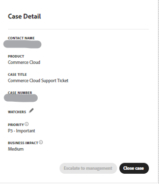
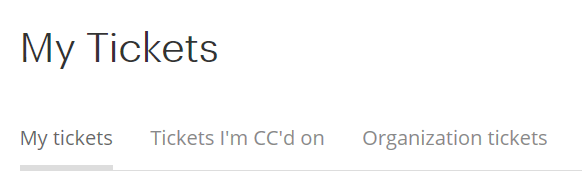
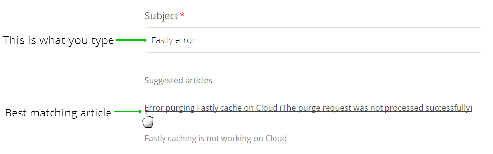

# Guida utente di Adobe Commerce Help Center

In questa guida, scopri come inviare un ticket di supporto al [Centro assistenza Adobe Commerce](https://support.magento.com/hc/en-us) e forniscono accesso condiviso agli account Adobe Commerce.

>[!NOTE]
>
>Il supporto Adobe Commerce è in fase di passaggio dall’Help Center di Adobe Commerce all’Experience League. Se ti è stato notificato che hai accesso, utilizza il flusso del modulo del caso di Experience League descritto [qui](#what-is-experience-support). Se non ricevi alcuna notifica, continua a utilizzare [Flusso dei casi dell&#39;Help Center di Adobe Commerce](#what-is-adobe-commerce-help-center).

>[!NOTE]
>
>La parte Knowledge Base del Centro assistenza di Adobe Commerce è stata migrata al portale Adobe Experience League. Quando crei un ticket di supporto, ti verranno suggeriti gli articoli correlati della Knowledge Base, insieme ad altra documentazione pertinente di Adobe Commerce proveniente da Adobe Experience League.

**Aggiornamento principale:** 8 luglio 2024

**[COS’È IL SUPPORTO EXPERIENCE LEAGUE?](#what-is-experience-support)**

**[CASI DI SUPPORTO](#support-cases)**

* [Accedi al supporto Experience League](#sign-in-experience-support)
* [Inviare un caso di supporto](#submit-case)

   * [Pagina iniziale di Adobe Experience League](#experience-league-start-page)
   * [Pagina dell’account Adobe Commerce](#submit-case-adobe-commerce-account-page)
   * [*Verificare l&#39;indirizzo e-mail*](#verify-email-address-error)

* [Tracciare i casi di supporto](#track-support-cases)
* [Commenti nel tuo caso](#comments-in-your-case)
* [Chiudi il caso](#close-case)

**[COS’È IL CENTRO ASSISTENZA ADOBE COMMERCE?](#what-is-adobe-commerce-help-center)**

**[TICKET DI SUPPORTO](#support-tickets)**

* [Accedi All&#39;Help Center](#login)
* [Invia un ticket di supporto](#submit-ticket)

   * [Pagina iniziale del Centro assistenza](#submit-ticket-help-center-start-page)
   * [Pagina Account Magento](#submit-ticket-magento-account-page)
   * [Console cloud](#submit-ticket-magento-cloud-account-page)
   * [Informazioni nel ticket di supporto](#info-in-support-ticket)
   * [Il collegamento &quot;Invia un ticket&quot; non viene visualizzato nella pagina iniziale del Centro assistenza Adobe Commerce](#no-submit-link)
   * [*&quot;Verifica il tuo indirizzo e-mail&quot;*](#verify-email-address)
   * [Modulo di invio biglietto: il commerciante non viene visualizzato nel menu a discesa Organizzazione](#merchant-not-displayed)

* [Tracciare i biglietti](#track-tickets)
* [Hotline di Adobe Commerce P1 (accesso richiesto)](#P1-hotline)
* [Modello operativo per responsabilità condivisa Adobe Commerce (accesso richiesto)](#shared-responsibility-operational-model)
* [Spiegazione dei campi dei ticket di supporto](#ticket-fields-explained)
* [Stato del ticket: modalità di elaborazione delle richieste](#ticket-status)
* [Conversazione nel biglietto](#conversation-in-ticket)
* [Risolvi il tuo ticket](#resolve-ticket)
* [Aprire un ticket di follow-up](#follow-up)

**[ACCESSO CONDIVISO: CONCEDI PRIVILEGI AD ALTRI UTENTI PER ACCEDERE AL TUO ACCOUNT](#shared-access)**

* [Chi può fornire l’accesso condiviso](#who-can-provide-shared-access)
* [Fornire accesso condiviso](#provide-shared-access)
* [Revoca (eliminazione) accesso condiviso](#revoke-shared-access)

   * [Come si eliminano gli utenti a cui è stato concesso l’accesso condiviso tramite un progetto Cloud?](#remove-cloud-shared-access-users)

* [Accedere all’account condiviso (cambiare account)](#switch-accounts)
* [Risoluzione dei problemi di accesso condiviso](#troubleshooting-shared-access)

**[DOMANDE FREQUENTI SULLA FATTURAZIONE PER ADOBE COMMERCE](#billing-faq)**

**[IL MAGENTO U FA ORA PARTE DI ADOBE DIGITAL LEARNING SERVICES](#magento-u)**

>[!NOTE]
>
>A meno che tu non riceva una notifica, continua a utilizzare [Flusso dei casi dell&#39;Help Center di Adobe Commerce](#what-is-adobe-commerce-help-center). Se ti è stato notificato che sei nella coorte con accesso, segui l’Experience League di flusso del modulo del caso descritto [sotto](#what-is-experience-league-support).

## COS’È IL SUPPORTO EXPERIENCE LEAGUE? {#what-is-experience-support}

Experience League Support è un portale di supporto, ad Adobe dove i clienti Adobe Commerce idonei possono inviare e gestire ticket di supporto. È anche possibile consultare gli articoli sulla risoluzione dei problemi.

## CASI DI SUPPORTO {#support-cases}

La gestione dei casi di supporto di Adobe Experience League consente di lavorare con il supporto tramite casi per risolvere problemi specifici rilevati durante l’utilizzo di prodotti Adobe, incluso Adobe Commerce, per tutti i prodotti Adobe Commerce sotto contratto.

## ACCEDI AL SUPPORTO EXPERIENCE LEAGUE {#sign-in-experience-support}

L’accesso ti consente di inviare, aggiornare e rispondere alle domande degli agenti sui ticket di supporto.

Per accedere al supporto Adobe Experience League, eseguire la procedura seguente:

1. Accedi a [experienceleague.adobe.com](https://experienceleague.adobe.com/).
1. Accedi utilizzando le credenziali di accesso di Adobe.

### Inviare un caso di supporto {#support-case}

Dopo aver effettuato l’accesso, puoi inviare un caso di supporto utilizzando la pagina Home di Adobe Experience League, la pagina dell’account Adobe Commerce e la pagina dell’account Adobe Commerce Cloud.

* Se sei il proprietario dell’account, segui i passaggi indicati di seguito.
* Se si è un utente di Accesso condiviso, è necessario innanzitutto cambiare account. Consulta [Accedere all’account condiviso (cambiare account)](https://experienceleague.adobe.com/en/docs/commerce-knowledge-base/kb/help-center-guide/magento-help-center-user-guide#switch-accounts), quindi procedere ai passaggi seguenti.

#### Pagina iniziale di Adobe Experience League {#experience-league-start-page}

Per inviare un nuovo caso di supporto utilizzando la pagina iniziale di Adobe Experience League, eseguire la procedura seguente:

>[!NOTE]
>
>1. Se appartieni a più organizzazioni, dovrai selezionare l’organizzazione appropriata dal menu a discesa.
>1. Per inoltrare un caso, devi avere diritto al supporto. In caso contrario, nella parte superiore della pagina viene visualizzata una barra che informa che non sei un utente autorizzato al supporto nell’organizzazione.

1. Fai clic su **Supporto** nell’intestazione. Verrà aperta la pagina home del Supporto tecnico.

   

1. Per avviare il processo di assegnazione del supporto, fare clic su **[!UICONTROL Open Ticket]** nel menu a sinistra, oppure fare clic su **[!UICONTROL Get Started]** in *[!UICONTROL Open a support ticket]* Card.

   

1. Seleziona un prodotto dal menu a discesa e fornisci il titolo e la descrizione del caso.

   

1. Adobe Experience League ti suggerirà articoli e best practice per risolvere il tuo caso. Se hai ancora bisogno di supporto diretto, dovrai fornire alcune informazioni aggiuntive prima di inviare il caso.

   

1. Dopo aver inserito tutte le informazioni richieste, fai clic su **[!UICONTROL Submit case]**.

Per accedere all&#39;Experience League e inviare un caso di supporto è necessario disporre di un account sia su https://account.adobe.com che su https://account.magento.com. Non potrai inviare un caso di supporto finché non avrai effettuato l’accesso.

>[!NOTE]
>
>Se disponi già di un account all’indirizzo https://account.magento.com ma non sei in grado di accedere, potresti non essere stato registrato per un account all’indirizzo https://account.adobe.com, richiesto da agosto 2022.
>
>Per risolvere il problema:
>1. Crea un account all’indirizzo https://account.adobe.com utilizzando lo stesso indirizzo e-mail sul tuo ID MAG.
>1. Vai all’indirizzo https://account.magento.com per collegare il tuo Adobe ID con l’ID MAG.

#### Pagina dell’account Adobe Commerce {#submit-case-adobe-commerce-account-page}

Per inviare un nuovo ticket di supporto utilizzando la pagina dell’account Adobe Commerce, effettua le seguenti operazioni:

1. Accedi al tuo account Adobe Commerce. Consulta [istruzioni dettagliate](https://experienceleague.adobe.com/docs/commerce-admin/start/commerce-account/commerce-account-create.html?lang=en#create-a-commerce-account) nella guida utente.
1. Fai clic su **Supporto** scheda.

   {width="800"}

1. La pagina di supporto di Adobe Experience League viene caricata automaticamente.
1. Seleziona **[!UICONTROL Open Ticket]** dal menu di sinistra.
1. Compila i campi.
1. Clic **Invia**.

#### *Verifica il tuo indirizzo email* errore nella pagina dell’account Adobe Commerce {#verify-email-address-error}

Non potrai inviare un ticket di supporto se ricevi l’errore Verifica il tuo indirizzo e-mail simile a quello riportato di seguito sulla [Account Adobe Commerce](https://account.magento.com/) pagina.

### Tracciare i casi di supporto {#track-support-case}

I casi di assistenza sono quelli che:

* si sono presentati personalmente.
* sono stati aggiunti a come watcher tramite CC (copia per conoscenza).

#### Visualizza i tuoi casi

Puoi visualizzare i tuoi casi facendo clic su **[!UICONTROL My Cases]** nel menu di sinistra.

#### Cerca casi

Per trovare i casi, digita la query di ricerca nel *[!UICONTROL Search]* field e press *Invio* sulla tastiera.

#### Intensifica i casi

Se ritieni che un caso richieda ulteriore attenzione e che il tempo di risposta iniziale sia scaduto, puoi inoltrare il caso. Per farlo,

1. Fai clic su **[!UICONTROL Escalate to management]** in basso a destra del *[!UICONTROL Case Detail]* sul lato destro dello schermo.

   

1. Dopo aver fatto clic su, viene visualizzato un modulo popup. Compila il modulo e fai clic su **[!UICONTROL Escalate]**.

   

   *I motivi dell&#39;escalation possono includere*: abilità di comunicazione dell’agente, conoscenze tecniche dell’agente, richiamata/aggiornamento in attesa, modifica dell’urgenza del problema, risoluzione non rispondente alle aspettative o tempo di risoluzione.

#### Aggiungere un controllo sui casi di supporto

Puoi aggiungere dei controlli ai casi di supporto inviati da membri dell’organizzazione. I controllori riceveranno notifiche e-mail quando vengono inviati nuovi casi o quando i casi esistenti vengono aggiornati.

1. Per aggiungere un watcher a un case esistente, apri il case e fai clic sull’icona a forma di matita accanto a &quot;watchers&quot; nel pannello Dettagli case sul lato destro dello schermo.

   

1. Dopo aver fatto clic sulla matita, puoi aggiungere o rimuovere gli osservatori dall’elenco.

   

### Commenti nel tuo caso {#comments-in-your-case}

I commenti nel tuo caso contengono tutti i commenti scritti da te o dal team di supporto Adobe Commerce. I commenti vengono visualizzati dall&#39;ultimo (in alto) al primo (in basso).
Per aggiungere un commento, effettua le seguenti operazioni:

1. Scorri fino alla parte inferiore del biglietto.
1. Scrivi il commento in **[!UICONTROL Comments]** e fai clic su **[!UICONTROL Add comments]**.

### Chiudi il caso {#close-case}

Per chiudere il caso, fare clic su **[!UICONTROL Close case]** in basso a destra del *[!UICONTROL Case Detail]* pannello.

>[!NOTE]
>
>Continua a utilizzare il flusso di moduli di Adobe Commerce Help Center [sotto](#what-is-adobe-commerce-help-center) per l’invio e la gestione dei ticket, a meno che non ti sia stato comunicato di essere nella coorte con accesso al flusso del modulo per i casi di Experience League descritto [qui](#what-is-experience-league-support).

## CHE COS&#39;È ADOBE COMMERCE HELP CENTER? {#what-is-adobe-commerce-help-center}

Il [Centro assistenza Adobe Commerce](https://support.magento.com/hc/en-us) è un portale di supporto per Adobe Commerce, dove i clienti qualificati possono inviare e gestire ticket di supporto. È anche possibile consultare gli articoli sulla risoluzione dei problemi.

## TICKET DI SUPPORTO {#support-tickets}

Adobe Commerce Ticketing System consente di utilizzare i ticket di supporto per risolvere i problemi specifici che si verificano durante l’utilizzo di Adobe Commerce, per tutti i prodotti Adobe Commerce.

## ACCEDI AL CENTRO ASSISTENZA {#login}

L’accesso consente di inviare, aggiornare e rispondere alle domande degli agenti sui ticket di supporto.

Per accedere al Centro assistenza di Adobe Commerce, effettua le seguenti operazioni:

1. Accedi all’Help Center all’indirizzo <https://support.magento.com>.
1. Clic **Accedi** nell’angolo superiore destro.

Usa le credenziali dell&#39;account di Magento per accedere. Per ulteriori informazioni, consulta [Account di Magento](https://experienceleague.adobe.com/docs/commerce-admin/start/commerce-account/commerce-account-create.html) nella guida utente.

### <strong>Invia un ticket di supporto</strong> {#submit-ticket}

Dopo aver effettuato l’accesso, puoi inviare un ticket di supporto utilizzando la pagina iniziale dell’Help Center, la pagina dell’account di Magento e la pagina dell’account Magento Cloud.

* Se sei il **Proprietario account** segui la procedura indicata di seguito.
* Se sei un **utente di Shared Access, è necessario cambiare prima gli account** [Accedere all’account condiviso (cambiare account)](#switch-accounts), quindi procedere ai passaggi seguenti.

#### Pagina iniziale del Centro assistenza {#submit-ticket-help-center-start-page}

Per inviare un nuovo ticket di supporto utilizzando la pagina iniziale di Adobe Commerce Help Center, eseguire la procedura seguente:

1. Vai a [Centro assistenza Adobe Commerce](https://support.magento.com/hc/en-us).
1. Clic **Invia un ticket** nell&#39;angolo superiore destro.

   {width="800"}

1. Compila i campi.
1. Clic **Invia**.

Tu *deve avere* un account su https://account.adobe.com e https://account.magento.com, quindi accedi all’Help Center utilizzando il tuo account Adobe Commerce per inviare un ticket di supporto. Fino a quando non hai effettuato l’accesso [il **Invia un ticket** il pulsante non viene visualizzato](#no-submit-link).

>[!NOTE]
>
>Se disponi già di un account all’indirizzo https://account.magento.com ma non sei in grado di effettuare l’accesso, potresti non essere stato registrato per un account all’indirizzo https://account.adobe.com, richiesto da agosto 2022.
>
>Per risolvere il problema:
>
>1. Crea un account all’indirizzo https://account.adobe.com utilizzando lo stesso indirizzo e-mail sul tuo ID MAG.
>1. Vai all’indirizzo https://account.magento.com per collegare il tuo Adobe ID con l’ID MAG.

#### Pagina Account Magento {#submit-ticket-magento-account-page}

Per inviare un nuovo ticket di supporto utilizzando la pagina dell’account di Magento, effettua le seguenti operazioni:

1. Accedi al tuo account di Magento. Consulta [istruzioni dettagliate](https://experienceleague.adobe.com/docs/commerce-admin/start/commerce-account/commerce-account-create.html?lang=en#create-a-commerce-account) nella guida utente.
1. Fai clic su **Supporto** scheda.

   {width="800"}

1. La pagina iniziale dell&#39;Help Center viene caricata automaticamente.
1. Clic **Invia un ticket** nell’angolo superiore destro.
1. Compila i campi.
1. Clic **Invia**.

#### Console cloud {#submit-ticket-magento-cloud-account-page}

Per inviare un nuovo ticket di supporto tramite Cloud Console, effettua le seguenti operazioni:

1. Accedi a [Console cloud](https://console.adobecommerce.com).
1. Seleziona **[!UICONTROL Support]** nel menu utente.
1. Il **[!UICONTROL My Tickets]** caricamento della pagina.
1. Clic **[!UICONTROL Submit a ticket]** nell’angolo superiore destro.
1. Compila i campi.
1. Clic **Invia**.
1. Clic **[!UICONTROL Submit]**.

#### Informazioni nel ticket di supporto {#info-in-support-ticket}

I campi contrassegnati da un asterisco rosso ( **\*** ), sono obbligatori e devono essere compilati. Se lasci vuoto uno di questi campi, non potrai inviare il biglietto.

Consulta [Spiegazione dei campi dei biglietti](#ticket-fields-explained) per informazioni più dettagliate.

### Il collegamento &quot;Invia un ticket&quot; non viene visualizzato nella pagina iniziale del Centro assistenza Adobe Commerce {#no-submit-link}

#### Problema

Accedi all’Help Center di Adobe Commerce e desideri inviare una richiesta di supporto, ma il **Invia un ticket** non viene visualizzato nella pagina iniziale del Centro assistenza.

#### Causa

La causa potrebbe essere una delle seguenti:

* Non è stato eseguito l&#39;accesso all&#39;Help Center.
* Se utilizzi l’accesso condiviso per la prima volta, non hai eseguito i passaggi necessari per garantire che Adobe Commerce Help Center sia configurato correttamente tramite la chiamata SSO da Magento.com.
* Il tuo account non ha diritto al supporto di Adobe Commerce (ad esempio, non sei un cliente Commerce pagante o sei un cliente Open Source).

#### Soluzione

[Accedi all&#39;Help Center](/help/help-center-guide/help-center/magento-help-center-user-guide.md#provide-shared-access).

Il **Invia un ticket** il collegamento viene visualizzato solo per i clienti che dispongono di un’e-mail collegata a un contratto di supporto valido.

#### Utilizzo dell’account di accesso condiviso

Per poter utilizzare l’account di accesso condiviso per inviare i ticket di supporto, è necessario eseguire le seguenti operazioni (questa operazione deve essere eseguita solo una volta):

1. Dopo la ricezione [accesso condiviso](https://support.magento.com/hc/en-us/articles/360052444712#who-can-provide-shared-access), accedere al [Account di Magento sul sito Web magento.com](https://account.magento.com/).
1. In **Cambia account** in alto a destra, seleziona l’account di accesso condiviso.
1. Fai clic sul pulsante **Supporto** nel pannello sinistro. In questo modo il Centro assistenza Adobe Commerce sarà configurato correttamente tramite la chiamata SSO da Magento.com al Centro assistenza Adobe Commerce.

#### Ancora non vedo il **Invia un ticket** link

Se non hai **Account condivisi** sotto **Cambia account** ma si sta lavorando per un cliente che dispone di una licenza Adobe Commerce, chiedere di concedere l&#39;accesso condiviso. Per ulteriori dettagli, consulta [Fornire accesso condiviso all’account di Magento](/help/help-center-guide/help-center/magento-help-center-user-guide.md#provide-shared-access).

Se sei un proprietario della licenza di Adobe Commerce, verifica di non disporre di una fattura con **Pagamento in sospeso** stato. I diritti di supporto vengono concessi o revocati automaticamente in base allo stato di pagamento della fattura.

Come Controllare Lo Stato Del Pagamento:

1. Accedi a [magento.com](https://support.magento.com/).
1. Fai clic su **Cronologia fatturazione** a sinistra.
1. Se **fare** avere una fattura con **Pagamento in sospeso** stato, **contatta il team del tuo account Adobe** per risolvere il problema relativo al pagamento.

Forniamo supporto solo ai proprietari di licenze Adobe Commerce e agli account con accesso condiviso a un account con una licenza Adobe Commerce. Se hai bisogno di supporto per la versione di Magento Open Source, utilizza queste risorse tecniche di supporto autonomo:

* [Centro assistenza Adobe Commerce](https://support.magento.com/)
* [Documentazione per gli sviluppatori di Adobe Commerce](https://developer.adobe.com/commerce/docs/)
* [Risorse per la documentazione di Adobe Commerce](https://experienceleague.adobe.com/docs/commerce.html)
* [Forum Magenti](https://community.magento.com/?_ga=2.99592990.1084044056.1559046120-720752292.1551793747)

Se si verificano problemi durante l&#39;accesso al proprio account o si ritiene che l&#39;accesso condiviso sia stato configurato correttamente, ma non è ancora possibile visualizzare **Invia un ticket** pulsante, invia un&#39;e-mail [Problemi di accesso all’Help Center](mailto:grp-magento-helpcenterloginissues@adobe.com)e saremo lieti di rivedere le impostazioni del tuo account e le adesioni per il supporto.

>[!NOTE]
>
>Se riscontri un problema durante l’accesso al progetto cloud, invia il ticket per questo problema tramite i canali regolari. Non inviare un’e-mail se sei in grado di inviare un ticket.

### Errore &quot;Verifica il tuo indirizzo e-mail&quot; nella pagina dell’account del Magento {#verify-email-address}

Non potrai inviare un ticket di supporto se ricevi il *Verifica il tuo indirizzo email* errore simile a quello riportato di seguito nella [Pagina Account Magento](https://account.magento.com/).

{width="800"}

La soluzione consiste nel convalidare il tuo indirizzo e-mail:

1. Accedi a https://account.adobe.com e richiedi una password, se necessario.
1. Verifica il tuo account Adobe.

>[!NOTE]
>
>Questo vale solo per il collegamento di convalida e-mail da https://account.magento.com (pagina Account di Magento).

### Modulo di invio biglietto: il commerciante non viene visualizzato nel menu a discesa Organizzazione {#merchant-not-displayed}

#### Problema

Prerequisiti: disponi di un account di accesso condiviso concesso da un esercente.

Passaggi da riprodurre:

1. Accedi all&#39;Help Center utilizzando l&#39;account condiviso.
1. Fai clic su **Invia un ticket** collegamento. Viene aperto il modulo di invio dei ticket.
1. Espandi **Organizzazione** per selezionare il commerciante.

Risultato previsto:

L’esercente corrispondente all’account condiviso è elencato nel **Organizzazione** opzioni.

Risultato effettivo:

L’esercente corrispondente all’account condiviso utilizzato non è disponibile nel **Organizzazione** opzioni.

#### Soluzione

Dopo aver ottenuto l’accesso condiviso dal commerciante, devi effettuare le seguenti operazioni (una sola volta):

1. Accedi al tuo [Account di Magento sul sito Web magento.com](https://account.magento.com/).
1. In **Cambia account** in alto a destra, seleziona l’account di accesso condiviso.
1. Fai clic sul pulsante **Supporto** nel pannello sinistro. In questo modo il Centro assistenza Adobe Commerce sarà configurato correttamente tramite la chiamata SSO da Magento.com al Centro assistenza Adobe Commerce.

Se hai già eseguito questa operazione, controlla se ti è stato concesso *accesso condiviso da più esercenti* facendo clic sul pulsante [[!UICONTROL Shared with me] scheda sul tuo account](https://account.magento.com/grantor/manage/shared/):
* Se solo uno [!UICONTROL Share Name] è elencato, ovvero è stato concesso da un solo commerciante, *non vedrai un [!UICONTROL Organization] elenco a discesa*.
* Se sono presenti più [!UICONTROL Share Names]Tuttavia, i diritti all&#39;aiuto del commerciante potrebbero essere scaduti perché la licenza era stata precedentemente revocata a causa di problemi di pagamento.

### Tracciare i biglietti {#track-tickets}

I tuoi biglietti sono quelli che:

* hanno inviato personalmente
* sono stati aggiunti a come watcher tramite CC (copia per conoscenza)

#### Visualizza i tuoi biglietti

Per elencare tutti i biglietti, fai clic sul menu del tuo profilo (angolo superiore destro) nella pagina iniziale del Centro assistenza e seleziona **I miei biglietti**.

{width-&quot;800&quot;}

Per passare dai biglietti in corso a quelli in fase di CC, fare clic sulla scheda corrispondente:

* **I miei biglietti**
* **Biglietti con licenza CC**
* **Ticket organizzazione** (disponibile se l’account è associato a più organizzazioni)

Per ordinare i ticket, fai clic su **Creato** o **Ultima attività** intestazioni di colonna.

#### Cerca biglietti

Per trovare i ticket, digita la query di ricerca nella **Cerca ticket** field e press *Invio* sulla tastiera. Seleziona [uno stato](#ticket-status) per ulteriori filtri.

#### Segui ticket organizzazione

Puoi seguire i ticket di supporto inviati dai membri della tua organizzazione.

Quando segui i biglietti della tua organizzazione:

* può visualizzare i ticket all’interno di **Ticket organizzazione** scheda
* ricevere notifiche e-mail quando vengono inviati nuovi biglietti o quando vengono modificati quelli esistenti

Per seguire/non seguire i ticket di un’organizzazione:

1. Vai a **I miei biglietti** > **Ticket organizzazione** scheda.
1. Seleziona un’organizzazione nel menu e fai clic su **Segui/Non seguire**.

### Hotline per Adobe Commerce P1 {#P1-hotline}

**È necessario effettuare l&#39;accesso** per accedere a [Hotline per Adobe Commerce P1](https://experienceleague.adobe.com/docs/commerce-knowledge-base/kb/how-to/adobe-commerce-p1-notification-hotline.html) articolo che fornisce i numeri di hotline P1 per Adobe Commerce quando si cerca aiuto durante un incidente P1 e spiega quali informazioni fornire.

### Modello operativo per responsabilità condivisa Adobe Commerce {#shared-responsibility-operational-model}

Vedi l’articolo su [Modello operativo per responsabilità condivisa Adobe Commerce](https://experienceleague.adobe.com/en/docs/commerce-operations/security-and-compliance/shared-responsibility#operational-responsibilities-summary), che mira a chiarire le responsabilità operative per la sola offerta Pro Infrastructure.

### Spiegazione dei campi dei ticket di supporto {#ticket-fields-explained}

#### URL interessato

Crea un collegamento all’ambiente in cui il team di supporto Adobe Commerce potrebbe riscontrare il problema. Assicurati di avviare l’URL con &quot;http://&quot; o &quot;https://&quot;.

#### Allegati

Allega registri, schermate, registrazioni video o qualsiasi altro supporto che possa illustrare meglio il problema.

#### URL backoffice (solo MOM)

L&#39;URL deve iniziare con &quot;https://&quot;. In genere è nel formato: nome del commerciante +&quot;.mcom.magento.com/admin/login&quot;, ad esempio &quot;https://luma.mcom.magento.com/admin/login&quot;.

Puoi anche inserire il collegamento diretto relativo al problema.

#### CC

E-mail delle persone che desideri seguire il biglietto (ad esempio, *first@e.mail*).

Puoi aggiungere le e-mail delle persone che non hanno un Account di Magento o un account Zendesk; queste persone sono ancora in grado di contribuire alla conversazione nel biglietto.

Per aggiungere più e-mail a CC:

>[!NOTE]
>
>L’utente in CC: deve disporre di un account esistente all’indirizzo https://account.magento.com. In caso contrario, devono innanzitutto crearne uno all’indirizzo https://account.adobe.com e accedere a https://account.magento.com con tale account.

1. Immetti l’e-mail.
1. Premi *Spazio* sulla tastiera per salvare l’e-mail immessa. L’e-mail viene visualizzata in una cornice grigia.\
   
1. Inizia a digitare l’e-mail successiva.
1. Salva tutte le altre e-mail premendo *Spazio*.

Per eliminare le e-mail da CC: fai clic su **x** in un messaggio e-mail con frame.

#### Prodotto

Seleziona il tipo di prodotto Adobe Commerce con cui stai lavorando:

* Adobe Commerce: The **[!UICONTROL Implementation Type]** dopo aver selezionato questa opzione verrà visualizzato il campo (vedi di seguito per i dettagli)
* Magento Order Management
* Rapporti di Adobe Commerce: non inclusi [Reporting avanzato](https://experienceleague.adobe.com/docs/commerce-admin/config/general/advanced-reporting.html)
* Adobe Commerce [Servizi di pagamento](https://experienceleague.adobe.com/docs/commerce-merchant-services/payment-services/overview.html)
* Servizi Adobe Commerce: [Channel Manager](https://experienceleague.adobe.com/docs/commerce-channels/channel-manager/guide-overview.html) solo

#### Tipo di implementazione

Questo campo verrà visualizzato solo dopo aver selezionato **[!UICONTROL Product]** = *Adobe Commerce*

Specificare il metodo di distribuzione:

* Cloud: scegli questa opzione solo se utilizzi Adobe Commerce su infrastruttura cloud
* Locale: *Tutte le istanze self-hosted e [AWS] hosting basato su cloud* (escluso Adobe Commerce su Cloud)

#### URL progetto cloud

Specifica l’URL per il progetto Cloud Console, ad esempio: `https://console.adobecommerce.com/<owner-user-name>/<project-ID>`.

Un altro metodo per ottenere l’URL del progetto è il seguente:

1. Accedi a [Console cloud](https://console.adobecommerce.com).
1. Fai clic sul progetto appropriato.
1. Copia l’URL.

#### Motivo del contatto

I motivi del contatto variano a seconda del prodotto. Scegliere il motivo del contatto più adatto ai sintomi che si manifestano. Consulta la sezione [Descrizioni dei motivi del contatto del ticket di supporto](/help/faq/general/support-ticket-contact-reason-descriptions.md) articolo per ulteriori informazioni sul motivo del contatto da scegliere.

#### ID ambiente Adobe Commerce

Questo campo verrà visualizzato solo dopo aver selezionato **[!UICONTROL Contact Reason]** = *Applicazione Adobe Commerce Cloud*, seguito da **Motivo contatto applicazione Adobe Commerce** = *[!DNL Live Search]*.
Vai a **[!UICONTROL System]** > **[!UICONTROL Services]** > **[!UICONTROL Commerce Services Connector]** > **[!UICONTROL SaaS Identifier]** e forniscono *[!UICONTROL Data Space ID]*.

#### Tipo di integrazione (dati) (solo reporting di Adobe Commerce)

Seleziona il tipo di integrazione disponibile in Adobe Commerce Reporting. Questo aiuterà i nostri ingegneri a risolvere in modo più efficiente il problema.

#### Descrizione

Includi una panoramica del problema con il maggior numero di dettagli ragionevolmente possibile.

Fornisci dettagli precisi e passaggi da riprodurre (tranne per l’infrastruttura on-premise e cloud di Adobe Commerce, in cui è presente un [Passaggi da riprodurre](#steps) ) e i sintomi del problema o della richiesta. Assicurati di includere eventuali SKU interessate, punti di dati pertinenti e altri collegamenti pertinenti.

#### Ambiente (Adobe Commerce su infrastruttura cloud, Adobe Commerce on-premise, solo Adobe Commerce Reporting and Shipping)

Seleziona la **tipo di ambiente** su cui si affronta il problema:

* Sviluppo (**Rami di integrazione**)
* Staging
* Produzione

Ulteriori informazioni su Adobe Commerce sugli ambienti dell’infrastruttura cloud in [Architettura Pro](https://experienceleague.adobe.com/docs/commerce-cloud-service/user-guide/architecture/pro-architecture.html) nella guida utente.

#### Numero di ordini interessati (solo MOM)

Selezionare l&#39;intervallo di ordini interessati.

Elenco a discesa applicabile solo al prodotto Order Management.

#### Organizzazione

Indica l’organizzazione a cui vuoi associare il biglietto, nel caso in cui lavori con più organizzazioni.

Questo campo viene visualizzato quando l’account è associato a più organizzazioni.

>[!WARNING]
>
>Assicurati di aver selezionato l’organizzazione corretta. Se si seleziona un&#39;organizzazione errata, una terza parte non correlata all&#39;organizzazione sarà in grado di visualizzare informazioni potenzialmente riservate e proprietarie.

>[!NOTE]
>
>L’organizzazione può essere modificata dopo l’invio del ticket. Per modificare l’organizzazione, segui la procedura riportata di seguito.
>
>1. Vai alla colonna di destra del biglietto.
>1. Individua il menu a discesa delle organizzazioni disponibili.
>1. Seleziona l’organizzazione appropriata.
>
>

Inoltre, questo ci consentirebbe di incrociare rapidamente i riferimenti a ticket simili/duplicati/correlati inviati per questa organizzazione in passato e di identificare indizi che potrebbero essere utili per indagare e risolvere il ticket corrente.

Se si dispone dell&#39;accesso condiviso a più organizzazioni ma questo campo non è disponibile, fare riferimento a [Modulo di invio biglietto: il commerciante non viene visualizzato nel menu a discesa Organizzazione](https://experienceleague.adobe.com/docs/commerce-knowledge-base/kb/help-center-guide/magento-help-center-user-guide.html#merchant-not-displayed)

#### Nome partner (nome commerciante)

Per i commercianti: **Nome partner** è il nome dell’organizzazione di sviluppo (Adobe Commerce [Partner tecnologico](https://partners.magento.com/portal/directory/?&amp;partner_type=6) o [Partner della soluzione](https://partners.magento.com/portal/directory/?&amp;partner_type=1)) che partecipano allo sviluppo del tuo store Adobe Commerce.

Per i partner: **Nome commerciante** è il nome del cliente.

#### URL progetto (solo Commerce Cloud)

Collegamento a [Console cloud](https://experienceleague.adobe.com/docs/commerce-cloud-service/user-guide/project/overview.html).

#### Passaggi per la riproduzione (solo Adobe Commerce on-premise e Adobe Commerce su infrastruttura cloud)

Fornisci istruzioni dettagliate per riprodurre il problema, tra cui:

* Passaggi da replicare
* Risultato previsto
* Risultato effettivo

*Consiglio:* Supponiamo che tu stia scrivendo questi passaggi per qualcuno che conosce **niente** Adobe Commerce:

* Menziona ogni passaggio, anche se sembra semplice e ovvio
* Non fare affidamento sul presupposto che il lettore sappia cosa si intende

Scrivi in un linguaggio semplice, con frasi brevi.

#### Oggetto

Includi una breve panoramica del problema (ad esempio, *Errore 404 su tutte le pagine*).

**Articoli consigliati:** Quando inserisci il termine di ricerca, viene visualizzato un elenco degli articoli della documentazione di Adobe Commerce che potrebbero essere correlati al problema. Fare clic su un articolo nell&#39;elenco per aprirlo.

*Consiglio:* Considera attentamente gli articoli proposti, che potrebbero contenere la soluzione che ti aspetti di ricevere dal team di supporto Adobe Commerce.

#### Versione (Adobe Commerce on-premise, Adobe Commerce on cloud infrastructure and Shipping only)

Seleziona la versione di Adobe Commerce con cui stai richiedendo assistenza. Tutte le versioni supportate di Adobe Commerce sono elencate in alto. Le versioni non supportate sono elencate in basso tra parentesi. Se è in corso la migrazione, seleziona la versione più recente per assicurarti di essere supportato.

Per trovare la versione di Adobe Commerce (infrastruttura cloud), scorri verso il basso la sezione [Console cloud](https://experienceleague.adobe.com/docs/commerce-cloud-service/user-guide/project/overview.html) e controllare la parte inferiore centrale della finestra.

Se sta usando [Elasticsearch](https://experienceleague.adobe.com/docs/commerce-operations/installation-guide/prerequisites/search-engine/overview.html) o [OpenSearch](https://experienceleague.adobe.com/docs/commerce-operations/installation-guide/prerequisites/search-engine/aws-opensearch.html), non selezionare questa opzione.

Per ottenere queste informazioni, in Adobe Commerce Admin, vai a **Marketing** > **Live Search** > **GraphQL Playground**, scorri verso il basso fino alla parte inferiore della pagina, quindi fai clic su **INTESTAZIONI HTTP**.

### Stato del biglietto: modalità di elaborazione dei biglietti {#ticket-status}

Il biglietto può avere uno di questi tre stati.

#### **1. Apri**

Il ticket non è stato risolto ed è in fase di elaborazione da parte del team di supporto Adobe Commerce. Quando hai fornito tutte le informazioni che ti vengono fornite in un particolare passaggio della conversazione e il passaggio successivo deve essere effettuato dal supporto di Adobe Commerce, il tuo biglietto ha la **Apri** stato.

#### **2. In attesa di risposta**

Il supporto Adobe Commerce si aspetta di ricevere informazioni da parte tua.

Nella tua risposta, puoi specificare ulteriori dettagli tecnici sul problema, fornire dettagli sull’escalation o dichiarare se la soluzione, offerta dal supporto Adobe Commerce, si è rivelata utile per il problema. Assicurati di fornire le risposte il prima possibile, poiché il supporto Adobe Commerce non può procedere con l’elaborazione del ticket mentre si trova in **In attesa di risposta** stato.

Fai riferimento a [Aggiornamento dei criteri del ciclo di vita dei ticket di supporto Adobe Commerce](/help/help-center-guide/help-center/magento-support-ticket-lifecycle-policy-update.md) articolo per informazioni dettagliate su tempistica e criteri di notifica.

#### **3. Risolto**

Il supporto Adobe Commerce ha fornito una soluzione per il problema e hai accettato che sia stato utile. Sei tu che contrassegna il biglietto come **Risolto**. Se il problema risolto si verifica di nuovo, è possibile riaprire il ticket, impostandone lo stato su Indietro a **Apri**.

### Conversazione nel biglietto {#conversation-in-ticket}

La conversazione nel ticket unisce tutti i commenti scritti da te o dal team di supporto Adobe Commerce. I commenti vengono visualizzati dall&#39;ultimo (in alto) al primo (in basso).

Per aggiungere un commento alla conversazione, eseguire la procedura seguente:

1. Scorri fino alla parte inferiore del biglietto.
1. Fai clic su **Aggiungi alla conversazione** campo per iniziare a scrivere.

   

1. Per aggiungere una persona al commento, specifica l’e-mail nel **CC** del campo commento.

   >[!NOTE]
   >
   >L’utente in CC: deve disporre di un account esistente all’indirizzo https://account.magento.com. In caso contrario, devono innanzitutto crearne uno all’indirizzo https://account.adobe.com e accedere a https://account.magento.com con tale account.

   

1. Una volta completato il commento, fai clic su **Invia**.

### Risolvi il tuo ticket {#resolve-ticket}

Per risolvere il ticket, fai clic su **Contrassegna come risolto** in fondo al biglietto.

### Aprire un ticket di follow-up {#follow-up}

L’apertura di un ticket di follow-up garantirà che la questione originale sia collegata al ticket di follow-up per la continuità.

Per aprire un ticket di follow-up, fai clic su &quot;*creare un follow-up*&quot; in fondo al ticket a cui desideri dare seguito.

## ACCESSO CONDIVISO: CONCEDI PRIVILEGI AD ALTRI UTENTI PER ACCEDERE AL TUO ACCOUNT {#shared-access}

Puoi concedere un accesso limitato al tuo account per altri titolari di account Adobe Commerce. In particolare, utilizzando **accesso condiviso** funzionalità, è possibile fornire privilegi a dipendenti e provider di servizi attendibili per utilizzare l&#39;account del Centro assistenza in modo che possano utilizzare i ticket di supporto.

Puoi fornire e gestire l’accesso condiviso utilizzando la pagina del tuo account Adobe Commerce all’indirizzo [https://account.magento.com](https://account.magento.com/).

### Chi può fornire l’accesso condiviso {#who-can-provide-shared-access}

Solo il proprietario dell’account (titolare dell’account principale) con i privilegi indicati di seguito può fornire l’accesso condiviso ad altri utenti.

La gestione degli utenti e del loro accesso è responsabilità del cliente, in particolare nella prospettiva dell’accesso condiviso. Pertanto, il team di supporto Adobe Commerce non può fornire l’accesso condiviso a un account Adobe Commerce per conto di un cliente. Si consiglia ai clienti di aggiungere utenti con accesso condiviso, utilizzando [Pagina dell’account Adobe Commerce](https://account.magento.com/).

Gli utenti a cui è stato fornito l’accesso condiviso non possono trasferire o concedere tale accesso ad altri utenti.

### Fornire accesso condiviso {#provide-shared-access}

Consulta la [Condividere un account Commerce](https://experienceleague.adobe.com/en/docs/commerce-admin/start/commerce-account/commerce-account-share) sezione della Guida introduttiva di Adobe Commerce per i passaggi dettagliati sulla configurazione di un account condiviso.

Dopo aver fornito l’accesso condiviso a un nuovo utente, le informazioni correlate sono disponibili in **Accesso condiviso** > **Gestisci autorizzazioni** della pagina del tuo account Adobe Commerce.

### Revoca (eliminazione) accesso condiviso {#revoke-shared-access}

1. Accedi al tuo account Adobe Commerce all’indirizzo [https://account.magento.com](https://account.magento.com/).
1. Nel pannello a sinistra, in Accesso condiviso, scegli **Gestire le autorizzazioni.**
1. Trova l’utente da cui revocare l’accesso condiviso e fai clic su {width="25"} nella riga dell&#39;utente (**Azioni** colonna).
1. Clic **Elimina utente** per revocare l&#39;accesso o X nell&#39;angolo superiore per annullare la revoca.

   {width="800"}

   È inoltre possibile revocare l&#39;accesso condiviso utilizzando **Modifica** menu:

1. Accedi al tuo account Adobe Commerce all’indirizzo [https://account.magento.com](https://account.magento.com/).
1. Nel pannello a sinistra, in Accesso condiviso, scegli **Gestire le autorizzazioni.**
1. Trova l’utente da cui revocare l’accesso condiviso e fai clic su **Modifica** nella riga dell&#39;utente (**Azioni** colonna).
1. Clic **Elimina questo utente** nella parte inferiore della pagina.
1. Nel popup di conferma, fai clic su **Elimina utente** per revocare l&#39;accesso o X nell&#39;angolo superiore per annullare la revoca.

### Come si eliminano gli utenti a cui è stato concesso l’accesso condiviso tramite un progetto Cloud? {#remove-cloud-shared-access-users}

<u>Prodotti e versioni interessati</u>

* Adobe Commerce Cloud (tutte le versioni)

<u>Causa</u>

Se hai/hai avuto un progetto Adobe Commerce Cloud e hai aggiunto un utente al progetto, ti verrà automaticamente concesso l’accesso condiviso sull’ID immagine del proprietario del progetto. Questo sarebbe normalmente indicato nella **[!UICONTROL Share Name]** colonna, visualizzazione *Accesso condiviso cloud da MAG[XYZ]*.

Se manca il collegamento DELETE, significa che Accesso condiviso è stato concesso automaticamente tramite Commerce Cloud.

<u>Soluzione</u>

Non è possibile eliminare l&#39;elenco di utenti di Accesso condiviso con il nome di condivisione *Accesso condiviso cloud da MAG[XYZ]* se l&#39;accesso condiviso non è stato aggiunto/fornito in questa pagina. Questi vengono conservati a scopo informativo/di audit.

Tuttavia, una volta revocate le autorizzazioni per tali utenti di Accesso condiviso, questi non disporranno più di tale accesso.

1. Accedi al tuo account Adobe Commerce all’indirizzo [https://account.magento.com](https://account.magento.com/).
1. Nel pannello a sinistra, sotto *[!UICONTROL Shared Access]*, scegli **[!UICONTROL Manage Permissions]**.
1. Trova l’utente da cui revocare l’accesso condiviso e fai clic su **[!UICONTROL Edit]** nella riga dell&#39;utente (*[!UICONTROL Actions]* colonna).
1. Deseleziona tutte le risorse in *[!UICONTROL Grant Account Permissions]*.

{width="800"}

Per ulteriori informazioni, fare riferimento al [Gestisci accesso utente](https://experienceleague.adobe.com/docs/commerce-cloud-service/user-guide/project/user-access.html#manage-users-from-the-project-web-interface) documentazione sulla guida Commerce on Cloud Infrastructure.

### Accedere all’account condiviso (cambiare account) {#switch-accounts}

Per utilizzare l’accesso condiviso fornito, effettua le seguenti operazioni:

1. Accedi al tuo account Adobe Commerce all’indirizzo [https://account.magento.com](https://account.magento.com/).
1. Fai clic su **Cambia account** e selezionare un account.

   {width="800"}

Per sapere quale account si sta attualmente utilizzando (il proprio account nativo o accesso condiviso), vedere **Cambia account** menu: visualizza l’account attivo.

### Risoluzione dei problemi di accesso condiviso {#troubleshooting-shared-access}

Consulta la sezione [Articolo sulla risoluzione dei problemi di accesso condiviso](/help/troubleshooting/miscellaneous/shared-access-troubleshooting.md) nella nostra knowledge base di supporto.

## DOMANDE FREQUENTI SULLA FATTURAZIONE PER ADOBE COMMERCE {#billing-faq}

I commercianti solitamente pagano i nostri servizi con una transazione con carta di credito (CC), e questo [Domande frequenti sulla fatturazione per Adobe Commerce](/help/faq/general/billing-faq-for-adobe-commerce.md) è una risorsa per aiutarti a pagare la bolletta.

## IL MAGENTO U FA ORA PARTE DI ADOBE DIGITAL LEARNING SERVICES {#magento-u}

Il Magento U è stato unito con [Servizi di apprendimento digitale Adobe (ADLS)](https://learning.adobe.com/).

