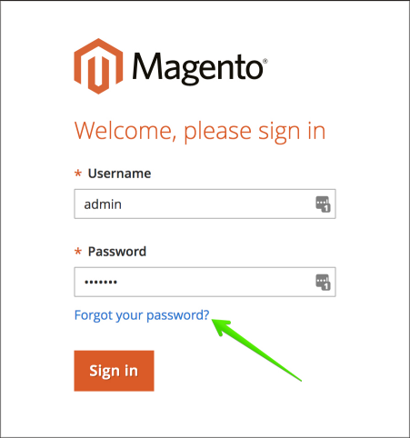

# Modifica della password amministratore su Adobe Commerce nell’infrastruttura cloud

## Metodo 1: Password dimenticata (reimpostazione tramite e-mail)

Leggi i passaggi nella sezione [Reimpostare la password di Accesso amministratore](https://experienceleague.adobe.com/docs/commerce-admin/start/admin/admin-signin.html?lang=it#admin-sign-in) nella nostra guida utente.

Di seguito sono riportate le note di utilizzo critiche.

### Abilita e-mail in uscita

Prima di utilizzare il modulo **Password dimenticata**, assicurati di [abilitare le e-mail in uscita](https://experienceleague.adobe.com/docs/commerce-cloud-service/user-guide/project/outgoing-emails.html?lang=it) tramite la [console cloud](https://experienceleague.adobe.com/docs/commerce-cloud-service/user-guide/project/overview.html?lang=it). Questo vale solo per gli ambienti di integrazione e i progetti sandbox.

Se le e-mail in uscita sono realmente disabilitate in Produzione o Staging, il che significa che l&#39;e-mail non è stata selezionata da SendGrid, puoi verificarlo selezionando [Abilita e-mail nella console cloud](https://experienceleague.adobe.com/it/docs/commerce-on-cloud/user-guide/project/outgoing-emails#enable-emails-in-the-cli). Se il problema persiste, puoi inviare un [ticket di supporto](https://experienceleague.adobe.com/it/docs/commerce-knowledge-base/kb/help-center-guide/magento-help-center-user-guide) di Adobe.

### Controlla la cartella Posta indesiderata

Se non riesci a trovare il messaggio con un collegamento Reimposta password, controlla la cartella *Posta indesiderata*. Il nome dell&#39;e-mail è *Conferma reimpostazione password per nome utente amministratore*.

## Metodo 2: aggiunta di un nuovo utente amministratore

Se non è possibile ripristinare o reimpostare la password per l&#39;utente esistente, è possibile creare un nuovo utente amministratore e impostare una password per questo utente. A tale scopo, effettua le seguenti operazioni:

1. Utilizza [SSH per accedere all&#39;ambiente remoto](https://experienceleague.adobe.com/docs/commerce-cloud-service/user-guide/develop/secure-connections.html?lang=it).
1. Esegui il comando seguente: `bin/magento admin:user:create   --admin-user=%user_name% --admin-password=%your_password% --admin-email=%your_email% --admin-firstname=%admin_user_first_name% --admin-lastname=%admin_user_last_name%`
