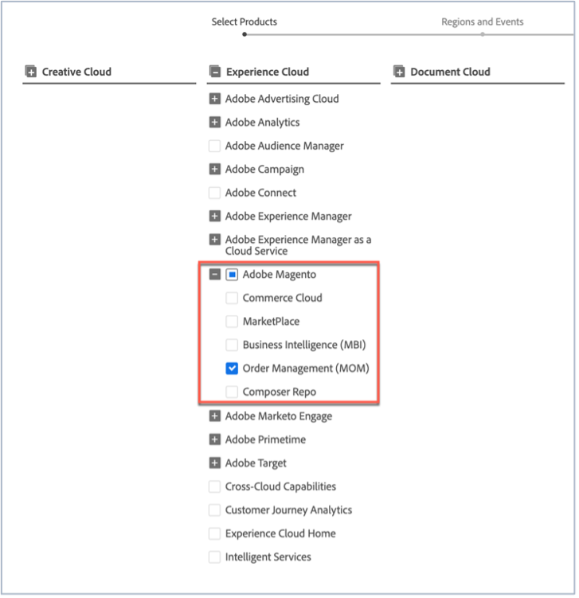
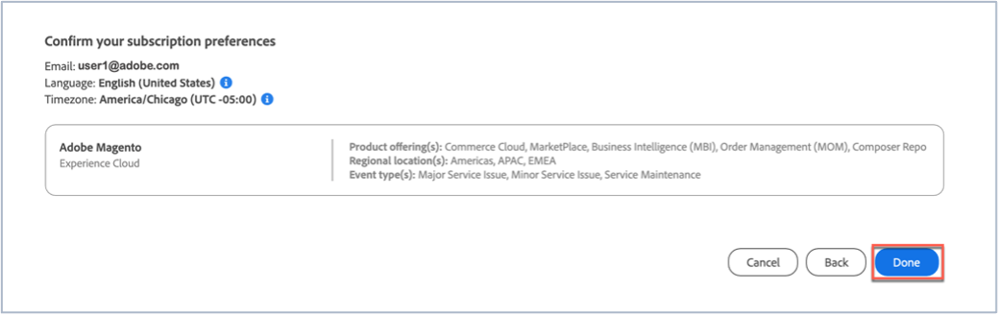

# Iscrizione agli aggiornamenti sullo stato di Adobe Commerce

## Come abbonarsi agli aggiornamenti sullo stato dei Magenti di Adobi

1. Vai a [Stato Adobe](https://status.adobe.com).
1. Fai clic su **Accedi**.
1. Accedi con le tue credenziali di Adobe.
1. Selezionare **Account aziendale o scolastico** se viene presentata l&#39;opzione.
1. Fai clic su **Gestisci abbonamenti** in alto a destra, sopra i cloud elencati.

   
1. Fai clic su **Crea abbonamenti**.

   
1. Viene visualizzata una finestra in cui è possibile selezionare le notifiche per i prodotti. Può essere diversa dalla schermata seguente in quanto alcuni abbonamenti possono essere preselezionati in base al tuo profilo o perché hai già configurato alcuni abbonamenti. Fai clic su **Magento Adobe** in Experience Cloud. Se desideri ricevere notifiche per tutti i servizi di Magento Adobe, seleziona la casella di controllo Magento Adobe. In questo modo verranno selezionati automaticamente tutti i servizi di Magento di Adobe che puoi visualizzare quando la sezione Magento di Adobe si espande (vedi la schermata).

   

   In alternativa, per selezionare un servizio di Magento di Adobe, deselezionare le caselle di controllo degli altri servizi di Magento di Adobe. Ad esempio, se desideri ricevere solo le notifiche per Order Management (MOM), deseleziona gli altri servizi, in modo che vengano selezionate solo la casella di controllo Magento Adobe e la casella di controllo Order Management (MOM) (vedi la schermata).

   
1. Viene visualizzata una finestra in cui è possibile selezionare le notifiche per i prodotti per aree geografiche ed eventi selezionati. Se desideri ricevere notifiche per le stesse aree geografiche e gli stessi tipi di eventi per tutti i prodotti, seleziona la casella di controllo **Seleziona aree geografiche e tipi di eventi per tutti i prodotti** (vedi la schermata).

   

   In alternativa, se hai effettuato l&#39;abbonamento a più prodotti (non solo Magento Adobe) e desideri che ogni prodotto abbia notifiche per diverse aree geografiche e tipi di eventi, seleziona la casella di controllo **Personalizza aree geografiche e tipi di eventi per prodotti** (vedi la schermata).

   
1. Fai clic su **Continua**.
1. Viene visualizzata la finestra **Conferma le preferenze dell&#39;abbonamento**. Verifica che le notifiche riflettano ciò che desideri. Fai clic su **Fine**.

Dopo aver fatto clic su **Fine**, verrà visualizzato un riepilogo delle sottoscrizioni di prodotti e di eventi e verrà visualizzato un messaggio di posta elettronica dal titolo &quot;Notifiche e-mail di abbonamento allo stato&quot; da Adobe. Se desideri annullare l’abbonamento e/o modificare le impostazioni delle notifiche, ripeti i passaggi da uno a nove.
