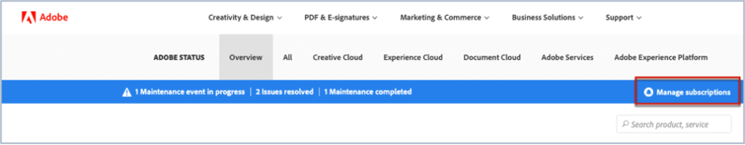

# Iscrizione agli aggiornamenti sullo stato di Adobe Commerce

## Come abbonarsi agli aggiornamenti sullo stato dei Magenti di Adobi

1. Vai a [Stato Adobe](https://status.adobe.com).
1. Clic **Accedi**.
1. Accedi con le tue credenziali di Adobe.
1. Seleziona **Account aziendale o scolastico** se viene presentata con l’opzione.
1. Clic **Gestire gli abbonamenti** in alto a destra, sopra le nuvole elencate.

   
1. Clic **Creare abbonamenti**.

   
1. Viene visualizzata una finestra in cui è possibile selezionare le notifiche per i prodotti. Può essere diversa dalla schermata seguente in quanto alcuni abbonamenti possono essere preselezionati in base al tuo profilo o perché hai già configurato alcuni abbonamenti. Fai clic su **Magento Adobe** in Experience Cloud. Se desideri ricevere notifiche per tutti i servizi di Magento Adobe, seleziona la casella di controllo Magento Adobe. In questo modo verranno selezionati automaticamente tutti i servizi di Magento di Adobe che puoi visualizzare quando la sezione Magento di Adobe si espande (vedi la schermata).

   

   In alternativa, per selezionare un servizio di Magento di Adobe, deselezionare le caselle di controllo degli altri servizi di Magento di Adobe. Ad esempio, se si desidera ricevere solo notifiche per Order Management (MOM), deselezionare gli altri servizi, in modo che siano selezionate solo la casella di controllo Magento di Adobe e la casella di controllo Gestione ordini (MOM) (vedere la schermata).

   
1. Viene visualizzata una finestra in cui è possibile selezionare le notifiche per i prodotti per aree geografiche ed eventi selezionati. Se desideri ricevere notifiche per le stesse aree geografiche e gli stessi tipi di eventi per tutti i prodotti, seleziona la **Seleziona aree geografiche e tipi di eventi per tutti i prodotti** (vedi la schermata).

   

   In alternativa, se hai effettuato l’abbonamento a più prodotti (non solo Magento di Adobe) e desideri che ogni prodotto abbia notifiche per diverse aree geografiche e tipi di eventi, controlla **Personalizza aree geografiche e tipi di eventi per prodotto** (vedi la schermata).

   
1. Clic **Continua**.
1. Il **Conferma le preferenze di abbonamento** viene visualizzata la finestra. Verifica che le notifiche riflettano ciò che desideri. Clic **Fine**.

Dopo aver fatto clic su **Fine** dovresti visualizzare un riepilogo delle sottoscrizioni di prodotti e degli eventi e riceverai un’e-mail dal titolo &quot;Abbonamento alle notifiche e-mail di stato&quot; da Adobe. Se desideri annullare l’abbonamento e/o modificare le impostazioni delle notifiche, ripeti i passaggi da uno a nove.
