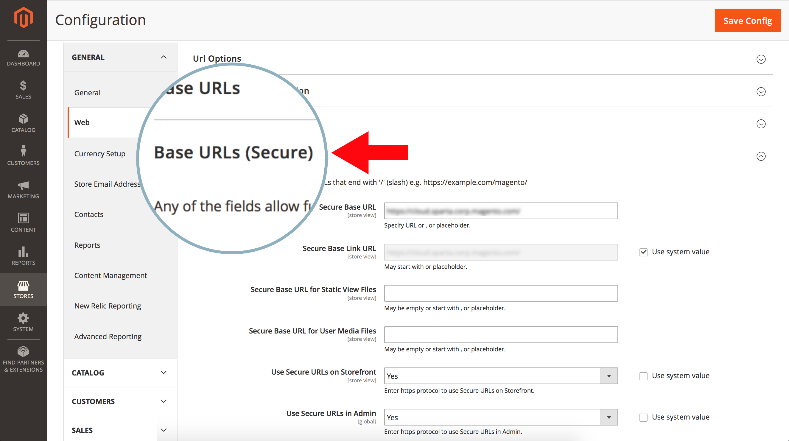

# Reindirizza HTTP a HTTPS per tutte le pagine su Adobe Commerce nell’infrastruttura cloud (Forza TLS)

Attiva la funzionalità **Force TLS** di Fastly nell&#39;amministratore di Commerce per abilitare il reindirizzamento globale da HTTP a HTTPS per tutte le pagine dell&#39;Adobe Commerce nell&#39;archivio dell&#39;infrastruttura cloud.

Questo articolo fornisce [passaggi](#steps) dettagliati, una rapida panoramica della funzione Force TLS, delle versioni interessate e collegamenti alla relativa documentazione.

## Passaggi {#steps}

### Passaggio 1: configurare URL protetti {#step-1-configure-secure-urls}

In questo passaggio definiamo gli URL sicuri per l’archivio. Se l&#39;operazione è già stata eseguita, passare al [passaggio 2: Abilita Forza TLS](#step-2-enable-force-tls).

1. Accedi all’amministratore di Commerce.
1. Passa a **Archivi** > **Configurazione** > **Generale** > **Web**.
1. Espandi la sezione **URL di base (protetti)**.    
1. Nel campo **URL di base sicuro**, specifica l&#39;URL HTTPS dell&#39;archivio.
1. Impostare **Usa URL protetti in Storefront** e **Usa URL protetti in Admin** su **Sì**.    
1. Fai clic su **Salva configurazione** nell&#39;angolo superiore destro per applicare le modifiche.

**Documentazione correlata nella guida utente:**   [Archivia URL](https://experienceleague.adobe.com/en/docs/commerce-admin/stores-sales/site-store/store-urls).

### Passaggio 2: abilitare Force TLS (Forza TLS) {#step-2-enable-force-tls}

1. In Amministrazione Commerce, passa a **Archivi** > **Configurazione** > **Avanzate** > **Sistema**.
1. Espandi la sezione **Cache a pagina intera**, quindi **Configurazione rapida** e infine **Configurazione avanzata**.
1. Fare clic sul pulsante **Forza TLS**.    
1. Nella finestra di dialogo visualizzata, fai clic su **Carica**.    
1. Dopo la chiusura della finestra di dialogo, accertati che lo stato corrente di Force TLS sia visualizzato come **enabled**.    

**Documentazione rapida correlata:**   [Forza la guida TLS](https://github.com/fastly/fastly-magento2/blob/master/Documentation/Guides/FORCE-TLS.md) per Adobe Commerce 2.

## Info Forza TLS

TLS (Transport Layer Security) è un protocollo per connessioni HTTP sicure che sostituisce il suo predecessore meno sicuro, il protocollo SSL (Secure Socket Layer).

La funzionalità Force TLS di Fastly consente di forzare a TLS tutte le richieste non crittografate in entrata per le pagine del sito.

&#x200B;>>
Funziona restituendo una risposta *301 spostata definitivamente* a qualsiasi richiesta non crittografata, che reindirizza all&#39;equivalente TLS. Ad esempio, la creazione di una richiesta per *http://www.example.com/foo.jpeg* verrebbe reindirizzata a *https://www.example.com/foo.jpeg*.

[Protezione delle comunicazioni](https://docs.fastly.com/guides/securing-communications/) (documentazione rapida)

## Versioni interessate

* **Adobe Commerce sull&#39;infrastruttura cloud:**
   * versione: 2.1.4 e successive
   * piani: Adobe Commerce su infrastruttura cloud Architettura del piano iniziale e Adobe Commerce su infrastruttura cloud Architettura del piano Pro (inclusa Pro Legacy)
* **In breve:** 1.2.4

## Nessuna modifica necessaria in route.yaml

Per abilitare il reindirizzamento da HTTP a HTTPS su **tutte** le pagine dell&#39;archivio, non è necessario aggiungere le pagine al file di configurazione `routes.yaml`. È sufficiente abilitare Force TLS globally per l&#39;intero archivio (tramite l&#39;amministratore di Commerce).

## Documentazione Fastly correlata

* [Forza guida TLS per Adobe Commerce 2](https://github.com/fastly/fastly-magento2/blob/master/Documentation/Guides/FORCE-TLS.md)
* [Forzatura di un reindirizzamento TLS](https://docs.fastly.com/guides/securing-communications/forcing-a-tls-redirect)
* [Protezione delle comunicazioni](https://docs.fastly.com/guides/securing-communications/)
