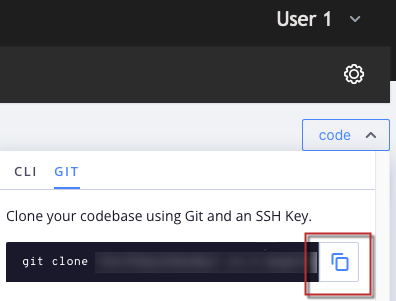

# Ripristinare l’ambiente su Adobe Commerce nell’infrastruttura cloud

Questo articolo mostra diversi scenari di ripristino dello stato precedente di un ambiente su Adobe Commerce su un’infrastruttura cloud.
>[!NOTE]
>
>Questa guida si applica a tutti gli ambienti Cloud Starter e solo agli ambienti di integrazione su Cloud Pro.

Scegliere il caso più appropriato:

* Se hai pianificato un&#39;attività (implementazione o aggiornamento pianificato) - [Scenario 1: attività pianificata](#scen1).
* Se si dispone di uno snapshot valido - [Scenario 2: ripristinare uno snapshot](#scen2).
* Se si dispone di una build stabile ma non di uno snapshot valido - [Scenario 3: nessuna snapshot, build stabile (connessione SSH disponibile)](#scen3).
* Se la build è interrotta e non si dispone di uno snapshot valido - [Scenario 4: nessuna snapshot; build interrotta (nessuna connessione SSH)](#scen4).

## Scenario 1: attività pianificata

Con una distribuzione o un aggiornamento pianificato, il [!UICONTROL Rollback] più semplice e consigliato sarebbe per il commerciante, come parte dei tuoi preparativi, fare quanto segue:

>[!NOTE]
>
>Esegui sempre il test di questi passaggi nell’ambiente inferiore.

<u>Cinque giorni prima delle attività di aggiornamento/distribuzione</u>:

1. Controllare le dimensioni del database corrente.
1. Verificare che lo spazio su disco su `/data/exports` sia sufficiente per contenere [!UICONTROL Database Dump]. Se lo spazio su disco non è sufficiente, rimuovere i dati indesiderati oppure creare un caso di supporto e richiedere l&#39;espansione del disco.

<u>Il giorno delle modifiche</u>:

1. Inserisci il sito Web in [!UICONTROL Maintenance Mode].
Ulteriori informazioni su [Abilitare o disabilitare [!UICONTROL Maintenance Mode]](https://experienceleague.adobe.com/docs/commerce-operations/installation-guide/tutorials/maintenance-mode.html) nella guida utente e [[!UICONTROL Maintenance Mode] opzioni per l&#39;aggiornamento](https://experienceleague.adobe.com/docs/commerce-operations/upgrade-guide/troubleshooting/maintenance-mode-options.html) nella guida all&#39;aggiornamento.
1. Disattiva processi cron. Ulteriori informazioni sulla disabilitazione dei processi cron nella [guida alle proprietà crons](<https://experienceleague.adobe.com/en/docs/commerce-cloud-service/user-guide/configure/app/properties/crons-property#disable-cron-jobs>).
1. Prendi un [[!UICONTROL Database Dump]](https://experienceleague.adobe.com/docs/commerce-knowledge-base/kb/how-to/create-database-dump-on-cloud.html) locale.

<u>Se è necessario [!UICONTROL Rollback]</u>:

1. Se applicazioni come [!DNL MariaDB] sono state aggiornate come parte di questa attività pianificata, richiedere prima la reinstallazione dell&#39;applicazione a una versione precedente.
1. [!UICONTROL Rollback] il database utilizzando [!UICONTROL Database Dump] locale e importarlo nuovamente in [!DNL MariaDB].
1. [!UICONTROL Rollback] il codice tramite [!DNL Git] a una versione precedente di lavoro.

L&#39;utilizzo di [!UICONTROL Snapshots] non è il metodo consigliato per l&#39;aggiornamento/attività pianificata [!UICONTROL rollbacks/restores], in quanto richiede molto più tempo per recuperare i dati rispetto a un [!UICONTROL Database Dump] locale, come descritto sopra nel passaggio 2 della sezione **Se è necessario un [!UICONTROL Rollback]**.

[!UICONTROL Snapshots] non sono presenti nel nodo/server, ma in un blocco di archiviazione separato. Poiché i dati devono essere trasmessi dall&#39;archiviazione dei blocchi in rete a un nuovo disco, il processo richiede tempo. Il nuovo disco viene quindi montato sul nodo pronto per il recupero/l&#39;importazione sul disco originale connesso al nodo/server.

Se si confronta questo con l&#39;importazione di un [!UICONTROL Database Dump] locale, i dati sono già recuperabili sul nodo/server, pertanto viene risparmiato molto tempo, poiché è necessario solo un [!UICONTROL Database Import].

## Scenario 2: ripristinare uno snapshot

Leggi: [Ripristinare un&#39;istantanea su Adobe Commerce nell&#39;infrastruttura cloud](https://experienceleague.adobe.com/en/docs/commerce-cloud-service/user-guide/develop/storage/snapshots#restore-snapshot) nella documentazione per gli sviluppatori.

>[!NOTE]
>
>La creazione di un’istantanea deve essere il primo passaggio dopo l’accesso all’account Adobe Commerce sull’infrastruttura cloud e prima di applicare modifiche principali. Si tratta di una best practice fortemente consigliata.

Leggi: [Crea uno snapshot](https://experienceleague.adobe.com/en/docs/commerce-cloud-service/user-guide/develop/storage/snapshots#create-snapshot) nella documentazione per gli sviluppatori.

## Scenario 3: nessuna istantanea, compilazione stabile (connessione SSH disponibile)

Questa sezione mostra come ripristinare un ambiente quando non è stata creata una copia istantanea ma è possibile accedere all’ambiente tramite SSH.

I passaggi sono i seguenti:

1. Disabilita Gestione configurazione.
1. Disinstallare il software Adobe Commerce.
1. Reimposta il ramo [!DNL git].

Dopo aver eseguito questi passaggi:

* L&#39;installazione di Adobe Commerce torna allo stato Vanilla (database ripristinato; configurazione di distribuzione rimossa; directory in `var` cancellate).
* Il ramo [!DNL git] è stato ripristinato allo stato desiderato in passato.

Leggi i passaggi dettagliati riportati di seguito.

### Passaggio 0 (prerequisito): rimuovere config.php per disabilitare Configuration Management

È necessario disabilitare Gestione configurazione in modo che non applichi automaticamente le impostazioni di configurazione precedenti durante la distribuzione.

Per disabilitare Configuration Management, verificare che la directory `/app/etc/` non contenga il file `config.php`.

Per rimuovere il file di configurazione, effettuare le seguenti operazioni:

1. [SSH nell&#39;ambiente](https://experienceleague.adobe.com/docs/commerce-cloud-service/user-guide/develop/secure-connections.html).
1. Rimuovi il file di configurazione: `rm app/etc/config.php`

Ulteriori informazioni sulla [gestione della configurazione per le impostazioni dello store](https://experienceleague.adobe.com/docs/commerce-cloud-service/user-guide/configure-store/store-settings.html) nella documentazione per gli sviluppatori.

### Passaggio 1: disinstallare il software Adobe Commerce con il comando setup:uninstall


La disinstallazione del software Adobe Commerce provoca la perdita e il ripristino del database, la rimozione della configurazione di distribuzione e la cancellazione delle directory in `var`.

Leggi: [Disinstallare il software Adobe Commerce](https://experienceleague.adobe.com/docs/commerce-operations/installation-guide/tutorials/uninstall.html) nella documentazione per gli sviluppatori.

Per disinstallare il software Adobe Commerce, effettuare le seguenti operazioni:

1. [SSH nell&#39;ambiente](https://experienceleague.adobe.com/docs/commerce-cloud-service/user-guide/develop/secure-connections.html).
1. Esegui `setup:uninstall` : `bin/magento setup:uninstall`
1. Confermare la disinstallazione.

Per confermare la disinstallazione corretta viene visualizzato il seguente messaggio:

```php
[SUCCESS]: Magento uninstallation complete.
```

Questo significa che abbiamo ripristinato l’installazione di Adobe Commerce (incluso DB) al suo stato autentico (Vanilla).

### Passaggio 2: reimpostare il ramo [!DNL git]

Con il ripristino di [!DNL git], il codice verrà ripristinato allo stato desiderato nel passato.

1. Clona l’ambiente nell’ambiente di sviluppo locale. Puoi copiare il comando nella console Cloud:    
1. Accedi alla cronologia dei commit. Utilizza `--reverse` per visualizzare la cronologia in ordine inverso per maggiore comodità: `git log --reverse`
1. Seleziona l’hash di commit su cui sei stato bravo. Per ripristinare il codice al suo stato autentico (Vanilla), individua il primo commit che ha creato il ramo (ambiente).
   
1. Applica ripristino rigido [!DNL git]: `git reset --h <commit_hash>`
1. Invia modifiche al server: `git push --force <origin> <branch>`

Dopo aver eseguito questi passaggi, il ramo [!DNL git] viene reimpostato e l&#39;intero [!DNL git] changelog è cancellato. L&#39;ultimo [!DNL git] push attiva la ridistribuzione per applicare tutte le modifiche e reinstallare Adobe Commerce.

## Scenario 4: nessuna istantanea; compilazione interrotta (nessuna connessione [!DNL SSH])

In questa sezione viene illustrato come reimpostare un ambiente quando si trova in uno stato critico: la procedura di distribuzione non riesce a creare un&#39;applicazione funzionante, rendendo così la connessione [!DNL SSH] non disponibile.

In questo scenario, è innanzitutto necessario ripristinare lo stato di funzionamento dell&#39;applicazione Adobe Commerce utilizzando [!DNL git] reimpostato, quindi disinstallare il software Adobe Commerce (per eliminare e ripristinare il database, rimuovere la configurazione di distribuzione, ecc.). Lo scenario prevede gli stessi passaggi dello scenario 3, ma l’ordine dei passaggi è diverso ed è presente un ulteriore passaggio: forzare la ridistribuzione. I passaggi sono i seguenti:

1. [Reimposta il ramo  [!DNL git] .](/help/how-to/general/reset-environment-on-cloud.md#reset-git-branch)
1. [Disabilita Gestione configurazione.](/help/how-to/general/reset-environment-on-cloud.md#disable_config_management)
1. [Disinstallare il software Adobe Commerce.](/help/how-to/general/reset-environment-on-cloud.md#setup-uninstall)
1. Forza la ridistribuzione.

Dopo aver eseguito questi passaggi, si otterranno gli stessi risultati dello Scenario 3.

### Passaggio 4: forzare la ridistribuzione

Esegui un commit (potrebbe essere vuoto, anche se non è consigliato) e invialo al server per attivarne la ridistribuzione:

```git
git commit --allow-empty -m "<message>" && git push <origin> <branch>
```

## Se il programma di installazione :uninstall non riesce, reimpostare il database manualmente

Se l&#39;esecuzione del comando `setup:uninstall` ha esito negativo e non può essere completata, è possibile cancellare il database manualmente con la procedura seguente:

1. [SSH nell&#39;ambiente](https://experienceleague.adobe.com/docs/commerce-cloud-service/user-guide/develop/secure-connections.html).
1. Connettersi al database MySQL: `mysql -h database.internal` (per gli ambienti Pro vedere: [Configurare il servizio MySQL](https://experienceleague.adobe.com/docs/commerce-cloud-service/user-guide/configure/service/mysql.html)).
1. Rilascia il database `main`: `drop database main;`
1. Crea un database `main` vuoto: `create database main;`
1. Eliminare i seguenti file di configurazione: `config.php`, `config.php.bak`, `env.php`, `env.php.bak`

Dopo aver reimpostato il database, [invia un messaggio push all&#39;ambiente per attivare la ridistribuzione [!DNL git]  e installare Adobe Commerce in un database appena creato. &#x200B;](https://experienceleague.adobe.com/docs/commerce-operations/configuration-guide/deployment/examples/example-using-cli.html) Oppure [eseguire il comando di ridistribuzione](https://experienceleague.adobe.com/docs/commerce-cloud-service/user-guide/dev-tools/cloud-cli.html#environment-commands).
