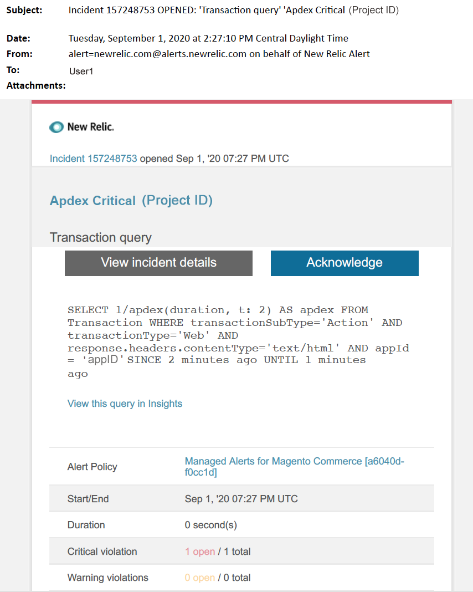

# Avvisi gestiti per Adobe Commerce: avviso critico di circa

Questo articolo fornisce i passaggi per la risoluzione dei problemi quando ricevi un avviso critico Apdex per Adobe Commerce in New Relic. Il punteggio Apdex misura la soddisfazione degli utenti in relazione al tempo di risposta delle applicazioni e dei servizi web. È necessaria un&#39;azione immediata per risolvere il problema. L’avviso avrà un aspetto simile al seguente, a seconda del canale di notifica dell’avviso selezionato.

{width="500"}

## Prodotti e versioni interessati

* Architettura del piano Pro di Adobe Commerce su infrastruttura cloud
* Adobe Commerce sull’infrastruttura cloud Architettura del piano iniziale

## Problema

In New Relic riceverai un avviso gestito se hai effettuato la registrazione a [Avvisi gestiti per Adobe Commerce](/help/support-tools/managed-alerts-for-adobe-commerce/managed-alerts-for-magento-commerce.md) e una o più soglie di avviso sono state superate. Questi avvisi sono stati sviluppati da Adobe per fornire ai commercianti un set standard utilizzando le informazioni provenienti da Supporto e Progettazione.

<u> **Esegui!** </u>

* Interrompi qualsiasi distribuzione pianificata fino a quando l&#39;avviso non viene cancellato.
* Attiva immediatamente la modalità di manutenzione se il sito non risponde o se non risponde completamente. Per i passaggi, consulta [Guida all&#39;installazione > Abilitare o disabilitare la modalità di manutenzione](https://experienceleague.adobe.com/en/docs/commerce-operations/installation-guide/tutorials/maintenance-mode) nella documentazione per gli sviluppatori. Assicurarsi di aggiungere l&#39;IP all&#39;elenco degli indirizzi IP esenti per assicurarsi di poter accedere al sito per la risoluzione dei problemi. Per ulteriori informazioni, consulta [Gestire l&#39;elenco degli indirizzi IP esenti](https://experienceleague.adobe.com/en/docs/commerce-operations/installation-guide/tutorials/maintenance-mode#instgde-cli-maint-exempt) nella documentazione per gli sviluppatori.

<u>**Non fare!**</u>

* Avvia ulteriori campagne di marketing che possono portare ulteriori visualizzazioni di pagina sul sito.
* Eseguire indicizzatori o nodi aggiuntivi che possono causare ulteriore stress alla CPU o al disco.
* Esegui le principali attività amministrative (ad esempio, l’amministratore di Commerce, le importazioni/esportazioni di dati).
* Cancella la cache.

Effettuando le operazioni descritte in precedenza, quando si riceve un avviso critico, prima di aver risolto la causa dell’avviso, se non si è già verificata un’interruzione del sito il sito potrebbe non rispondere.

## Soluzione

Per identificare e risolvere la causa, seguire la procedura riportata di seguito.

>[!WARNING]
>
>Poiché si tratta di un avviso critico, è consigliabile completare il **passaggio 1** prima di provare a risolvere il problema (passaggio 2 in poi).

1. Controlla se è presente un ticket di supporto Adobe Commerce. Per ulteriori informazioni, consulta [Tracciare i ticket di supporto](/help/help-center-guide/help-center/magento-help-center-user-guide.md#track-tickets) nella Knowledge Base di supporto. Il supporto potrebbe aver ricevuto un avviso di soglia New Relic, aver creato un ticket e iniziato a lavorare sul problema. Se non esiste alcun ticket, creane uno. Il ticket deve contenere le seguenti informazioni:
   * Motivo contatto: selezionare &quot;Avviso New Relic CRITICAL ricevuto&quot;.
   * Descrizione dell&#39;avviso.
   * [Collegamento per incidente New Relic](https://docs.newrelic.com/docs/alerts-applied-intelligence/new-relic-alerts/alert-incidents/view-violation-event-details-incidents). Questo è incluso nei tuoi [Avvisi gestiti per Adobe Commerce](/help/support-tools/managed-alerts-for-adobe-commerce/managed-alerts-for-magento-commerce.md).
1. Per identificare l&#39;origine del problema, utilizzare la [pagina Transazione di New Relic APM](https://docs.newrelic.com/docs/apm/applications-menu/monitoring/transactions-page-find-specific-performance-problems) per identificare le transazioni con problemi di prestazioni:
   * Ordina le transazioni in base ai punteggi di Apdex crescenti. [Apdex](https://docs.newrelic.com/docs/apm/new-relic-apm/apdex/apdex-measure-user-satisfaction) fa riferimento alla soddisfazione degli utenti per il tempo di risposta delle applicazioni e dei servizi Web. Un punteggio Apdex basso può indicare un collo di bottiglia (una transazione con un tempo di risposta più elevato). Di solito si tratta del database, Redis o PHP. Per i passaggi, fare riferimento a New Relic [Visualizza le transazioni con il più alto livello di insoddisfazione Apdex](https://docs.newrelic.com/docs/apm/new-relic-apm/apdex/apdex-measure-user-satisfaction/#dissatisfaction).
   * Ordina le transazioni in base alla velocità effettiva più elevata, al tempo medio di risposta più lento, al tempo più lungo e ad altre soglie. Per i passaggi, fare riferimento a New Relic [Trova problemi di prestazioni specifici](https://docs.newrelic.com/docs/apm/applications-menu/monitoring/transactions-page-find-specific-performance-problems). Se hai ancora difficoltà a identificare il problema, utilizza la pagina Infrastruttura di New Relic APM.
1. Utilizza la [pagina Infrastruttura di New Relic APM](https://docs.newrelic.com/docs/infrastructure/infrastructure-ui-pages/infra-hosts-ui-page/) per identificare i processi che richiedono un uso intensivo di risorse. Per i passaggi, fare riferimento alla pagina Host di monitoraggio infrastruttura di New Relic [> scheda Processi](https://docs.newrelic.com/docs/infrastructure/infrastructure-ui-pages/infra-hosts-ui-page/#processes).
1. Se servizi come Redis o MySQL sono la fonte principale di consumo di memoria, provare a effettuare le seguenti operazioni:
   * Verifica di essere nella versione più recente. Le versioni più recenti possono a volte correggere le perdite di memoria. Se non utilizzi la versione più recente, puoi procedere con l’aggiornamento. Per i passaggi, consulta [Cloud for Adobe Commerce > Services > Change Services](https://experienceleague.adobe.com/docs/commerce-cloud-service/user-guide/configure/service/services-yaml.html) nella documentazione per gli sviluppatori.
   * Verificare la presenza di problemi MySQL quali query con esecuzione prolungata, chiavi primarie non definite e indici duplicati. Per i passaggi, consulta [Problemi più comuni relativi al database in Adobe Commerce sull&#39;infrastruttura cloud](https://experienceleague.adobe.com/docs/commerce-operations/implementation-playbook/best-practices/maintenance/resolve-database-performance-issues.html) nella documentazione per gli sviluppatori.
   * Verifica la presenza di problemi PHP. Esaminare i processi in esecuzione eseguendo `ps aufx` in CLI/Terminal. Nell’output del terminale vengono visualizzati i processi e i processi cron attualmente in esecuzione. Controlla l’output per il tempo di esecuzione dei processi. Se c&#39;è un cron con un lungo tempo di esecuzione, il cron può essere appeso. Per informazioni sulla risoluzione dei problemi, consultare [Crons con prestazioni lente e tempi di esecuzione lunghi](/help/troubleshooting/miscellaneous/slow-performance-slow-and-long-running-crons.md) e [Processo Cron bloccato nello stato &quot;in esecuzione&quot;](/help/troubleshooting/miscellaneous/cron-job-is-stuck-in-running-status.md) nella Knowledge Base di supporto.

1. Una volta identificata la sorgente, SSH viene introdotto nell’ambiente per approfondire l’analisi. Per i passaggi, consulta [Cloud for Adobe Commerce > Tecnologie e requisiti > SSH nel tuo ambiente](https://experienceleague.adobe.com/en/docs/commerce-cloud-service/user-guide/develop/secure-connections#ssh) nella documentazione per gli sviluppatori.
1. Se hai ancora difficoltà a identificare l’origine, rivedi le tendenze recenti per identificare i problemi relativi alle recenti distribuzioni del codice o alle modifiche alla configurazione (ad esempio, nuovi gruppi di clienti e modifiche di grandi dimensioni al catalogo). È consigliabile verificare negli ultimi sette giorni di attività le correlazioni presenti nelle distribuzioni o nelle modifiche del codice.
1. Se non riesci a trovare una soluzione entro un tempo ragionevole, richiedi un’operazione di upsize o attiva la modalità di manutenzione per il sito, se non lo hai già fatto. Per ulteriori informazioni, consultare [Come richiedere il ridimensionamento temporaneo](/help/how-to/general/how-to-request-temporary-magento-upsize.md) nella Knowledge Base di supporto e [Guida all&#39;installazione > Abilitare o disabilitare la modalità di manutenzione](https://experienceleague.adobe.com/en/docs/commerce-operations/installation-guide/tutorials/maintenance-mode) nella documentazione per gli sviluppatori.
1. Se l’upsize ripristina le normali operazioni del sito, puoi richiedere un upsize permanente (contatta il team dell’account Adobe) oppure provare a riprodurre il problema nella gestione temporanea dedicata eseguendo un test di carico e ottimizzando le query o il codice che riduce la pressione sui servizi. Consulta [Cloud for Adobe Commerce > Test Deployment > Load and stress testing](https://experienceleague.adobe.com/en/docs/commerce-cloud-service/user-guide/develop/test/staging-and-production#load-and-stress-testing) nella documentazione per gli sviluppatori.
