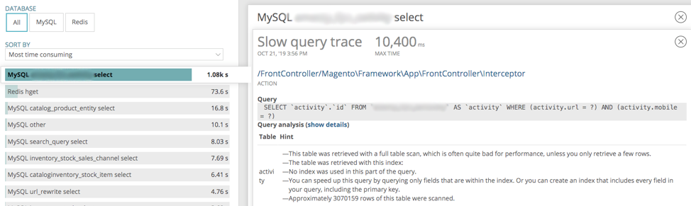

# Collo di bottiglia di MySQL ad alto carico in Adobe Commerce sull’infrastruttura cloud

Questo argomento descrive una soluzione quando un carico elevato da MySQL causa un problema di collo di bottiglia delle prestazioni in Adobe Commerce sull’infrastruttura cloud.

## Prodotti e versioni interessati

* Adobe Commerce su infrastruttura cloud 2.x.x, account Pro.

### Prerequisiti

* ECE Tools versione 2002.0.16 e successive
* Servizio New Relic APM (**Il tuo account Adobe Commerce su infrastruttura cloud include il software per il servizio New Relic APM** insieme a un codice di licenza.)

Per ulteriori informazioni sul servizio New Relic APM e sulla relativa configurazione con l’account Adobe Commerce sull’infrastruttura cloud, consulta [Servizi New Relic](https://devdocs.magento.com/guides/v2.3/cloud/project/new-relic.html) e [Introduzione a New Relic APM](https://docs.newrelic.com/docs/apm/new-relic-apm/getting-started/introduction-apm/).

## Problema

<u>Passaggi Per Verificare Se Il Problema Influisce Su Di Te</u>

1. Nel grafico di panoramica di New Relic APM, verificare che MySQL sia diventato un collo di bottiglia. Vedere l&#39;immagine di esempio seguente in cui MySQL è diventato un collo di bottiglia e richiede la maggior parte del tempo delle transazioni Web:

   

   Si noti come la linea tratteggiata rossa nell&#39;immagine mostri una tendenza verso l&#39;alto distinguibile nel tempo delle transazioni Web MySQL e quindi picchi a livelli ancora più alti.
1. Da qui puoi passare al tuo **Database** schermo in cui è possibile vedere la seconda indicazione di throughput elevato o lento `SELECT` query in MySQL e nell&#39;immagine di esempio seguente è possibile visualizzare quando si ordina per **Più dispendioso in termini di tempo**, il tuo negozio, in questo esempio, è lento `SELECT` Query MySQL.

   

Analizzare le transazioni lente in New Relic APM. Se si verifica un elevato volume di query o una pressione elevata su un database MySQL, è possibile distribuire il carico tra nodi diversi abilitando `SLAVE` connessioni.

## Causa

Il tuo archivio Adobe Commerce su infrastruttura cloud ha un throughput elevato o è lento `SELECT` Query MySQL.

## Soluzione

>[!WARNING]
>
>Per l&#39;architettura scalata (architettura divisa), le connessioni slave Redis **NON DEVE** essere abilitato. Per verificare se l’architettura è scalata, visita l’URL del progetto, ad esempio `https://console.adobecommerce.com/<owner-user-name>/<project-ID>/<environment-name>`. Fai clic su **[!UICONTROL SSH]**. Se sono presenti più di tre nodi, l’architettura è in scala. Se abiliti Redis Slave Reads su architettura scalata, il cliente riceverà errori quando le connessioni Redis non sono in grado di connettersi. Questo ha a che fare con il modo in cui i cluster sono configurati per elaborare le connessioni Redis. Gli schiavi Redis sono ancora attivi ma non verranno utilizzati per Redis Reads. Per l’architettura scalata si consiglia di utilizzare Adobe Commerce 2.3.5 o versione successiva e implementare la nuova configurazione back-end Redis e implementare il caching L2 per Redis.

Se si verificano queste due indicazioni, attivare `SLAVE` Le connessioni per il database MySQL e Redis possono essere utili per distribuire il carico tra nodi diversi.

Adobe Commerce può leggere più database o Redis in modo asincrono. Aggiornamento di `.magento.env.yaml` file impostando su `true` i valori `MYSQL_USE_SLAVE_CONNECTION` e `REDIS_USE_SLAVE_CONNECTION` per utilizzare un **sola lettura** connessione al database per ricevere traffico di sola lettura su un nodo non principale. Ciò migliora le prestazioni tramite il bilanciamento del carico, in quanto solo un nodo deve gestire il traffico di lettura-scrittura. Imposta su `false` per rimuovere qualsiasi array di connessione di sola lettura esistente dal `env.php` file.

### Passaggi

1. Modifica il `.magento.env.yaml` e aggiungi il seguente contenuto:

   

   Ulteriori dettagli sono disponibili in [Distribuire variabili in DevDocs](https://devdocs.magento.com/cloud/env/variables-deploy.html#mysql_use_slave_connection).

1. Apporta le modifiche e le invia in push.
1. Il push delle modifiche avvierà un nuovo processo di distribuzione. Una volta completata la distribuzione, l’istanza di Adobe Commerce sull’infrastruttura cloud ora deve essere configurata per l’utilizzo di connessioni slave.

## Domande comuni

Di seguito sono riportate le domande comuni che potresti porre quando prendi in considerazione l’utilizzo della funzionalità Connessioni slave per l’archivio dell’infrastruttura cloud di Adobe Commerce.

* Esistono problemi noti o limitazioni all’utilizzo delle connessioni slave? **Non sono presenti problemi noti relativi all’utilizzo delle connessioni slave. Assicurati di utilizzare il pacchetto di strumenti ece aggiornato più di recente. Le istruzioni sono qui su [come aggiornare il pacchetto ece-tools](https://devdocs.magento.com/cloud/project/ece-tools-update.html).**
* Esiste una latenza aggiuntiva con l’utilizzo delle connessioni slave? *Sì, la latenza cross-AZ (cross-Availability Zones) è più elevata e riduce le prestazioni di un’istanza Adobe Commerce sull’infrastruttura cloud nel caso in cui l’istanza non sia sovraccarica e possa sopportare l’intero carico. Ma chiaramente, se l&#39;istanza è sovraccarica, master-slave aiuterà con le prestazioni distribuendo il carico sul database MySQL o Redis tra nodi diversi.*

  **Nei cluster non sovraccarichi** -  **Le connessioni slave rallentano le prestazioni del 10-15%**, che è uno dei motivi per cui non è predefinito.

  *Tuttavia, nei cluster con sovraccarico, si verifica un aumento delle prestazioni perché questi livelli del 10-15% vengono mitigati riducendo il carico dal traffico.*
* È necessario attivare queste impostazioni per il negozio? *Se il carico è elevato o si prevede un carico elevato sul database MySQL o Redis, è assolutamente necessario abilitare le connessioni slave. Per un cliente normale con traffico medio, questo è&#x200B;**non**un&#39;impostazione ottimale da abilitare.*

## Lettura correlata

Nella documentazione per gli sviluppatori:

* [Distribuire le variabili](https://devdocs.magento.com/cloud/env/variables-deploy.html).
* [Configurare la replica del database opzionale](https://devdocs.magento.com/guides/v2.3/config-guide/multi-master/multi-master_slavedb.html).
* [pacchetto strumenti ece](https://devdocs.magento.com/cloud/reference/ece-tools-reference.html).

>[!NOTE]
>
>Siamo consapevoli che questo articolo può ancora contenere termini software standard del settore che alcuni possono trovare razzisti, sessisti o oppressivi, e che possono far sentire il lettore ferito, traumatizzato, o sgradito. Adobe sta lavorando per rimuovere questi termini dal nostro codice, dalla nostra documentazione e dalle esperienze utente.
