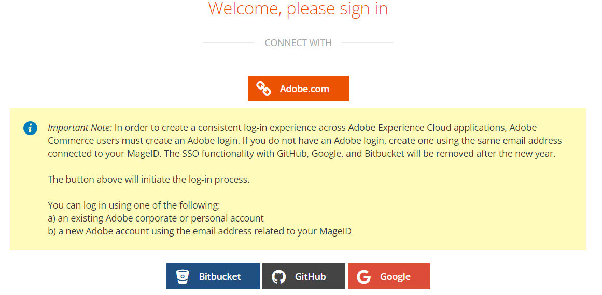

# Impossibile accedere all’account/progetto cloud corretto oppure il progetto non è presente nel tuo account

Questo articolo fornisce una correzione per i seguenti problemi dopo che è stata apportata una modifica alla proprietà dell’account o agli indirizzi e-mail associati:

1. Non riesci ad accedere ai progetti cloud Adobe Commerce corretti.
1. Nessun progetto cloud Adobe Commerce visualizzato nel tuo account all’indirizzo [accounts.magento.cloud/user](https://accounts.magento.cloud/user).
1. Stai visualizzando i dettagli di un altro account (ad esempio, il precedente proprietario dell’account) in [accounts.magento.cloud/user](https://accounts.magento.cloud/user).

## Problema

Non puoi accedere al progetto cloud Adobe Commerce corretto in caso di modifiche di proprietà o indirizzi e-mail.

## Prodotti e versioni interessati

* Adobe Commerce sull’infrastruttura cloud, [tutte le versioni supportate](https://www.adobe.com/content/dam/cc/en/legal/terms/enterprise/pdfs/Adobe-Commerce-Software-Lifecycle-Policy.pdf)

## Causa

Questo problema si verifica in genere quando il Single Sign-On (SSO) del proprietario del progetto precedente è ancora integrato con Adobe.com dopo:

1. La proprietà del progetto cloud è stata trasferita a te (l’utente) e viene visualizzato l’account del proprietario del progetto originale. Fai clic qui per visualizzare [soluzione](#solution-for-cause-one-and-two).

   OPPURE

1. (L’utente) ti sei trasferito in un’altra società, accompagnato da una modifica dell’indirizzo e-mail e dei progetti a cui hai accesso. Puoi vedere i progetti a cui hai avuto accesso nel tuo precedente ruolo/azienda. Fai clic qui per visualizzare [soluzione](#solution-for-cause-one-and-two).

   OPPURE

1. Hai modificato il tuo indirizzo e-mail all’indirizzo https://account.adobe.com in un altro indirizzo e-mail attualmente non associato a un progetto cloud. Fai clic qui per visualizzare [soluzione](#solution-for-cause-three).

## Soluzione per la causa uno e due {#solution-for-cause-one-and-two}

La soluzione per quando il problema è causato da uno e due è la disconnessione dell&#39;integrazione single sign-on con Adobe.com. Per disconnettersi, effettuare le seguenti operazioni:

1. Da https://accounts.magento.cloud/user, espandi il **[!UICONTROL Single Sign-On]** sezione. Clic **[!UICONTROL Disconnect from Adobe.com]**, per disconnettersi.

   

1. Clic **[!UICONTROL Disconnect]**.

   

1. Disconnetti.
1. Fai clic sul pulsante **[!UICONTROL Adobe.com]** pulsante.

   

1. Ora dovresti essere in grado di visualizzare l’account corretto e accedere al progetto cloud corretto.

## Soluzione per la terza causa {#solution-for-cause-three}

Se il problema è stato causato dalla terza causa, chiedi a un super utente esistente sul progetto di aggiungere il tuo nuovo indirizzo e-mail al progetto. Per ulteriori informazioni, consulta [Gestire l’accesso degli utenti](https://experienceleague.adobe.com/docs/commerce-cloud-service/user-guide/project/user-access.html).
