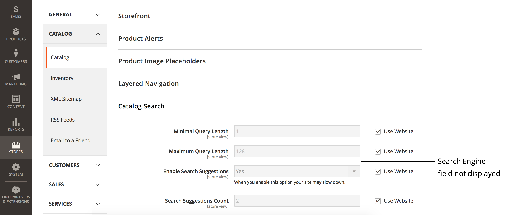

# Impossibile modificare il motore di ricerca con Commerce Admin (il menu del motore di ricerca non è accessibile)

>[!WARNING]
>
> [Il motore di ricerca del catalogo MySQL verrà rimosso in Adobe Commerce 2.4.0](/help/announcements/adobe-commerce-announcements/mysql-catalog-search-engine-will-be-removed-in-magento-2-4-0.md). Prima di installare la versione 2.4.0, è necessario aver configurato e configurato l’host Elasticsearch.
> 
> Consulta:
> [Installa e configura Elasticsearch](https://experienceleague.adobe.com/en/docs/commerce-cloud-service/user-guide/configure/service/elasticsearch).
> [Installa e configura Opensearch](https://experienceleague.adobe.com/en/docs/commerce-cloud-service/user-guide/configure/service/opensearch)
> [Installa e configura Live Search](https://experienceleague.adobe.com/en/docs/commerce-merchant-services/live-search/install)

Questo articolo fornisce una soluzione per modificare il motore di ricerca di Adobe Commerce utilizzando l&#39;amministratore di Commerce se il campo **Motore di ricerca** non è visualizzato o se la casella di controllo **Usa valore di sistema** è disattivata e non accessibile.

In questo articolo:

* [Versioni interessate](#affected-versions)
* [Modificare il motore di ricerca con Commerce Admin (passaggi)](#change-search-engine-using-magento-admin-steps)
* [Problemi relativi ad Adobe Commerce on-premise](#magento-commerce-on-premise)
* [Adobe Commerce sull’infrastruttura cloud](#magento-commerce-cloud)

## Versioni interessate

* Adobe Commerce on-premise: 2.4.X
* Adobe Commerce sull’infrastruttura cloud:
   * Versione: 2.4.X
   * Architettura del piano Starter e Pro
* MySQL, Elasticsearch, Opensearch, Live Search: tutte le versioni supportate

## Modificare il motore di ricerca tramite Admin (passaggi)

1. Accedere a **[!UICONTROL Admin]** come amministratore.
1. Sul lato sinistro della barra laterale **[!UICONTROL Admin]**, fare clic su **[!UICONTROL Stores]**.
1. In **[!UICONTROL Settings]** scegliere **[!UICONTROL Configuration]**.
1. Passa al pannello a sinistra in **[!UICONTROL Catalog],** e scegli **[!UICONTROL Catalog]**.
1. Espandere la sezione **[!UICONTROL Catalog Search]**.    
1. Passare al campo **[!UICONTROL Search Engine]** e rimuovere la selezione dalla casella di controllo **[!UICONTROL Use system value]**.
1. Fare clic sul menu **[!UICONTROL Search Engine]** e selezionare una delle opzioni disponibili, come illustrato di seguito.    
1. Fai clic su **[!UICONTROL Save Config]** nell&#39;angolo superiore destro della pagina.

## Problemi relativi ad Adobe Commerce on-premise

### Problema 1: il campo Motore di ricerca non viene visualizzato

Quando accedi alla sezione **Ricerca nel catalogo**, il menu **Motore di ricerca** non viene visualizzato.



### Causa: la vista archivio non è una configurazione predefinita

La visualizzazione archivio per l&#39;amministratore è stata impostata su un valore diverso da *Configurazione predefinita*.

Il motore di ricerca è una configurazione globale impostata a livello di applicazione, non nell&#39;ambito dell&#39;archivio. Gli archivi all’interno di un’applicazione Adobe Commerce non possono utilizzare motori di ricerca diversi.

### Soluzione: impostare la visualizzazione archivio su Configurazione predefinita

1. Accedere a **[!UICONTROL Admin]** come amministratore.
1. Sul lato sinistro della barra laterale **[!UICONTROL Admin]**, fare clic su **[!UICONTROL Stores]**.
1. Passare a **[!UICONTROL Settings]** e scegliere **[!UICONTROL Configuration]**.
1. Nell&#39;angolo superiore sinistro fare clic sul selettore **[!UICONTROL Store View]** e scegliere **[!UICONTROL *Configurazione predefinita *]**.
1. Fare clic su **[!UICONTROL OK]** nella finestra di dialogo di conferma per approvare le modifiche alla visualizzazione dello store.


**Documentazione correlata:** [Modifica dell&#39;ambito](https://experienceleague.adobe.com/docs/commerce-admin/config/scope-change.html#set-the-scope) nella guida utente.

### Problema 2: impossibile deselezionare &quot;Usa valore di sistema&quot;

Quando accedi alla sezione **Ricerca nel catalogo** dell&#39;amministratore, la casella di controllo **Usa valore di sistema** è disattivata, pertanto non puoi rimuovere la selezione dalla casella di controllo per cambiare il motore di ricerca in un secondo momento.

### Causa

Il motore di ricerca predefinito è stato configurato nel livello di configurazione dell&#39;applicazione nei file `app/etc/env.php` o `app/etc/config.php` e pertanto non può essere modificato con Admin.

Esempio della sezione con configurazione predefinita del motore di ricerca:

```php
'system'=>
array (
'default'=>
array (
'catalog'=>
array (
'search'=>
array (
'engine'=>'mysql',
),
),
),
),
```

### Soluzione

Rimuovere la sezione con la configurazione predefinita del motore di ricerca dai file di configurazione `app/etc/env.php` o `app/etc/config.php`.

### Articoli correlati nella documentazione per sviluppatori

[File di configurazione di Adobe Commerce](https://experienceleague.adobe.com/docs/commerce-operations/configuration-guide/files/deployment-files.html) nella Guida alla configurazione di Adobe Commerce

## Adobe Commerce sull’infrastruttura cloud

Il passaggio da un motore di ricerca all’altro utilizzando l’amministratore non è disponibile in Adobe Commerce sull’infrastruttura cloud a causa del modo in cui questa è stata organizzata.

Durante il processo di distribuzione, gli script di distribuzione dell&#39;infrastruttura cloud di Adobe Commerce verificano se l&#39;Elasticsearch è stato dichiarato nella variabile `MAGENTO_CLOUD_RELATIONSHIPS`. Se dichiarato, l&#39;Elasticsearch viene selezionato come motore di ricerca attivo e configurato automaticamente; il motore di ricerca [MySQL](/help/announcements/adobe-commerce-announcements/mysql-catalog-search-engine-will-be-removed-in-magento-2-4-0.md) diventa inaccessibile nell&#39;amministratore. Se la relazione Elasticsearch non è stata dichiarata, MySQL è impostato su attivo e Elasticsearch diventa inaccessibile.

Non è consigliabile modificare i file di configurazione `app/etc/env.php` o `app/etc/config.php` direttamente nell&#39;ambiente cloud. Per questo motivo, la modifica di questi file per rendere il motore di Elasticsearch da visualizzare nell&#39;amministratore (la soluzione consigliata nella sezione precedente) non è applicabile al progetto cloud.

### Modificare il motore di ricerca negli ambienti di staging e produzione

Prima di cambiare il motore di ricerca da MySQL a Elasticsearch negli ambienti di staging e produzione, assicurati di aver inviato in precedenza [un ticket di supporto](/help/help-center-guide/help-center/magento-help-center-user-guide.md#submit-ticket) richiedendo di abilitare Elasticsearch nell&#39;ambiente e che il ticket sia stato risolto correttamente.

Per cambiare il motore di ricerca utilizzato negli ambienti di staging e produzione, modifica la variabile di ambiente `SEARCH_CONFIGURATION` nel file `.magento.env.yaml` nell&#39;ambiente locale, quindi invia le modifiche agli ambienti di integrazione e staging/produzione affinché le modifiche diventino effettive.

Se si passa all&#39;Elasticsearch 7, la variabile SEARCH\_CONFIGURATION nel file `.magento.env.yaml` risultante potrebbe avere il seguente aspetto:

```yaml
stage:
  deploy:
   SEARCH_CONFIGURATION:
     engine: elasticsearch7
     elasticsearch_server_hostname: hostname
     elasticsearch_server_port: '12345'
     elasticsearch_index_prefix: magento
     elasticsearch_server_timeout: '15'
```

Se si passa a [Opensearch (in 2.4.6 e versioni successive)](https://experienceleague.adobe.com/en/docs/commerce-knowledge-base/kb/troubleshooting/elasticsearch/search-engine-shown-elasticsearch-despite-open-search), la variabile SEARCH\_CONFIGURATION nel file `.magento.env.yaml` risultante potrebbe avere il seguente aspetto:

```yaml
stage:
  deploy:
   SEARCH_CONFIGURATION:
     engine: opensearch
     elasticsearch_server_hostname: hostname
     elasticsearch_server_port: '12345'
     elasticsearch_index_prefix: magento
     elasticsearch_server_timeout: '15'
```

Se [passi a Live Search](https://experienceleague.adobe.com/en/docs/commerce-knowledge-base/kb/troubleshooting/miscellaneous/error-opensearch-search-engine-doesnt-exist-falling-back-to-livesearch), la variabile SEARCH\_CONFIGURATION nel file `.magento.env.yaml` risultante potrebbe avere il seguente aspetto:

```yaml
stage:
  deploy:
   SEARCH_CONFIGURATION:
     engine: livesearch
```

### Documentazione correlata

#### Knowledge Base di supporto

* [Abilita Elasticsearch su cloud](/help/how-to/general/enable-elasticsearch-on-cloud.md)

#### Documentazione per gli sviluppatori

* [Configura servizio Elasticsearch](https://experienceleague.adobe.com/docs/commerce-cloud-service/user-guide/configure/service/elasticsearch.html)
* [Genera e distribuisci](https://experienceleague.adobe.com/docs/commerce-cloud-service/user-guide/configure/env/configure-env-yaml.html) (documentazione sul file di configurazione `.magento.env.yaml`)
* [Distribuisci variabili](https://experienceleague.adobe.com/docs/commerce-cloud-service/user-guide/configure/env/stage/variables-deploy.html) ([SEARCH\_CONFIGURATION section](https://experienceleague.adobe.com/docs/commerce-cloud-service/user-guide/configure/env/stage/variables-deploy.html#search_configuration))
* [Servizi](https://experienceleague.adobe.com/docs/commerce-cloud-service/user-guide/configure/service/services-yaml.html) (documentazione sul file di configurazione `.magento/services.yaml`)
* [Live Search](https://experienceleague.adobe.com/en/docs/commerce-merchant-services/live-search/overview)
