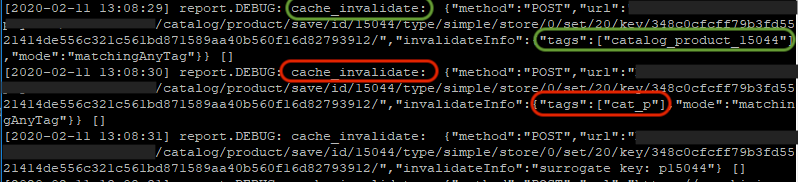

# La cache invalidata causa un deterioramento del tempo di risposta

Questo articolo fornisce una soluzione su come evitare l’invalidazione della cache, che potrebbe causare un rallentamento delle prestazioni di un archivio Adobe Commerce.

PRODOTTI E VERSIONI INTERESSATI:

* Adobe Commerce on-premise 2.2.x, 2.3.x
* Adobe Commerce sull’infrastruttura cloud 2.2.x, 2.3.x

## Problema

Risposta del sito lenta.

## Causa

Un tempo di risposta lungo potrebbe essere causato dall’invalidazione (svuotamento) della cache.

La cache viene utilizzata per generare risposte rapide alle richieste dei visitatori del sito. Se non sono disponibili dati di cache appropriati, l&#39;applicazione Adobe Commerce recupera i dati dal database, li calcola e li aggrega e li memorizza nella memoria cache. Il processo di generazione della cache richiede risorse di sistema aggiuntive che causano il degrado totale del tempo di risposta.

In Adobe Commerce sono disponibili due tipi di cache:

1. Interno:
   * memorizza i dati sul server
   * memorizza dati specifici (configurazione, dettagli del prodotto, dettagli della categoria, ecc.)
1. Esterno:
   * CDN o vernice (nel caso di Adobe Commerce su infrastruttura cloud, Fastly CDN)
   * archivia le pagine intere già generate. Ad esempio, catalogo/categoria, pagine di catalogo/prodotto e così via.

### Controlla se la cache è stata invalidata

Nel file `<install_directory>/var/log/debug.log` sono disponibili informazioni sui tipi di cache invalidati.

Per eseguire questa operazione:

1. Apri `<install_directory>/var/log/debug.log`
1. Cerca il messaggio &quot; *cache\_invalidate*&quot;.
1. Quindi controlla il tag specificato. Indica quale cache è stata scaricata. Potresti riscontrare dei problemi a causa della cache invalidata se visualizzi un tag senza un particolare ID entità specificato, ad esempio:
   * `cat_p` - sta per cache prodotti catalogo.
   * `cat_c` - cache categoria catalogo.
   * `FPC` - cache a pagina intera.
   * `CONFIG` - cache di configurazione.

   Avere anche solo uno di loro scaricato rallenterebbe la risposta del sito web. Se il tag contiene un ID entità, ad esempio `category_product_1258`, ciò indicherebbe la cache per un particolare prodotto o categoria e così via. Lo scaricamento della cache per un particolare prodotto o categoria non ridurrebbe in modo significativo il tempo di risposta.

Di seguito è riportato un esempio di `debug.log` contenente record relativi allo scaricamento della cache di `cat_p` e `category_product_15044`:

Di solito, la cache viene invalidata per i seguenti motivi:

* Reindicizzazione completa.
* Lampeggiamento della cache da CLI, manualmente o utilizzando cron.

## Consiglio

1. Evita di scaricare la cache da Commerce CLI.
1. Configurare gli indicizzatori in **Aggiorna in base alla pianificazione** anziché **Aggiorna in modalità di salvataggio** perché quest&#39;ultima attiva la reindicizzazione completa. Per maggiori informazioni, consulta [Gestire gli indicizzatori > Configurare gli indicizzatori](https://experienceleague.adobe.com/en/docs/commerce-operations/configuration-guide/cli/manage-indexers#configure-indexers) nella documentazione per gli sviluppatori.
