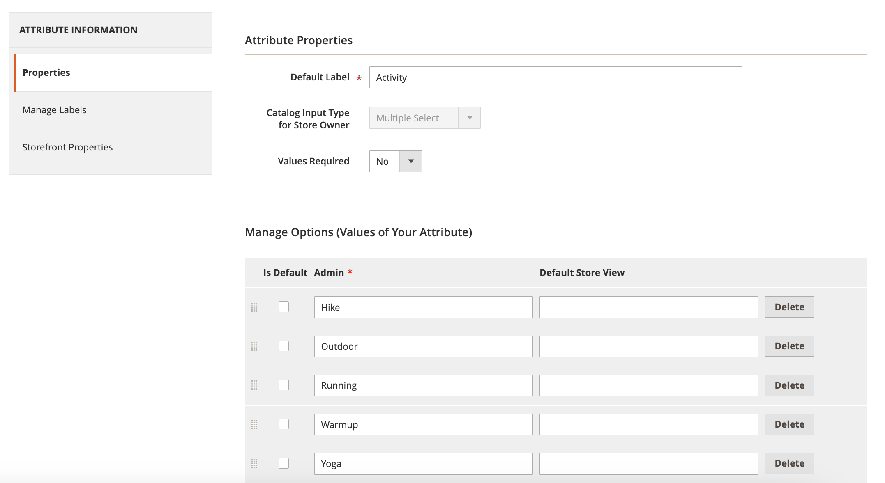

# [!DNL Live Search] facet non sono ordinati alfabeticamente

## Prodotti e versioni interessati

Adobe Commerce versioni 2.4.x e successive

Tutti i facet della vetrina Adobe Commerce sono ordinati alfabeticamente con opzioni di selezione singola, indipendentemente dal tipo di input assegnato all’attributo corrispondente.

Tuttavia, in alcuni casi edge, i facet potrebbero non essere ordinati alfabeticamente come impostato nell&#39;[[!DNL Live Search] area di lavoro Faceting](https://experienceleague.adobe.com/en/docs/commerce-merchant-services/live-search/live-search-admin/facets/faceting-workspace). Come soluzione alternativa, è possibile ordinare gli attributi del prodotto nella sezione degli attributi [!UICONTROL Admin].

1. Nella barra laterale **[!UICONTROL Admin]**, vai a **Archivi** > *Attributi* > **Prodotto**.
1. Selezionare un attributo dalla tabella.

   

1. Apri l&#39;attributo con i valori che desideri ordinare e seleziona **Informazioni attributo** > **Proprietà**.
1. In **Gestisci opzioni** puoi ordinare i valori degli attributi.

   
