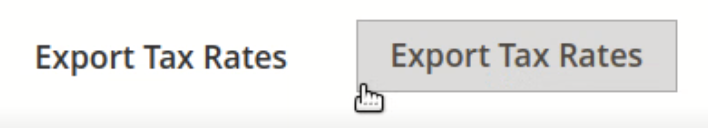

# Problema noto di Adobe Commerce 2.4.0 - L’aliquota dell’imposta sull’esportazione non funziona

Questo articolo fornisce una soluzione per un problema noto di Adobe Commerce 2.4.0 in cui il pulsante **Esporta aliquote fiscali** non funziona.

## Prodotti e versioni interessati

* Adobe Commerce sull’infrastruttura cloud 2.4.0
* Adobe Commerce on-premise 2.4.0

## Problema

<u>Passaggi da riprodurre:</u>

1. Vai a Pannello di amministrazione di Commerce > **Archivi** > **Regole fiscali**.
1. Fare clic sul pulsante **Aggiungi nuova regola fiscale**.
1. Fare clic sul testo del pulsante **Esporta aliquote fiscali**.

   

<u>Risultato previsto</u>:

Download di un file `tax_rates.csv` contenente le aliquote fiscali.

<u>Risultato effettivo</u>:

Nessun file .csv scaricato.

## Soluzione

Soluzione alternativa:

Fare clic sul bordo inferiore sinistro del pulsante **Esporta aliquote fiscali** per esportare il file `tax_rates.csv`.

Il problema verrà risolto in una patch 2.4.1.

## Lettura correlata

Nella nostra knowledge base di supporto:

* [Problema noto di Adobe Commerce 2.4.0: i metodi di pagamento di Braintree non vengono visualizzati nell&#39;estrazione di più indirizzi](/help/troubleshooting/payments/magento-2-4-0-braintree-not-in-multiple-addresses-checkout.md).
* [Problema noto di Adobe Commerce 2.4.0 - l&#39;aggiornamento delle attività del cliente non funziona](/help/troubleshooting/miscellaneous/magento-2-4-0-refresh-on-customer-activities-does-not-work.md).
* [Problema noto di Adobe Commerce 2.4.0: il pulsante &quot;Aggiungi selezioni al carrello&quot; non funziona](/help/troubleshooting/miscellaneous/magento-2-4-0-add-selections-to-my-cart-does-not-work.md).
