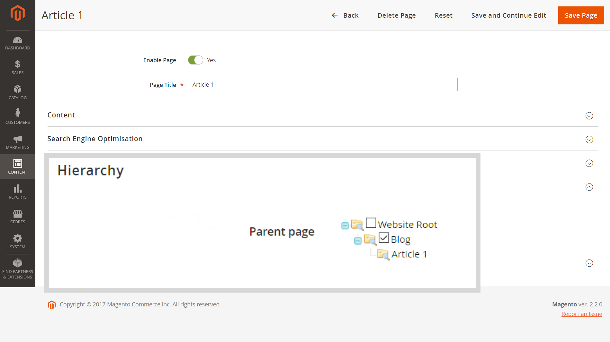

# Menu principale (Categorie) non visualizzato nelle pagine secondarie con Fastly abilitato

Questo articolo fornisce una correzione per quando il menu principale (o [Menu navigazione superiore categoria](/docs/commerce-admin/catalog/catalog/navigation/navigation-top.html) nella guida utente) non viene visualizzato nella vetrina per le pagine secondarie (ad esempio, *blog/pagina*) quando Fastly o Varnish è abilitato.

**Causa:** non consentito `/` carattere (barra) nella *Chiave URL* parametro della pagina (impostazioni di ottimizzazione motore di ricerca). Il carattere viene in genere aggiunto quando *Percorso URL* (con l&#39;intera posizione della pagina) viene erroneamente specificato al posto di *Chiave URL*: ad esempio, *blog/pagina\_name* invece di semplicemente *page\_name*.

**Soluzione:** rimuovere il `/` carattere (barra); per *Chiave URL* , specificare solo il nome della pagina.

## Versioni interessate

* Adobe Commerce on-premise 2.X.X
* Adobe Commerce sull’infrastruttura cloud 2.X.X
* Fastly o vernice

## Problema

Il menu principale (noto anche come [Menu navigazione superiore categoria](/docs/commerce-admin/catalog/catalog/navigation/navigation-top.html) nella nostra guida utente) non viene visualizzato nella vetrina per le pagine secondarie quando sono abilitati i servizi Fastly o altri servizi basati su Vernice.

## Causa

Il problema è causato dal non consentito `/` carattere (barra), aggiunto al *Chiave URL* (impostazioni di ottimizzazione del motore di ricerca).

Il carattere viene in genere aggiunto quando *Percorso URL* (con l’intera posizione della pagina, inclusa la risorsa/directory principale della pagina) viene specificata per errore al posto di *Chiave URL*: ad esempio, *blog/pagina\_name* invece di semplicemente *page\_name*.

## Soluzione

Rimuovi il `/` carattere (barra) da *Chiave URL* per tutte le pagine del tuo archivio.

In altre parole, utilizza *Chiave URL* invece di *Percorso URL*: indica solo il nome della pagina senza risorsa/directory principale.

### Recommendations nella gerarchia delle pagine e SEO (Search Engine Optimization)

Per impostare la gerarchia delle pagine, utilizzare **Gerarchia** del menu Modifica pagina.

È inoltre possibile utilizzare il **Contenuto** > **Elementi** > **Gerarchia** menu - per soluzioni gerarchiche più complesse.

Per SEO (Search Engine Optimization) sulle pagine di prodotto, utilizza le riscritture URL (**Marketing** > **SEO e ricerca** > **Riscritture URL**).

## Ulteriori informazioni nella guida utente

Il *Chiave URL* Parametro per SEO:

* [Ottimizzazione motore di ricerca](/docs/commerce-admin/catalog/categories/create/categories-search-engine-optimization.html)
* [Aggiunta di una nuova pagina](/docs/commerce-admin/content-design/elements/pages/page-add.html)

Gerarchia pagine:

* [Panoramica](/docs/commerce-admin/content-design/elements/pages/page-hierarchy.html)
* [Aggiunta di un nodo](/docs/commerce-admin/content-design/elements/pages/page-hierarchy.html#add-a-hierarchy-node)
