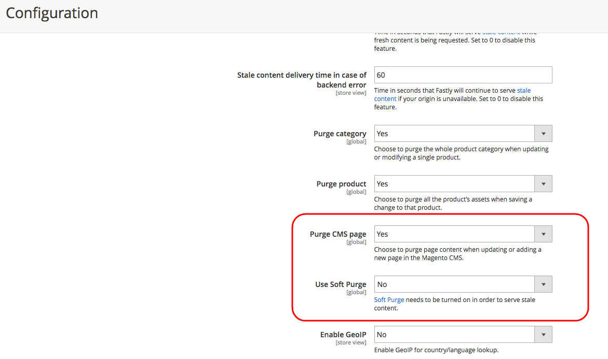

# Gli aggiornamenti pianificati per la gestione temporanea dei contenuti non vengono visualizzati con la cache Fastly non aggiornata

Questo articolo corregge i casi in cui gli archivi Adobe Commerce non visualizzano gli aggiornamenti pianificati quando si utilizzano Content Staging e Fastly. Il problema è dovuto alla funzione Fastly Soft Purge abilitata per impostazione predefinita. Questa funzione riduce il carico delle risorse dell’applicazione e rigenera una nuova cache solo su una seconda richiesta. Per risolvere il problema, puoi abilitare la pagina Rimuovi CMS tramite l’amministratore di Commerce per rigenerare e distribuire sempre nuovo contenuto.

## Problema

Aggiornamenti pianificati per una risorsa di contenuto del negozio (pagina, prodotto, blocco, ecc.) non vengono visualizzati nella vetrina subito dopo l&#39;ora di inizio dell&#39;aggiornamento. Ciò si verifica quando gli aggiornamenti sono stati pianificati utilizzando [Staging dei contenuti](https://experienceleague.adobe.com/docs/commerce-admin/content-design/staging/content-staging.html) funzionalità.

## Causa

A causa della funzionalità di Soft Purge di Fastly (abilitata per impostazione predefinita), la vetrina di Adobe Commerce riceve ancora i contenuti memorizzati nella cache non aggiornati durante l’invio **il primo** richiesta della risorsa aggiornata a Fastly. Fastly richiede una seconda richiesta per rigenerare i dati del sito.

Di conseguenza, Fastly può distribuire contenuto non aggiornato fino alla seconda richiesta di contenuto aggiornato.

**Memorizzazione in cache prevista:** Dopo aver pianificato l’aggiornamento di una risorsa di contenuto mediante Staging contenuto, Adobe Commerce invia una richiesta per aggiornare la cache a Fastly. Annulla infine la validità del contenuto precedentemente memorizzato in cache (senza eliminare il contenuto) e inizia a fornire il contenuto aggiornato.

**Memorizzazione in cache effettiva:** Se Fastly fornisce ancora il contenuto non aggiornato durante la ricezione **il primo** per il contenuto aggiornato, invierà solo il contenuto rigenerato e corretto dopo la ricezione **il secondo** richiesta. Questo comportamento è stato implementato per ridurre il carico del server rinnovando la cache solo in aree con traffico comprovato, senza rigenerare la cache per l’intero sito web. Aggiorna gradualmente la cache, salvando le risorse dell’applicazione.

## Soluzione

Se anche per la prima richiesta non è consentito distribuire contenuto non aggiornato, è possibile disabilitare la funzione Pulizia temporanea e abilitare la pagina Rimuovi CMS:

1. Accedi al tuo amministratore Commerce locale come amministratore.
1. Vai a **Negozi** > **Configurazione** > **Avanzate** > **Sistema** > **Cache a pagina intera**.
1. Espandi **Configurazione rapida**, quindi espandi **Avanzate**.
1. Imposta **Usa eliminazione temporanea** a *No*.
1. Imposta **Pagina Rimuovi CMS** a *Sì*.
1. Clic **Salva configurazione** nella parte superiore della pagina.

## Documentazione correlata

* [Configurare le opzioni di eliminazione](https://experienceleague.adobe.com/docs/commerce-cloud-service/user-guide/cdn/setup-fastly/fastly-configuration.html) nella Guida all’infrastruttura cloud di Commerce.
* [Staging dei contenuti](https://experienceleague.adobe.com/docs/commerce-admin/content-design/staging/content-staging.html) nella documentazione di Content and Design.
* [Distribuzione di contenuto non aggiornato](https://docs.fastly.com/guides/performance-tuning/serving-stale-content) nella documentazione di Fastly.
