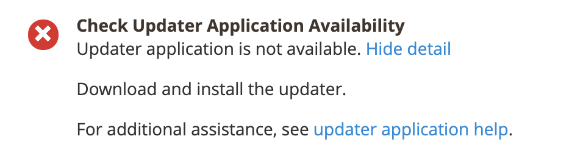

# Errore &quot;L’applicazione di aggiornamento non è disponibile&quot;

In questo articolo viene illustrata la soluzione per il problema &quot;L&#39;applicazione di aggiornamento non è disponibile&quot; che potrebbe verificarsi quando si tenta di aggiornare/installare Adobe Commerce on-premise utilizzando l&#39;Installazione guidata Web.

## Problema

Nel controllo di idoneità viene visualizzato il seguente messaggio:

## Prodotti/versioni interessati

* Adobe Commerce on-premise 2.2.x, 2.3.x
* Magento Open Source 2.2.x, 2.3.x

## Soluzione

Per risolvere questo problema, verifica se è presente `<magento_root>/update` directory che contiene file e sottodirectory. In caso contrario, vedere [Configurare l’aggiornamento](https://devdocs.magento.com/guides/v2.3/comp-mgr/updater/update-updater.html) nella documentazione per gli sviluppatori.
