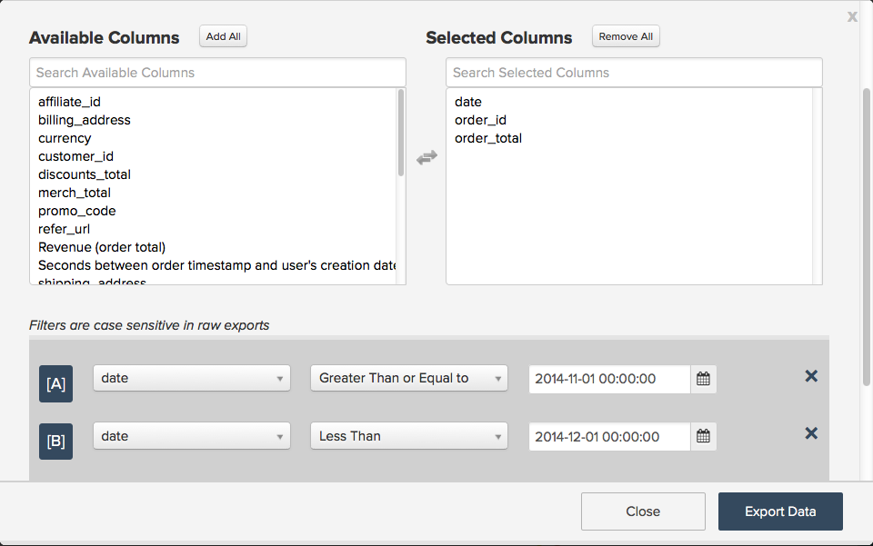

# Utilizzo delle esportazioni di dati per individuare le discrepanze

Questo articolo fornisce soluzioni per la risoluzione dei problemi relativi alle discrepanze nei dati BI di Magento. Le esportazioni di dati sono uno strumento utile per confrontare i dati di Magento BI con i dati di origine al fine di individuare le discrepanze di dati nei rapporti, soprattutto se l&#39;elenco di controllo di diagnostica delle discrepanze di dati [non ti ha aiutato a individuare il problema. ](https://experienceleague.adobe.com/it/docs/commerce-knowledge-base/kb/troubleshooting/miscellaneous/diagnosing-a-data-discrepancy) Questo articolo ti guiderà attraverso un esempio reale di come è possibile individuare le discrepanze di dati utilizzando le esportazioni di dati.

Effettua questa analisi, ad esempio:

C&#39;è un calo sospetto a novembre 2014. 500.780,94 dollari di fatturato? Non sembra giusto. Hai confermato che nel database di origine sono visualizzati altri ricavi per il mese di novembre 2014 e hai verificato che la metrica **Ricavi** utilizzata in questo report sia definita correttamente. Sembra che i dati nel data warehouse di Magento BI siano incompleti e che sia possibile confermarli utilizzando un’esportazione dati.

## Esportazione dei dati {#export}

Per iniziare, fai clic sull’ingranaggio nell’angolo in alto a destra del grafico, quindi sull’opzione Esportazione non elaborata nel menu a discesa. Questo ti darà un’esportazione non elaborata dei dati dietro il grafico.

Nel menu **Esportazione dati non elaborati**, è possibile selezionare la tabella da cui esportare insieme alle colonne da includere nell&#39;esportazione. I filtri possono essere applicati anche al set di risultati.

Nel nostro esempio, la metrica **Entrate** utilizzata in questo report utilizza il campo **order\_total** definito nella tabella **`orders`**, utilizzando la **data** come timestamp. Nell&#39;esportazione, vogliamo includere tutti i valori **order\_id** per novembre 2014 e il relativo **order\_total** . La metrica **Entrate** non utilizza alcun filtro, ma aggiungeremo un filtro all&#39;esportazione per limitare il set di risultati a solo novembre 2014.

Ecco l’aspetto del menu Esportazione dati non elaborati per questo esempio:

Fai clic su Esporta dati per iniziare l’esportazione. Viene visualizzata una finestra con i dettagli dell’esportazione, compreso lo stato. La preparazione dell&#39;esportazione richiede alcuni minuti, il che rende ora opportuno eseguire un&#39;estrazione analoga dei dati di origine per novembre 2014, inclusi **date, order\_id** e **order\_total**. Il file verrà aperto in Excel e non verrà più aperto, poiché torneremo a utilizzarlo tra breve.

Quando nella finestra Esportazioni dati non elaborati viene visualizzato il pulsante Scarica, fai clic su di esso per scaricare il file zip contenente il file CSV.

A questo punto, dobbiamo raccogliere tutti i dati in un unico foglio per trovare il problema. Importeremo il file CSV (l’esportazione da Magento BI) in un foglio diverso del file Excel contenente i nostri dati di origine.

## Individuazione del problema {#pinpoint}

Ora che tutti i dati sono in un unico posto, possiamo cercare la fonte della discrepanza. Confrontare il numero di righe in ogni foglio ci aiuterà a individuare il problema. Esaminiamo più da vicino ogni situazione.

### Entrambi i fogli contengono lo stesso numero di righe

Se entrambi i sistemi hanno lo stesso conteggio di righe e la metrica **Ricavi** non corrisponde ai dati di origine, il **ordine\_totale** deve essere disattivato. È possibile che il campo **order\_total** sia stato aggiornato nel database di origine e che Magento BI non stia rilevando queste modifiche.

Per confermare, controlla se la colonna **order\_total** è stata ricontrollata. Passare alla Gestione Date Warehouse e fare clic sulla tabella **`orders`**. Visualizzerai la [frequenza di ricontrollo](https://experienceleague.adobe.com/docs/commerce-business-intelligence/mbi/analyze/warehouse-manager/cfg-data-rechecks.html?lang=it) elencata in &#39;Modifiche?&#39; colonna. Il campo **order\_total** deve essere impostato in modo da ricontrollare ogni volta che si prevede che cambi; in caso contrario, procedere e impostarlo sulla frequenza di ricontrollo desiderata.

### 

Se la frequenza di ricontrollo è già impostata correttamente, c&#39;è un altro problema. Per ulteriori informazioni, consultare la [sezione Contattare il supporto](#support) alla fine di questo articolo.

## Il database di origine contiene PIÙ righe rispetto a Magento BI {#morerows}

Se il database di origine contiene più righe rispetto a Magento BI e lo spazio vuoto è maggiore del numero di ordini che si prevede di immettere durante il ciclo di aggiornamento, potrebbe verificarsi un problema di connessione. Ciò significa che Magento BI non è in grado di estrarre nuovi dati dal database di origine, il che può verificarsi per diversi motivi.

Passare alla pagina Connessioni e controllare lo stato dell&#39;origine dati contenente la tabella `order`:

1. **Se lo stato è Riauth** , la connessione non utilizza le credenziali corrette. Fai clic sulla connessione, immetti le credenziali corrette e riprova.
1. **Se lo stato è Non riuscito** , la connessione potrebbe non essere configurata correttamente sul lato server. Le connessioni non riuscite in genere derivano da un nome host errato o dal fatto che il server di destinazione non accetta connessioni sulla porta specificata.Fare clic sulla connessione, controllare l&#39;ortografia del nome host e verificare che la porta corretta sia stata immessa. Sul lato server, verificare che la porta possa accettare connessioni e che il firewall disponga dell&#39;indirizzo IP di Magento BI (54.88.76.97/32) come consentito. **Se la connessione continua a non riuscire**, fare riferimento alla [sezione Contattare il supporto](#support) alla fine di questo articolo per i passaggi successivi.
1. **Se lo stato è Riuscito** , il problema non è la connessione e il supporto RJ deve essere coinvolto. Per ulteriori informazioni, consultare la [sezione Contattare il supporto](#support) alla fine di questo articolo.

## Il database di origine contiene un numero minore di righe rispetto a Magento BI {#lessrows}

Se il database di origine contiene meno righe rispetto a Magento BI, è possibile che le righe vengano eliminate dal database di origine e che Magento BI non le stia rilevando. **&#x200B; [L&#39;eliminazione dei dati](https://experienceleague.adobe.com/docs/commerce-business-intelligence/mbi/best-practices/data/opt-db-analysis.html?lang=it) può causare discrepanze, tempi di aggiornamento più lunghi e numerosi problemi logistici** pertanto si consiglia vivamente di non eliminare mai i dati a meno che non sia realmente necessario.

Se, tuttavia, le righe vengono eliminate dalla tabella, controllare la frequenza di ricontrollo della chiave primaria. Ricontrollare la chiave primaria significa che la tabella verrà controllata per le righe eliminate.

In Gestione Date Warehouse le colonne chiave primaria sono contrassegnate da un simbolo di chiave. Nel nostro esempio, la chiave primaria è la colonna **order\_id**:

Se la chiave primaria è già impostata per essere ricontrollata o le righe non vengono mai eliminate da questa tabella, sarà necessario il supporto RJ per individuare il problema. Per i passaggi successivi, consulta la sezione seguente.

## Contattare il supporto {#support}

Se non si è in grado di individuare la fonte del problema, sarà necessario eseguire il ciclo in RJ Support. Prima di inviare un ticket, eseguire le operazioni seguenti:

* **Se il database di origine e il database di Magento hanno lo stesso numero di righe** e le frequenze di ricontrollo sono impostate correttamente, eseguire una ricerca vocale nel foglio di calcolo **per individuare i valori order\_id con un valore order\_total diverso tra il database di Magento di origine e il database di origine.** Includi questi valori quando invii il tuo ticket.
* **Se il database di origine contiene PIÙ righe rispetto al Magento BI** e la connessione viene visualizzata come riuscita o continua a non riuscire, è necessario conoscere il nome della connessione e il messaggio di errore visualizzato, se presente.
* **Se nel database di origine sono presenti meno righe rispetto al Magento BI,** righe non vengono eliminate dalla tabella e le frequenze di verifica sono impostate correttamente, eseguire una ricerca automatica nel foglio di calcolo **per individuare l&#39;ordine dei valori\_id presenti nel Magento BI** ma non nel database di origine. Includi questi valori quando invii il ticket.

## Lettura correlata

* [Elenco di controllo diagnostica discrepanza dati](https://experienceleague.adobe.com/it/docs/commerce-knowledge-base/kb/troubleshooting/miscellaneous/diagnosing-a-data-discrepancy)
* [Criteri di servizio Adobe Commerce Intelligence](https://experienceleague.adobe.com/it/docs/commerce-knowledge-base/kb/troubleshooting/miscellaneous/mbi-service-policies)
* [Best practice per la modifica delle tabelle del database](https://experienceleague.adobe.com/it/docs/commerce-operations/implementation-playbook/best-practices/development/modifying-core-and-third-party-tables#why-adobe-recommends-avoiding-modifications) nel playbook di implementazione di Commerce

