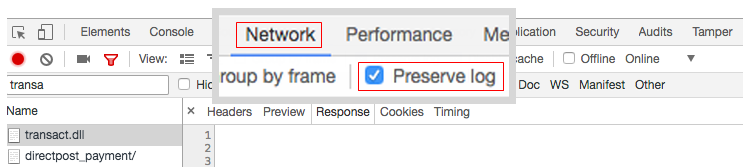

# Errore durante l&#39;ordine con l&#39;account Sandbox Authorize.net (si è verificato un errore sul server)

Questo articolo fornisce una correzione per &quot;*Errore nel server*&quot;messaggio di errore durante l&#39;effettuazione di un ordine tramite Authorize.Net Direct Post.

>[!WARNING]
>
>**Avviso di obsolescenza**
>
>In virtù della direttiva sui servizi di pagamento [PSD2](https://docs.magento.com/user-guide/v2.3/stores/compliance-payment-services-directive.html) e la continua evoluzione di molte API, Authorize.Net rischia di diventare obsoleto e non più conforme alle norme di sicurezza in futuro. Per questo motivo, ora è obsoleto. Ti consigliamo di disabilitarlo nella configurazione di Adobe Commerce e di passare al corrispondente [Estensione Commerce Marketplace](https://marketplace.magento.com/extensions.html).
>
>**Questa integrazione viene rimossa da Adobe Commerce 2.4.0 ed è ora obsoleta nelle versioni correnti della versione 2.3.**
>
>Per informazioni dettagliate sulla transizione sicura da integrazioni di pagamenti obsolete, consulta la nostra [DevBlog](https://community.magento.com/t5/Magento-DevBlog/Deprecation-of-Magento-core-payment-integrations/ba-p/426445).

## Problema

Inserimento di un ordine utilizzando [Pubblicazione diretta Authorize.Net](https://docs.magento.com/user-guide/v2.3/payment/authorize-net-direct-post.html) L’account sandbox causa un messaggio di errore:

>>
&quot;Si è verificato un errore sul server. Provare a riordinare&quot;

## Causa 1: la modalità di test è abilitata

Non sembra ovvio, ma il di Authorize.net **Modalità di prova** deve essere impostato su **No** anche durante il test con l’account Sandbox.

## Soluzione 1: disabilitare la modalità di test

1. Vai a **Negozi** > **Configurazione** > **Vendite** > **Metodi di pagamento** > **Altri metodi di pagamento** > **Authorize.net Direct Post**.
1. Imposta **Modalità di prova** a &quot;No&quot; (deseleziona) **Usa valore di sistema**, quindi selezionare &quot;No&quot; nel menu).
1. Clic **Salva configurazione**.

## Causa 2: URL errati

Le impostazioni Authorize.net potrebbero contenere indirizzi URL non corretti per le risorse critiche di Authorize.Net.

## Soluzione 2: fornire gli URL corretti

* **URL gateway:**   `https://test.authorize.net/gateway/transact.dll`
* **URL dettagli transazione:**   `https://apitest.authorize.net/xml/v1/request.api`
* **Riferimento API:**   `https://developer.authorize.net/api/reference/`

## In caso contrario: ottieni informazioni di debug

Se l’invio di un ordine con Authorize.net non riesce e viene visualizzato un messaggio non informativo *&quot;Si è verificato un errore&quot;* errore, controlla Adobe Commerce `debug.log`.

### Transact.dll

Se il valore `debug.log` è vuoto, controlla **transact.dll** risposta nella console del browser web:

1. Apri la console.
1. Prima di effettuare un ordine, vai al **Rete** e seleziona **Mantieni registro**.    
1. Filtrare le risposte per **transact.dll** per visualizzare un messaggio di risposta con un possibile errore.    
