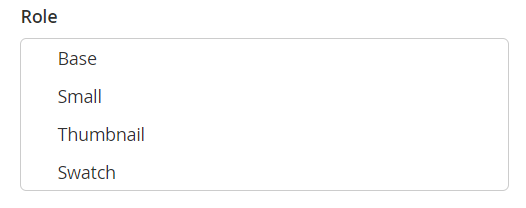

# Le immagini del prodotto non vengono visualizzate nonostante i ruoli immagine Modifica prodotto

Questo articolo corregge alcuni casi in cui le immagini del prodotto non vengono visualizzate nella vetrina, nonostante i ruoli impostati nella pagina di modifica del prodotto.

**Causa:** nelle istanze di Adobe Commerce con più store, alcune immagini di prodotto potrebbero presentare `no_selection` valori per gli attributi del ruolo immagine `image`, `small_image`, `thumbnail`, `swatch`. Tali `no_selection` I valori emergono quando il ruolo immagine prodotto è impostato sull’ambito globale di tutti gli store anziché sull’ambito di un particolare store (in altre parole, sulla **Tutte le visualizzazioni dello store** invece di un particolare **Visualizzazione store**). Per capire se si tratta di un caso, eseguire lo script SQL dal **Causa** sezione successiva.

**Soluzione:** eliminare le righe con `no_selection` valori per tali immagini utilizzando lo script SQL dalla sezione Soluzione di seguito.

## Versioni interessate

* Adobe Commerce on-premise 2.X.X
* Adobe Commerce sull’infrastruttura cloud 2.X.X

## Problema

Le immagini del prodotto potrebbero non essere visualizzate nella vetrina, anche se i ruoli immagine (Base, Piccola, Miniatura, Campione) sono stati impostati correttamente nella pagina Prodotto del pannello Amministratore.

Quando controlli la pagina del prodotto con **Visualizzazione store** imposta su **Tutte le visualizzazioni dello store**, l&#39;immagine ha i ruoli impostati su **Dettagli immagine** schermo.


Tuttavia, nella vetrina, l&#39;immagine non viene visualizzata; quando si controlla la pagina del prodotto in un particolare livello di negozio (passando da **Visualizzazione store**), l’immagine è presente ma i ruoli non sono impostati.



## Causa

Nelle istanze di Adobe Commerce in più store (con più store), alcune immagini di prodotto potrebbero presentare `no_selection` valori per attributi `image`, `small_image`, `thumbnail`, `swatch` (questi attributi corrispondono ai ruoli immagine). Tali `no_selection` I valori emergono quando il ruolo immagine prodotto è impostato sull’ambito globale di tutti gli store anziché sull’ambito di un particolare store (in altre parole, sulla **Tutte le visualizzazioni dello store** invece di un particolare **Visualizzazione store**).

Tecnicamente parlando: on `store_id=0` (contiene le impostazioni globali per tutti gli store nell’istanza Adobe Commerce), potrebbero essere impostati i ruoli dell’immagine del prodotto: questo significa che gli attributi `image`, `small_image`, `thumbnail`, `swatch` hanno valori validi (percorso delle immagini). Allo stesso tempo, il `store_id=1` (che è una particolare rappresentazione di archivio), i valori per questi attributi sono `no_selection`.

### Come verificare che sia il tuo problema

Esegui questa query SQL:

```sql
SELECT `cpev_s`.*, `cpev_0`.`value` AS `store_value` FROM `catalog_product_entity_varchar` `cpev_s` JOIN `eav_attribute` `ea` ON `cpev_s`.`attribute_id` = `ea`.`attribute_id` LEFT JOIN `catalog_product_entity_varchar` `cpev_0` ON `cpev_0`.`row_id` = `cpev_s`.`row_id` AND `cpev_0`.`attribute_id` = `cpev_s`.`attribute_id` AND `cpev_0`.`store_id` = 0 WHERE `cpev_s`.`value` = 'no_selection' AND `ea`.`attribute_code` IN ('image', 'small_image', 'thumbnail') AND `cpev_s`.`store_id` > 0 AND `cpev_s`.`value` != `cpev_0`.`value` AND `cpev_s`.`value` = 'no_selection';
```

Se la query restituisce un risultato come quello riportato di seguito, si sta affrontando il problema documentato in questo articolo:

```sql
+----------+--------------+----------+--------+--------------+----------------------------+
| value_id | attribute_id | store_id | row_id | value        | store_value                |
+----------+--------------+----------+--------+--------------+----------------------------+
|    67722 |           87 |        1 |    481 | no_selection | /3/5/355sss1_main.jpg      |
|    67723 |           88 |        1 |    481 | no_selection | /3/5/355sss1_main.jpg      |
|    67724 |           89 |        1 |    481 | no_selection | /3/5/355sss1_main.jpg      |
|    67814 |           87 |        1 |    503 | no_selection | /s/k/skb2031_main.jpg      |
|     6769 |           87 |        2 |    503 | no_selection | /s/k/skb2031_main.jpg      |
|    67815 |           88 |        1 |    503 | no_selection | /s/k/skb2031_main.jpg      |
|     6770 |           88 |        2 |    503 | no_selection | /s/k/skb2031_main.jpg      |
|    67816 |           89 |        1 |    503 | no_selection | /s/k/skb2031_main.jpg      |
|     6771 |           89 |        2 |    503 | no_selection | /s/k/skb2031_main.jpg      |
+----------+--------------+----------+--------+--------------+----------------------------+
9 rows in set (0.06 sec)
```

### Perché succede?

Se l’applicazione Adobe Commerce dispone di più archivi, è possibile che non sincronizzi i dati tra un particolare archivio e le impostazioni dell’archivio globale.

Valori su `store_id=1` hanno più priorità dell&#39;archivio predefinito (globale) (`store_id=0`). L&#39;applicazione può quindi ignorare le impostazioni globali dell&#39;immagine e utilizzare la configurazione dell&#39;ambito di archiviazione (`no_selection` per gli attributi del ruolo immagine) durante la visualizzazione di un&#39;immagine.

## Soluzione {#solution}

Elimina attributi con `no_selection` valori che utilizzano questo script SQL:

```
DELETE `cpev_s`.* FROM `catalog_product_entity_varchar` `cpev_s` JOIN `eav_attribute` `ea` ON `cpev_s`.`attribute_id` = `ea`.`attribute_id` LEFT JOIN `catalog_product_entity_varchar` `cpev_0` ON `cpev_0`.`row_id` = `cpev_s`.`row_id` AND `cpev_0`.`attribute_id` = `cpev_s`.`attribute_id` AND `cpev_0`.`store_id` = 0 WHERE `cpev_s`.`value` = 'no_selection' AND `ea`.`attribute_code` IN ('image', 'small_image', 'thumbnail') AND `cpev_s`.`store_id` > 0 AND `cpev_s`.`value` != `cpev_0`.`value` AND `cpev_s`.`value` = 'no_selection';
```

Una volta rimossi questi attributi, vengono impostati i ruoli per archivi particolari e le immagini vengono visualizzate nella vetrina.

## Dettagli aggiuntivi

Se nell’istanza Adobe Commerce è abilitata la cache a pagina intera, non potrai visualizzare immediatamente i risultati della correzione.

Per visualizzare le modifiche, aggiorna la cache delle pagine utilizzando **Gestione cache** del pannello di amministrazione.

## Ulteriori informazioni

### Archivi e ambiti

[Archivi e ambiti del negozio](/docs/commerce-admin/stores-sales/site-store/stores.html) nella guida utente

### Immagini

[Caricamento immagini prodotto](/docs/commerce-admin/catalog/products/digital-assets/product-image.html#upload-an-image) nella guida utente

### Cache

* [Gestione della cache](/docs/commerce-admin/systems/tools/cache-management.html) nella guida utente per l’amministratore di sistema.
* [Gestire la cache](/docs/commerce-operations/configuration-guide/cli/manage-cache.html) nella documentazione per gli sviluppatori