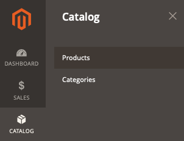

# Il prodotto non viene visualizzato nella vetrina

Questo articolo fornisce soluzioni per i casi in cui i prodotti non vengono visualizzati nella vetrina.

## Prodotti e versioni interessati

* Adobe Commerce on-premise X.X.X
* Adobe Commerce su infrastruttura cloud X.X.X

## Problema

<u>Passaggi da riprodurre</u>:

1. Accedi all’amministratore di Commerce.
1. Vai a **Catalogo** > **Prodotti**.

   

1. Fai clic su **Aggiungi prodotto** e segui il processo di creazione del prodotto. Oppure importa prodotti da un file CSV.

<u>Risultato previsto</u>:

Il prodotto viene visualizzato nella vetrina.

<u>Risultato effettivo</u>:

Il prodotto non viene visualizzato.

## Causa

Ciò può essere dovuto a diversi motivi. Segui i passaggi riportati di seguito per verificare i punti principali utili per identificare e risolvere il problema.

## Soluzione

Ciascuno dei seguenti punti potrebbe risolvere il problema.

* Controlla le impostazioni del prodotto in Admin. Vai a **Catalogo** > **Prodotti**, apri la pagina del prodotto e assicurati che i seguenti campi siano configurati correttamente:
   * **Abilita prodotto** = *Sì.*
   * **Stato Stock**: *In Stock*. Oppure se *Esaurito* è il valore corretto, assicurarsi che **Visualizza prodotti esauriti** (**ARCHIVI** > **Impostazioni** > **Configurazione** > **CATALOGO** > **Inventario** > **Opzioni magazzino** > **Visualizza prodotti esauriti**) sia impostato su *Sì* (configurato a livello globale).
   * **Categorie**: se tenti di trovare il prodotto in una pagina della categoria, verifica che il prodotto sia assegnato alla categoria. Per semplificare la risoluzione dei problemi, crea una nuova categoria dalla pagina corrente e assegna un prodotto.
   * **Visibilità** = *Catalogo, Ricerca.*
   * Nella sezione **Prodotto in siti Web**, assicurati che il prodotto sia assegnato al sito Web corretto.
   * Passa il selettore dell&#39;ambito alla visualizzazione dello store in cui si tenta di trovare il prodotto nella vetrina e verifica le stesse impostazioni.
* Eseguire la reindicizzazione completa eseguendo `bin/magento indexer:reindex` dalla console e svuotare tutta la cache dell&#39;amministratore in **Sistema** > **Strumenti** > **Gestione cache** oppure dalla console eseguendo `bin/magento cache:clean`.
* Se quanto sopra non aiuta, è possibile avviare ulteriori indagini controllando i registri nella directory `var/log`.

## Lettura correlata nella knowledge base del supporto

[Posizioni di registro (directory) per l’architettura Pro](/help/how-to/general/log-locations-directories-for-pro-plan-integration-staging-production.md)

